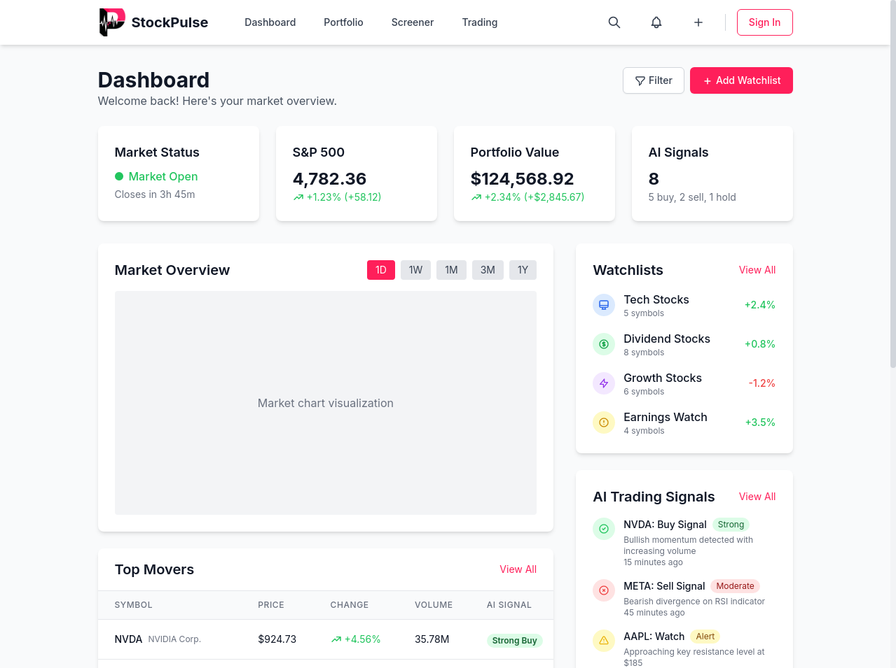
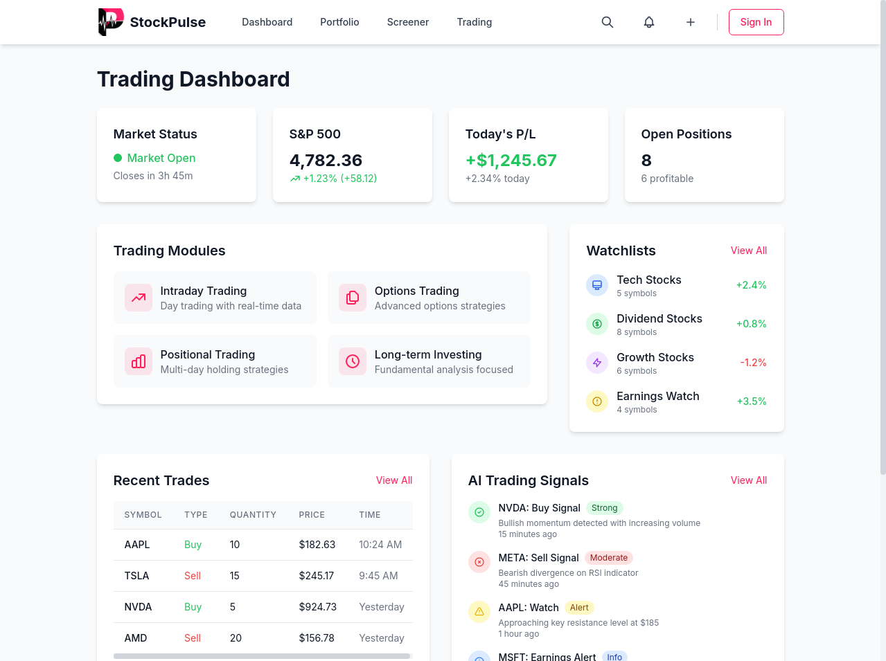

<div align="center">
  
  <h1>StockPulse</h1>
  <p>A comprehensive AI-powered stock analysis platform with real-time data, advanced trading tools, and automated agents.</p>
  <p>
    <strong>Version 0.0.2</strong>
  </p>
</div>

## 🚀 Features

### 📊 Advanced Trading Interfaces
- **Intraday Trading**
  - Real-time scalping charts with tick-by-tick data
  - Level II order book visualization
  - Time and sales analysis with volume profiling
  - Momentum indicators and real-time alerts

- **Options Trading**
  - Complete options chain visualization
  - Greeks display (Delta, Gamma, Theta, Vega, Rho)
  - Payoff diagrams for complex strategies
  - Volatility surface analysis

- **Positional Trading**
  - Trend indicators with multi-timeframe analysis
  - Sector rotation visualization
  - Support/resistance identification
  - Pattern recognition with AI assistance

- **Long-term Investing**
  - Discounted Cash Flow (DCF) calculator
  - Dividend analysis and projection charts
  - Fundamental ratio comparison
  - Long-term trend visualization

### 🤖 AI-Powered Automation
- **Agent Trading Configuration**
  - Customizable trading strategies
  - Performance backtesting
  - Risk parameter configuration
  - Market condition adaptation

- **Risk Management Framework**
  - Position sizing recommendations
  - Stop-loss automation
  - Portfolio exposure analysis
  - Drawdown protection mechanisms

- **Automation Controls**
  - Scheduled trading operations
  - Conditional execution based on market events
  - Manual override capabilities
  - Performance monitoring dashboards

### 🎨 Customizable Themes
- **Five Premium Color Themes**
  - Tropical Jungle (Vibrant Greens)
  - Ocean Sunset (Blues + Corals)
  - Desert Storm (Warm Neutrals)
  - Berry Fields (Purples + Pinks)
  - Arctic Moss (Cool Grays + Greens)

- **Responsive Design**
  - Optimized for desktop, tablet, and mobile
  - Dark and light mode support
  - Accessibility-focused UI elements
  - Customizable layouts

### 📱 User Experience
- **Multi-step Onboarding**
  - Personalized setup process
  - Trading experience assessment
  - Risk tolerance evaluation
  - Theme and preference configuration

- **Portfolio Management**
  - Real-time portfolio valuation
  - Performance analytics
  - Asset allocation visualization
  - Tax-lot tracking

- **Stock Screening**
  - Multi-factor screening engine
  - Technical and fundamental filters
  - Saved screen templates
  - Results comparison

## 🛠️ Tech Stack

- **Frontend**
  - React 18+ with TypeScript
  - Tailwind CSS for styling
  - React Query for state management
  - React Router DOM for routing
  - Recharts for financial data visualization
  - Framer Motion for animations

- **Data Integration**
  - Financial Modeling Prep API for market data
  - TAAPI.IO for technical indicators
  - Yahoo Finance for supplementary data

## 🚀 Getting Started

### Prerequisites

- Node.js 18+ and npm

### Installation

1. Clone the repository
```bash
git clone https://github.com/veerababumanyam/StockPulse.git
cd StockPulse
```

2. Install dependencies
```bash
npm install
```

3. Create a `.env` file in the root directory with your API keys:
```
VITE_FMP_API_KEY=your_financial_modeling_prep_api_key
VITE_TAAPI_API_KEY=your_taapi_io_api_key
```

4. Start the development server
```bash
npm run dev
```

5. Build for production
```bash
npm run build
```

## 📁 Project Structure

```
StockPulse/
├── public/             # Static assets
├── src/
│   ├── api/            # API services and utilities
│   ├── assets/         # Images, fonts, etc.
│   ├── components/     # Reusable UI components
│   │   ├── automation/ # Agent automation components
│   │   ├── layout/     # Layout components
│   │   ├── trading/    # Trading-specific components
│   │   │   ├── intraday/   # Intraday trading components
│   │   │   ├── options/    # Options trading components
│   │   │   ├── positional/ # Positional trading components
│   │   │   └── longterm/   # Long-term investing components
│   │   ├── ui/         # Generic UI components
│   │   └── performance/ # Performance-optimized components
│   ├── contexts/       # React context providers
│   ├── hooks/          # Custom React hooks
│   ├── layouts/        # Page layout components
│   ├── pages/          # Page components
│   │   ├── agents/     # Agent management pages
│   │   ├── analysis/   # Stock analysis pages
│   │   ├── auth/       # Authentication pages
│   │   ├── onboarding/ # User onboarding flow
│   │   └── trading/    # Trading interface pages
│   ├── utils/          # Utility functions
│   ├── config/         # Configuration files
│   ├── App.tsx         # Main application component
│   ├── index.css       # Global styles
│   └── main.tsx        # Application entry point
├── index.html          # HTML template
├── package.json        # Project dependencies
├── tailwind.config.js  # Tailwind CSS configuration
├── tsconfig.json       # TypeScript configuration
└── vite.config.ts      # Vite configuration
```

## 🔌 API Integration

The application integrates with:
- **Financial Modeling Prep API** for market data, financial statements, and company profiles
- **TAAPI.IO** for technical indicators and chart pattern recognition
- **Yahoo Finance API** for supplementary data including insider trading and stock insights

## 📱 Screenshots

<div align="center">
  
  
</div>

## 📄 License

This project is licensed under the Apache License 2.0.

---

<div align="center">
  <p>Built with ❤️ by the StockPulse team</p>
</div>
