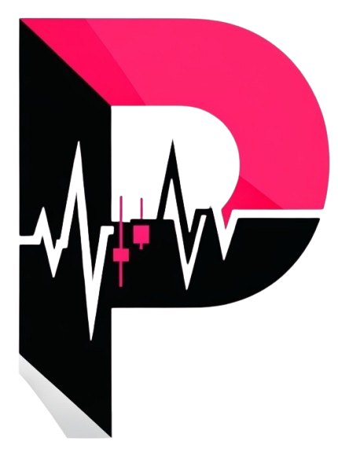
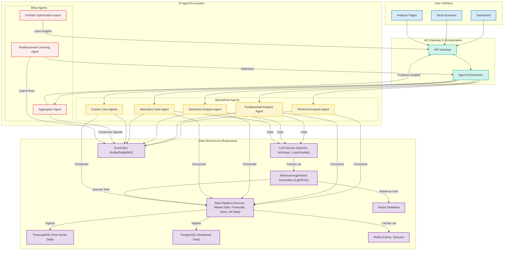
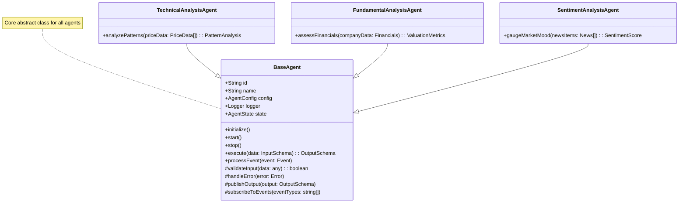
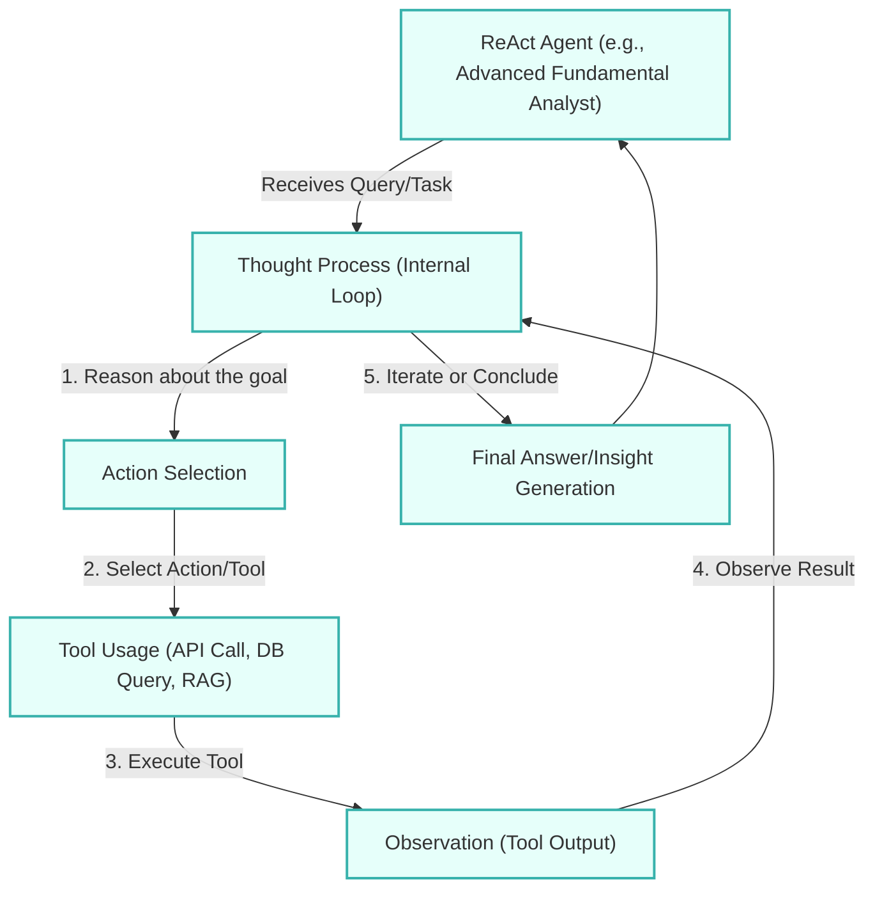
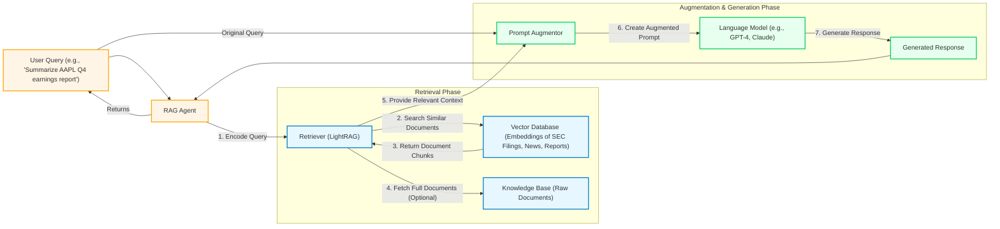
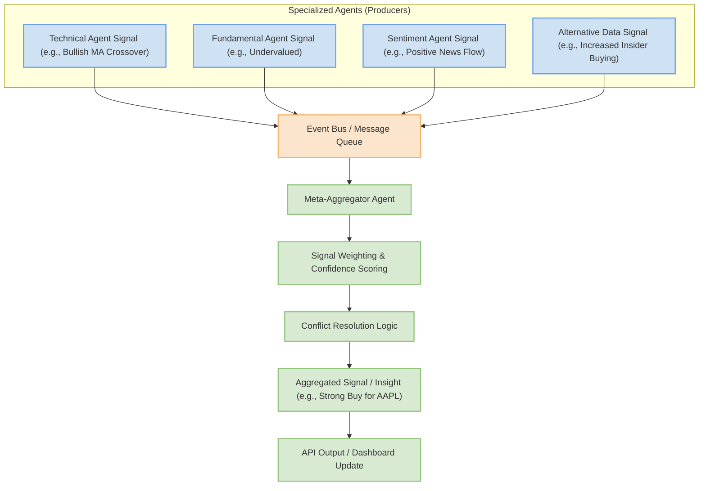

<div align="center">
  
</div>

# StockPulse: AI-Powered Stock Analysis Platform

StockPulse is an advanced stock analysis platform leveraging specialized AI agents to provide comprehensive insights for traders and investors. It offers 360-degree analysis, including technical, fundamental, sentiment, and alternative data, across various trading timeframes and strategies.

---

## 📜 Table of Contents

- [Key Features](#%EF%B8%8F-key-features)
- [🤖 AI Agent Architecture](#-ai-agent-architecture)
  - [Ecosystem Overview](#ecosystem-overview)
  - [BaseAgent Structure](#baseagent-structure)
  - [ReAct Pattern](#react-pattern)
  - [Retrieval-Augmented Generation (RAG) Agent](#retrieval-augmented-generation-rag-agent)
  - [Meta-Agent Signal Aggregation](#meta-agent-signal-aggregation)
- [🛠️ Technical Details](#%EF%B8%8F-technical-details)
  - [Offline-First Architecture](#offline-first-architecture)
  - [Theme System](#theme-system)
  - [Icon System](#icon-system)
- [👥 Team](#-team)
  - [Core Development Team](#core-development-team)
  - [SAWAS Organization](#sawas-organization)
  - [Contributing](#contributing)
  - [Contact](#contact)
- [🏗️ Project Structure](#%EF%B8%8F-project-structure)
- [💻 Technologies Used](#-technologies-used)
  - [Frontend](#frontend)
  - [Backend](#backend)
  - [DevOps & Tools](#devops--tools)
- [🚀 Getting Started](#-getting-started)
- [🎨 Brand Assets and Logo](#-brand-assets-and-logo)
  - [Logo Assets](#logo-assets)
  - [Using the Logo Component](#using-the-logo-component)
  - [Regenerating Logo Assets](#regenerating-logo-assets)
- [📦 Package Configuration Notes](#-package-configuration-notes)
  - [Frontend Package](#frontend-package)
  - [Backend Package](#backend-package)
  - [Shared Package](#shared-package)
- [🔍 Troubleshooting](#-troubleshooting)
- [☁️ Deployment](#️-deployment)
- [License](#license)

---

## ✨ Key Features

- **Comprehensive Analysis**: Integrates technical, fundamental, sentiment, and alternative data.
- **AI Agent Ecosystem**: Specialized agents for diverse analytical tasks (e.g., TechnicalAnalysisAgent, FundamentalAnalysisAgent, NewsAnalysisAgent).
- **Multi-Timeframe Trading Modules**: Dedicated modules for Day Trading, Positional Trading, Short-Term Investments, and Long-Term Investments.
- **Advanced Options Strategies**: Sophisticated options trading intelligence and analysis.
- **Real-Time Processing**: Low-latency signal generation and market monitoring.
- **LightRAG Integration**: Enhances LLM responses with relevant financial data for accuracy and reduced hallucination.
- **Stock Screener**: Powerful filtering with both technical parameters and natural language queries.
- **Trading Platform Integration**: Connects with various broker APIs for direct execution.
- **Customizable UI**: Responsive and adaptable interface with feature toggles for personalization.

---

## 🤖 AI Agent Architecture

This section outlines the core architectural patterns and structures for the AI agents within StockPulse.

### Ecosystem Overview

The StockPulse AI agent ecosystem is designed for modularity and collaboration, enabling a 360-degree analysis by combining insights from various specialized agents.


```mermaid
graph TD
    subgraph "User Interface"
        UI_Dashboard["Dashboard"]
        UI_Screener["Stock Screener"]
        UI_Analysis["Analysis Pages"]
    end

    subgraph "API Gateway & Orchestration"
        API["API Gateway"]
        Orchestrator["Agent Orchestrator"]
    end

    subgraph "AI Agent Ecosystem"
        direction LR
        subgraph "Specialized Agents"
            TA_Agent["Technical Analysis Agent"]
            FA_Agent["Fundamental Analysis Agent"]
            SA_Agent["Sentiment Analysis Agent"]
            ALT_Agent["Alternative Data Agent"]
            Custom_Agent["Custom User Agents"]
        end
        subgraph "Meta Agents"
            Aggregator_Agent["Aggregator Agent"]
            RL_Agent["Reinforcement Learning Agent"]
            Portfolio_Opt_Agent["Portfolio Optimization Agent"]
        end
    end

    subgraph "Data Services & Infrastructure"
        direction LR
        Data_Pipeline["Data Pipeline (Sources: Market Data, Financials, News, Alt-Data)"]
        LLM_Service["LLM Service (OpenAI, Anthropic, Local Models)"]
        RAG_Service["Retrieval-Augmented Generation (LightRAG)"]
        Vector_DB["Vector Database"]
        TimescaleDB["TimescaleDB (Time-Series Data)"]
        PostgreSQL["PostgreSQL (Relational Data)"]
        Redis["Redis (Cache, Queues)"]
        Event_Bus["Event Bus (Kafka/RabbitMQ)"]
    end

    UI_Dashboard --> API
    UI_Screener --> API
    UI_Analysis --> API
    API --> Orchestrator

    Orchestrator --> TA_Agent
    Orchestrator --> FA_Agent
    Orchestrator --> SA_Agent
    Orchestrator --> ALT_Agent
    Orchestrator --> Custom_Agent
    Orchestrator --> Aggregator_Agent

    TA_Agent --> Event_Bus
    FA_Agent --> Event_Bus
    SA_Agent --> Event_Bus
    ALT_Agent --> Event_Bus
    Custom_Agent --> Event_Bus

    TA_Agent -- Consumes --> Data_Pipeline
    FA_Agent -- Consumes --> Data_Pipeline
    SA_Agent -- Consumes --> Data_Pipeline
    ALT_Agent -- Consumes --> Data_Pipeline
    Custom_Agent -- Consumes --> Data_Pipeline

    FA_Agent -- Uses --> LLM_Service
    SA_Agent -- Uses --> LLM_Service
    ALT_Agent -- Uses --> LLM_Service

    LLM_Service -- Context via --> RAG_Service
    RAG_Service -- Retrieves from --> Vector_DB
    RAG_Service -- Sources from --> Data_Pipeline

    Aggregator_Agent -- Consumes Signals --> Event_Bus
    Aggregator_Agent -- Produces Insights --> API
    RL_Agent -- Learns from --> Event_Bus
    RL_Agent -- Optimizes --> Orchestrator
    Portfolio_Opt_Agent -- Uses Insights --> API

    Data_Pipeline -- Ingests --> TimescaleDB
    Data_Pipeline -- Ingests --> PostgreSQL
    Data_Pipeline -- Caches via --> Redis

    classDef ui fill:#D6EAF8,stroke:#2E86C1,stroke-width:2px;
    classDef api fill:#D1F2EB,stroke:#1ABC9C,stroke-width:2px;
    classDef agent fill:#FCF3CF,stroke:#F1C40F,stroke-width:2px;
    classDef meta fill:#FDEDEC,stroke:#E74C3C,stroke-width:2px;
    classDef data fill:#E8DAEF,stroke:#8E44AD,stroke-width:2px;

    class UI_Dashboard,UI_Screener,UI_Analysis ui;
    class API,Orchestrator api;
    class TA_Agent,FA_Agent,SA_Agent,ALT_Agent,Custom_Agent agent;
    class Aggregator_Agent,RL_Agent,Portfolio_Opt_Agent meta;
    class Data_Pipeline,LLM_Service,RAG_Service,Vector_DB,TimescaleDB,PostgreSQL,Redis,Event_Bus data;
```

### BaseAgent Structure

All specialized agents inherit from a `BaseAgent` class, ensuring standardized interfaces and functionalities.


```mermaid
classDiagram
    class BaseAgent {
        +String id
        +String name
        +AgentConfig config
        +Logger logger
        +AgentState state
        +initialize()
        +start()
        +stop()
        +execute(data: InputSchema): OutputSchema
        +processEvent(event: Event)
        #validateInput(data: any): boolean
        #handleError(error: Error)
        #publishOutput(output: OutputSchema)
        #subscribeToEvents(eventTypes: string[])
    }

    class TechnicalAnalysisAgent {
        +analyzePatterns(priceData: PriceData[]): PatternAnalysis
    }
    TechnicalAnalysisAgent --|> BaseAgent

    class FundamentalAnalysisAgent {
        +assessFinancials(companyData: Financials): ValuationMetrics
    }
    FundamentalAnalysisAgent --|> BaseAgent

    class SentimentAnalysisAgent {
        +gaugeMarketMood(newsItems: News[]): SentimentScore
    }
    SentimentAnalysisAgent --|> BaseAgent

    note for BaseAgent "Core abstract class for all agents"
```

### ReAct Pattern

The ReAct (Reason + Act) pattern allows agents to perform dynamic reasoning and tool usage to accomplish complex tasks.


```mermaid
graph TD
    ReAct_Agent["ReAct Agent (e.g., Advanced Fundamental Analyst)"]
    Thought_Process["Thought Process (Internal Loop)"]
    Action_Selection["Action Selection"]
    Tool_Usage["Tool Usage (API Call, DB Query, RAG)"]
    Observation["Observation (Tool Output)"]
    Final_Answer["Final Answer/Insight Generation"]

    ReAct_Agent -- Receives Query/Task --> Thought_Process
    Thought_Process -- "1. Reason about the goal" --> Action_Selection
    Action_Selection -- "2. Select Action/Tool" --> Tool_Usage
    Tool_Usage -- "3. Execute Tool" --> Observation
    Observation -- "4. Observe Result" --> Thought_Process
    Thought_Process -- "5. Iterate or Conclude" --> Final_Answer
    Final_Answer --> ReAct_Agent

    classDef react fill:#E6FFFA,stroke:#38B2AC,stroke-width:2px;
    class ReAct_Agent,Thought_Process,Action_Selection,Tool_Usage,Observation,Final_Answer react;
```

### Retrieval-Augmented Generation (RAG) Agent

RAG agents enhance LLM responses by grounding them in factual information retrieved from various data sources.


```mermaid
graph LR
    UserQuery["User Query (e.g., 'Summarize AAPL Q4 earnings report')"]
    RAG_Agent["RAG Agent"]
    subgraph "Retrieval Phase"
        Retriever["Retriever (LightRAG)"]
        VectorDB["Vector Database (Embeddings of SEC Filings, News, Reports)"]
        KnowledgeBase["Knowledge Base (Raw Documents)"]
    end
    subgraph "Augmentation & Generation Phase"
        LLM["Language Model (e.g., GPT-4, Claude)"]
        PromptAugmentor["Prompt Augmentor"]
        FinalResponse["Generated Response"]
    end

    UserQuery --> RAG_Agent
    RAG_Agent -- "1. Encode Query" --> Retriever
    Retriever -- "2. Search Similar Documents" --> VectorDB
    VectorDB -- "3. Return Document Chunks" --> Retriever
    Retriever -- "4. Fetch Full Documents (Optional)" --> KnowledgeBase
    Retriever -- "5. Provide Relevant Context" --> PromptAugmentor
    UserQuery -- "Original Query" --> PromptAugmentor
    PromptAugmentor -- "6. Create Augmented Prompt" --> LLM
    LLM -- "7. Generate Response" --> FinalResponse
    FinalResponse --> RAG_Agent
    RAG_Agent -- Returns --> UserQuery

    classDef rag_main fill:#FFF5E6,stroke:#FFA500,stroke-width:2px;
    classDef rag_retrieval fill:#E6F7FF,stroke:#007ACC,stroke-width:2px;
    classDef rag_generation fill:#E6FFEE,stroke:#00CC66,stroke-width:2px;
    class RAG_Agent,UserQuery rag_main;
    class Retriever,VectorDB,KnowledgeBase rag_retrieval;
    class LLM,PromptAugmentor,FinalResponse rag_generation;
```

### Meta-Agent Signal Aggregation

Meta-agents, like the Aggregator Agent, synthesize signals from multiple specialized agents to produce higher-level insights or trading signals.


```mermaid
graph TD
    subgraph "Specialized Agents (Producers)"
        TA_Signal["Technical Agent Signal (e.g., Bullish MA Crossover)"]
        FA_Signal["Fundamental Agent Signal (e.g., Undervalued)"]
        SA_Signal["Sentiment Agent Signal (e.g., Positive News Flow)"]
        ALT_Signal["Alternative Data Signal (e.g., Increased Insider Buying)"]
    end

    EventBus["Event Bus / Message Queue"]

    Meta_Aggregator["Meta-Aggregator Agent"]
    WeightingLogic["Signal Weighting & Confidence Scoring"]
    ConflictResolution["Conflict Resolution Logic"]
    Final_Decision["Aggregated Signal / Insight (e.g., Strong Buy for AAPL)"]
    API_Output["API Output / Dashboard Update"]

    TA_Signal --> EventBus
    FA_Signal --> EventBus
    SA_Signal --> EventBus
    ALT_Signal --> EventBus

    EventBus --> Meta_Aggregator
    Meta_Aggregator --> WeightingLogic
    WeightingLogic --> ConflictResolution
    ConflictResolution --> Final_Decision
    Final_Decision --> API_Output

    classDef producer fill:#CFE2F3,stroke:#6D9EEB,stroke-width:2px;
    classDef bus fill:#FCE5CD,stroke:#F6B26B,stroke-width:2px;
    classDef aggregator fill:#D9EAD3,stroke:#93C47D,stroke-width:2px;
    class TA_Signal,FA_Signal,SA_Signal,ALT_Signal producer;
    class EventBus bus;
    class Meta_Aggregator,WeightingLogic,ConflictResolution,Final_Decision,API_Output aggregator;
```

---

## 🛠️ Technical Details

### Offline-First Architecture
- **Local Asset Management**: All assets (fonts, icons, styles) are bundled with the application.
- **No External CDN Dependencies**: Self-hosted libraries and frameworks.
- **Service Worker Implementation**: Caches application shell and critical assets.
- **Offline Data Access**: Client-side storage with synchronization capabilities.

### Theme System
- **Dynamic Theming**: Supports multiple color themes with consistent design language.
- **Custom Theme Components**: Reusable themed components (ThemeCard, ThemeSwatch).
- **CSS Variables**: Theme colors defined via CSS custom properties.
- **Brand Colors**: Dedicated StockPulse brand color palette.

### Icon System
- **SVG-Based Icons**: Inline SVG icons for optimal performance.
- **Local Icon Utils**: Custom icon component system with TypeScript support.
- **Consistent Styling**: Standardized visual style across all icons.
- **No External Dependencies**: All icons packaged within the application.

---

## 👥 Team

### Core Development Team

- **Veera Babu Manyam** - Lead Developer & Project Architect
  - Architecture design and implementation
  - Core AI agent development
  - Technical leadership

### SAWAS Organization

SAWAS (Software Applications With Advanced Systems) is a technology organization focused on building intelligent financial systems. The organization brings together expertise in:

- Artificial Intelligence & Machine Learning
- Financial Markets Analysis
- High-Performance Computing
- Enterprise Software Architecture

### Contributing

We welcome contributions from the community! Please read our `CONTRIBUTING.md` (to be created) for details on our code of conduct and the process for submitting pull requests.

### Contact

For questions or support:
- Email: support@sawas.org (placeholder)
- GitHub Issues: [Create an issue](https://github.com/veerababumanyam/StockPulse/issues)
- Discord: [Join our community](https://discord.gg/your-discord-link) (placeholder)


Author: Veera Babu Manyam
Organization: SAWAS

---

## 🏗️ Project Structure

The project follows a monorepo structure using npm workspaces, organized into three main packages:

```
stockpulse-ai/
├── packages/
│   ├── frontend/          # React application (UI components, pages, state management)
│   ├── backend/           # Node.js backend (API, services, agent implementations)
│   └── shared/            # Shared code (types, constants, utilities)
├── tools/                # Development tools and scripts
├── docs/                 # Project documentation
└── config/               # Root configuration (ESLint, Jest, TypeScript)
```

---

## 💻 Technologies Used

This project is built with a comprehensive, modern technology stack:

### Frontend
- **Framework**: React with TypeScript
- **Styling**: Tailwind CSS with shadcn/ui components
- **State Management**: React Context API, React Query
- **Charts**: Recharts
- **Build Tools**: Vite

### Backend
- **Runtime**: Node.js with TypeScript
- **API**: Express/NestJS (or similar, TBD based on `docs/todo.md` Phase 1)
- **Data Models**: Zod for validation

### DevOps & Tools
- **Monorepo Management**: npm workspaces
- **Build Orchestration**: Turborepo
- **Development Standards**: ESLint, TypeScript, Prettier, Husky, Lint-Staged, Commitlint
- **Containerization**: Docker

---

## 🚀 Getting Started

The primary requirement is having Node.js & npm installed - [install with nvm](https://github.com/nvm-sh/nvm#installing-and-updating)

Follow these steps:

```sh
# Step 1: Clone the repository
git clone https://github.com/veerababumanyam/StockPulse.git

# Step 2: Navigate to the project directory
cd StockPulse

# Step 3: Install the necessary dependencies
npm install

# Step 4: Start the development servers
# Run everything:
npm run dev
# Or run specific packages:
npm run dev:frontend  # Frontend only
npm run dev:backend   # Backend only
```

The servers will start at:
- Frontend: `http://localhost:5173` (or as configured by Vite)
- Backend API: `http://localhost:4000` (or as configured)

---

## 🎨 Brand Assets and Logo

StockPulse includes a complete set of logo assets in various dimensions for different use cases.

### Logo Assets

All logo assets are stored in the `packages/frontend/public/assets/logo/` directory and include:

- **Favicon Assets**: Various sizes for browser tabs and bookmarks
- **Apple Touch Icons**: For iOS devices
- **Android Icons**: For Android devices and PWA
- **Microsoft Tile Icons**: For Windows devices
- **General Purpose Icons**: For various other use cases
- **Logo Variations**: Horizontal and square formats in standard and retina resolutions

### Using the Logo Component

The application includes a `<Logo />` React component (to be implemented in `packages/frontend/src/components/Logo.tsx`) for consistent branding:

```tsx
// Example Usage (actual implementation may vary)
import Logo from '@/components/Logo';

// Default usage
<Logo />

// With specific size
<Logo size="small" />
<Logo size="medium" />
<Logo size="large" />

// With specific variant
<Logo variant="square" />
<Logo variant="horizontal" />

// With custom dimensions
<Logo width={120} height={40} />
```

### Regenerating Logo Assets

If you need to regenerate all logo assets from the source file (`tools/assets/StockPulseLogo-main.png`):

```sh
# Run the logo generation script
npm run generate:logo
```

This will create all necessary sizes and formats from the source logo file, saving them to the appropriate directory.

---

## 📦 Package Configuration Notes

### Frontend Package
- Uses Vite for fast development experience.
- Styled with Tailwind CSS and shadcn/ui component library.
- Features a responsive design.

### Backend Package
- Built with Node.js and TypeScript.
- Will provide API endpoints for stock data, AI insights, and agent orchestration.

### Shared Package
- Contains common types, utilities, and constants.
- Used by both frontend and backend packages to ensure consistency.

---

## 🔍 Troubleshooting

If you encounter styling issues:
1. Ensure `postcss.config.js` exists in the `packages/frontend/config` directory.
2. Verify `tailwind.config.ts` in `packages/frontend/config` includes all necessary paths in the `content` section.
3. Check that all dependencies are installed: `cd packages/frontend && npm install -D tailwindcss-animate postcss autoprefixer`

For path alias issues:
- Check the `tsconfig.json` files in the root and within each package for proper path mappings (e.g., `@/*` for `packages/frontend/src/*`).
- Verify import statements use the correct alias format.

---

## ☁️ Deployment

The project can be built for production using:

```sh
npm run build
```

This will compile all packages in the correct order using Turborepo's pipeline. Deployment instructions will be updated based on the chosen infrastructure (e.g., Kubernetes, cloud provider specifics) as outlined in the `docs/todo.md`. The project is designed for self-hosted infrastructure.

---

## License

This project is licensed under the Apache License 2.0. See the [LICENSE](LICENSE) file for details.
