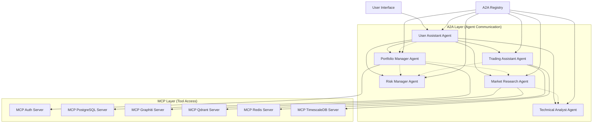

# StockPulse A2A Agents

## Overview

The StockPulse A2A (Agent-to-Agent) system implements Google's Agent-to-Agent protocol specification to provide intelligent, autonomous financial agents that can collaborate to deliver comprehensive portfolio management and market analysis services.

### 🚀 Key Features

- **Standards Compliant**: Full compliance with Google A2A protocol specification
- **Hybrid Architecture**: Combines A2A for agent collaboration with MCP for database access
- **Autonomous Agents**: 6 specialized financial intelligence agents
- **Real-time Collaboration**: Agents work together to solve complex financial problems
- **Production Ready**: Complete monitoring, logging, and error handling
- **Scalable Design**: Independent scaling and deployment of agents

## 🏗️ Architecture

### A2A + MCP Hybrid Design



### Agent Services

| Agent | Port | Specialization | MCP Dependencies |
|-------|------|----------------|------------------|
| **User Assistant** | 9001 | Orchestration, user interaction | auth, redis |
| **Portfolio Manager** | 9002 | Portfolio analysis, optimization | postgres, timescale, redis |
| **Market Researcher** | 9003 | Market analysis, news research | graphiti, qdrant, timescale |
| **Trading Assistant** | 9004 | Trade execution, order management | postgres, redis, timescale |
| **Risk Manager** | 9005 | Risk assessment, compliance | All MCP servers |
| **Technical Analyst** | 9006 | Technical analysis, signals | timescale, qdrant, redis |

### Infrastructure Services

| Service | Port | Purpose |
|---------|------|---------|
| **A2A Registry** | 9000 | Agent discovery, health monitoring |
| **A2A Gateway** | 9100 | Routing, authentication, rate limiting |

## 🛠️ Installation & Setup

### Prerequisites

- Docker and Docker Compose
- Python 3.11+
- Access to MCP servers (see `../mcp-servers/`)

### Quick Start

1. **Clone and navigate to A2A agents directory:**
   ```bash
   cd StockPulse/a2a-agents
   ```

2. **Install Python dependencies:**
   ```bash
   pip install -r requirements.txt
   ```

3. **Start MCP servers first** (if not already running):
   ```bash
   cd ../mcp-servers
   docker-compose -f docker-compose.mcp.yml up -d
   ```

4. **Start A2A agents:**
   ```bash
   docker-compose -f docker-compose.a2a.yml up -d
   ```

5. **Verify all agents are running:**
   ```bash
   curl http://localhost:9000/health
   ```

### Environment Configuration

Create `.env` file in the `a2a-agents/` directory:

```bash
# JWT Configuration
JWT_SECRET_KEY=your_jwt_secret_key_here

# Registry Configuration
REGISTRY_HOST=0.0.0.0
REGISTRY_PORT=9000
HEALTH_CHECK_INTERVAL=30

# Agent Configuration
LOG_LEVEL=info
AGENT_TIMEOUT=10.0

# MCP Server URLs
MCP_AUTH_URL=http://localhost:8002
MCP_POSTGRES_URL=http://localhost:8003
MCP_TIMESCALE_URL=http://localhost:8004
MCP_REDIS_URL=http://localhost:8005
MCP_GRAPHITI_URL=http://localhost:8006
MCP_QDRANT_URL=http://localhost:8007
```

## 📖 Usage Guide

### 1. Agent Discovery

List all available agents:
```bash
curl http://localhost:9000/agents
```

Get agent capabilities:
```bash
curl http://localhost:9000/agents/user-assistant/card
```

List all skills across agents:
```bash
curl http://localhost:9000/skills
```

### 2. Communicating with Agents

#### JSON-RPC 2.0 Request Format

```bash
curl -X POST http://localhost:9001/jsonrpc \
  -H "Content-Type: application/json" \
  -d '{
    "jsonrpc": "2.0",
    "method": "tasks/send",
    "params": {
      "skill_id": "user_interaction",
      "input": {
        "text": "How is my portfolio performing?",
        "mode": "text"
      }
    },
    "id": "1"
  }'
```

#### Response Format

```json
{
  "jsonrpc": "2.0",
  "result": {
    "task_id": "uuid-here",
    "status": "submitted"
  },
  "id": "1"
}
```

### 3. Task Management

#### Get Task Status
```bash
curl -X POST http://localhost:9001/jsonrpc \
  -H "Content-Type: application/json" \
  -d '{
    "jsonrpc": "2.0",
    "method": "tasks/get",
    "params": {
      "task_id": "uuid-here"
    },
    "id": "2"
  }'
```

#### Stream Task Updates (SSE)
```bash
curl http://localhost:9001/tasks/uuid-here/stream
```

#### Cancel Task
```bash
curl -X POST http://localhost:9001/jsonrpc \
  -H "Content-Type: application/json" \
  -d '{
    "jsonrpc": "2.0",
    "method": "tasks/cancel",
    "params": {
      "task_id": "uuid-here"
    },
    "id": "3"
  }'
```

### 4. Agent-Specific Examples

#### Portfolio Analysis
```bash
curl -X POST http://localhost:9002/jsonrpc \
  -H "Content-Type: application/json" \
  -d '{
    "jsonrpc": "2.0",
    "method": "tasks/send",
    "params": {
      "skill_id": "portfolio_analysis",
      "input": {
        "data": {
          "user_id": "user123",
          "timeframe": "3M",
          "include_benchmarks": true
        },
        "mode": "data"
      }
    },
    "id": "1"
  }'
```

#### Market Research
```bash
curl -X POST http://localhost:9003/jsonrpc \
  -H "Content-Type: application/json" \
  -d '{
    "jsonrpc": "2.0",
    "method": "tasks/send",
    "params": {
      "skill_id": "market_analysis",
      "input": {
        "text": "What are the current market trends in technology sector?",
        "mode": "text"
      }
    },
    "id": "1"
  }'
```

#### Trade Execution
```bash
curl -X POST http://localhost:9004/jsonrpc \
  -H "Content-Type: application/json" \
  -d '{
    "jsonrpc": "2.0",
    "method": "tasks/send",
    "params": {
      "skill_id": "trade_execution",
      "input": {
        "data": {
          "symbol": "AAPL",
          "action": "buy",
          "quantity": 100,
          "order_type": "market"
        },
        "mode": "data"
      }
    },
    "id": "1"
  }'
```

## 🔧 Development

### Project Structure

```
a2a-agents/
├── shared/                    # Shared A2A framework
│   └── a2a_framework.py      # Core A2A implementation
├── user-assistant/           # User Assistant Agent
│   ├── server.py            # Main agent implementation
│   └── Dockerfile           # Container configuration
├── portfolio-manager/        # Portfolio Manager Agent
│   ├── server.py            # Agent implementation
│   └── Dockerfile
├── market-researcher/        # Market Research Agent
├── trading-assistant/        # Trading Assistant Agent
├── risk-manager/            # Risk Manager Agent
├── technical-analyst/       # Technical Analyst Agent
├── registry/                # A2A Registry Service
│   ├── server.py            # Registry implementation
│   └── Dockerfile
├── gateway/                 # A2A Gateway Service
├── client-example/          # Example client implementation
├── docker-compose.a2a.yml   # Docker orchestration
├── requirements.txt         # Python dependencies
└── README.md               # This file
```

### Creating a New Agent

1. **Create agent directory:**
   ```bash
   mkdir my-new-agent
   cd my-new-agent
   ```

2. **Implement agent using A2A framework:**
   ```python
   from a2a_framework import A2AAgent, A2ASkill, A2AProvider
   
   class MyNewAgent(A2AAgent):
       def __init__(self):
           super().__init__(
               name="My New Agent",
               description="Description of agent capabilities",
               port=9007
           )
       
       def get_provider(self) -> A2AProvider:
           return A2AProvider(
               organization="StockPulse",
               website="https://stockpulse.ai"
           )
       
       def register_skills(self) -> List[A2ASkill]:
           return [
               A2ASkill(
                   id="my_skill",
                   name="My Skill",
                   description="What this skill does",
                   tags=["category"],
                   examples=["Example usage"]
               )
           ]
       
       async def execute_skill(self, skill_id: str, task: A2ATask) -> A2ATaskOutput:
           # Implement skill logic
           pass
   ```

3. **Add to Docker Compose:**
   ```yaml
   my-new-agent:
     build:
       context: .
       dockerfile: my-new-agent/Dockerfile
     ports:
       - "9007:9007"
     environment:
       - AGENT_PORT=9007
     networks:
       - a2a-network
   ```

### Testing

#### Unit Tests
```bash
cd shared/
python -m pytest tests/
```

#### Integration Tests
```bash
# Start all services
docker-compose -f docker-compose.a2a.yml up -d

# Run integration tests
python -m pytest tests/integration/
```

#### Load Testing
```bash
# Test agent performance
ab -n 1000 -c 10 -H "Content-Type: application/json" \
   -p test_request.json http://localhost:9001/jsonrpc
```

## 📊 Monitoring & Observability

### Health Monitoring

#### Overall System Health
```bash
curl http://localhost:9000/health
```

#### Individual Agent Health
```bash
curl http://localhost:9001/health  # User Assistant
curl http://localhost:9002/health  # Portfolio Manager
# ... etc for all agents
```

### Metrics & Logging

#### View Agent Logs
```bash
docker logs stockpulse-a2a-user-assistant
docker logs stockpulse-a2a-portfolio-manager
```

#### Registry Logs
```bash
docker logs stockpulse-a2a-registry
```

#### Task Performance Metrics
```bash
# Get task statistics from registry
curl http://localhost:9000/agents/user-assistant | jq '.recent_health_checks'
```

### Grafana Dashboards

Key metrics to monitor:
- Agent response times
- Task completion rates
- Error rates by agent
- A2A communication latency
- MCP tool usage statistics

## 🔒 Security

### Authentication

A2A agents support multiple authentication schemes:
- **Bearer tokens** (JWT)
- **OAuth2**
- **API keys**

### Rate Limiting

The A2A Gateway provides:
- Request rate limiting (100 req/min default)
- Burst protection
- Circuit breaker patterns

### Network Security

- **Internal communication**: A2A agents communicate within private Docker network
- **TLS encryption**: All external communication over HTTPS
- **mTLS**: Agent-to-agent communication in production

## 🚨 Troubleshooting

### Common Issues

#### 1. Agent Not Responding
```bash
# Check if agent is running
docker ps | grep a2a-user-assistant

# Check agent logs
docker logs stockpulse-a2a-user-assistant

# Check network connectivity
docker exec stockpulse-a2a-registry curl http://a2a-user-assistant:9001/health
```

#### 2. MCP Connection Issues
```bash
# Verify MCP servers are running
docker ps | grep mcp-

# Check MCP network connectivity
docker exec stockpulse-a2a-portfolio-manager curl http://mcp-postgres-server:8003/health
```

#### 3. Registry Discovery Problems
```bash
# Check registry status
curl http://localhost:9000/agents

# Manually register agent
curl -X POST http://localhost:9000/agents/register \
  -H "Content-Type: application/json" \
  -d '{
    "id": "portfolio-manager",
    "name": "Portfolio Manager",
    "url": "http://localhost:9002",
    "port": 9002
  }'
```

#### 4. Task Execution Failures
```bash
# Check task status
curl -X POST http://localhost:9001/jsonrpc \
  -H "Content-Type: application/json" \
  -d '{
    "jsonrpc": "2.0",
    "method": "tasks/get",
    "params": {"task_id": "task-uuid"},
    "id": "1"
  }'

# Review error logs
docker logs stockpulse-a2a-user-assistant | grep ERROR
```

### Performance Tuning

#### Agent Resources
```yaml
# In docker-compose.a2a.yml
services:
  a2a-user-assistant:
    deploy:
      resources:
        limits:
          memory: 512M
          cpus: '0.5'
        reservations:
          memory: 256M
          cpus: '0.25'
```

#### Database Connections
```python
# Optimize MCP client connections
await self.mcp.register_mcp_client(
    "postgres", 
    "http://localhost:8003",
    pool_size=10,
    max_overflow=20
)
```

## 📚 API Reference

### A2A Protocol Methods

| Method | Description | Parameters |
|--------|-------------|------------|
| `tasks/send` | Submit new task | `skill_id`, `input` |
| `tasks/get` | Get task status | `task_id` |
| `tasks/cancel` | Cancel running task | `task_id` |
| `tasks/sendSubscribe` | Submit with streaming | `skill_id`, `input` |

### Registry API

| Endpoint | Method | Description |
|----------|--------|-------------|
| `/agents` | GET | List all agents |
| `/agents/{id}` | GET | Get agent details |
| `/skills` | GET | List all skills |
| `/health` | GET | System health |
| `/agents/register` | POST | Register agent |
| `/agents/{id}/card` | GET | Get agent card |

### Agent Card Schema

```json
{
  "name": "Agent Name",
  "description": "Agent description",
  "version": "1.0.0",
  "provider": {
    "organization": "StockPulse",
    "website": "https://stockpulse.ai"
  },
  "url": "https://localhost:9001",
  "capabilities": {
    "streaming": true,
    "pushNotifications": true,
    "stateTransitionHistory": true
  },
  "skills": [
    {
      "id": "skill_id",
      "name": "Skill Name",
      "description": "What the skill does",
      "tags": ["category"],
      "examples": ["Usage examples"]
    }
  ]
}
```

## 🎯 Best Practices

### Agent Development
- **Single Responsibility**: Each agent focuses on specific domain
- **Async Operations**: Use async/await for all I/O operations
- **Error Handling**: Comprehensive error handling and logging
- **Resource Management**: Proper cleanup of connections and resources

### Task Design
- **Idempotent Operations**: Tasks should be safe to retry
- **Progress Tracking**: Update task progress for long-running operations
- **Timeout Handling**: Set appropriate timeouts for external calls
- **Result Caching**: Cache expensive computations when possible

### Communication Patterns
- **Agent Orchestration**: Use User Assistant for complex workflows
- **Direct Communication**: Direct agent-to-agent for simple requests
- **Streaming**: Use SSE for real-time updates
- **Batch Operations**: Group related operations for efficiency

## 🔄 CI/CD Integration

### GitHub Actions Workflow
```yaml
name: A2A Agents CI/CD
on:
  push:
    paths: ['a2a-agents/**']
  
jobs:
  test:
    runs-on: ubuntu-latest
    steps:
      - uses: actions/checkout@v3
      - name: Setup Python
        uses: actions/setup-python@v4
        with:
          python-version: '3.11'
      - name: Install dependencies
        run: |
          cd a2a-agents
          pip install -r requirements.txt
      - name: Run tests
        run: |
          cd a2a-agents
          python -m pytest tests/
      - name: Build and test containers
        run: |
          cd a2a-agents
          docker-compose -f docker-compose.a2a.yml build
          docker-compose -f docker-compose.a2a.yml up -d
          sleep 30
          curl -f http://localhost:9000/health
```

## 🚀 Production Deployment

### Kubernetes Deployment
```yaml
apiVersion: apps/v1
kind: Deployment
metadata:
  name: a2a-user-assistant
spec:
  replicas: 3
  selector:
    matchLabels:
      app: a2a-user-assistant
  template:
    metadata:
      labels:
        app: a2a-user-assistant
    spec:
      containers:
      - name: user-assistant
        image: stockpulse/a2a-user-assistant:latest
        ports:
        - containerPort: 9001
        env:
        - name: REGISTRY_URL
          value: "http://a2a-registry:9000"
        livenessProbe:
          httpGet:
            path: /health
            port: 9001
          initialDelaySeconds: 30
          periodSeconds: 10
```

### Load Balancing
```yaml
apiVersion: v1
kind: Service
metadata:
  name: a2a-user-assistant-service
spec:
  type: LoadBalancer
  ports:
  - port: 9001
    targetPort: 9001
  selector:
    app: a2a-user-assistant
```

---

## 📞 Support

For issues, questions, or contributions:

- **GitHub Issues**: [StockPulse Issues](https://github.com/stockpulse/issues)
- **Documentation**: [docs.stockpulse.ai](https://docs.stockpulse.ai)
- **Email**: support@stockpulse.ai

---

**🚀 StockPulse A2A Agents - Revolutionizing Financial Intelligence through Agent Collaboration** 🚀 