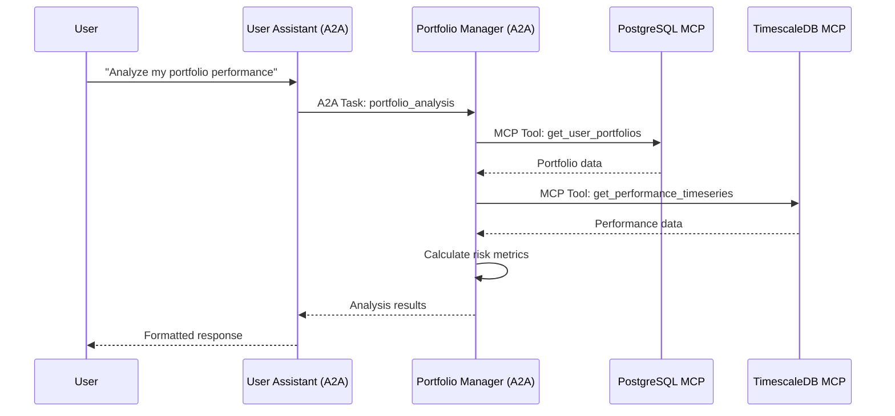

# StockPulse A2A + MCP Hybrid Architecture

## Overview

StockPulse implements a cutting-edge hybrid architecture combining **Agent-to-Agent (A2A) Protocol** for high-level agent collaboration with **Model Context Protocol (MCP)** for structured tool and resource access. This follows the [Google A2A + MCP complementary approach](https://google-a2a.github.io/A2A/topics/a2a-and-mcp/) where both protocols work together to create more powerful agentic systems.

## Architecture Principles

### A2A Protocol Layer (Agent Collaboration)

- **Purpose**: High-level agent-to-agent communication and collaboration
- **Use Cases**: Multi-agent workflows, agent discovery, task coordination
- **Communication**: JSON-RPC 2.0 over HTTP(S)
- **State Management**: Stateful, long-running conversations and tasks

### MCP Protocol Layer (Tool/Resource Access)

- **Purpose**: Structured access to tools, databases, and resources
- **Use Cases**: Database operations, API calls, specific tool invocations
- **Communication**: JSON-RPC 2.0 over HTTP(S)
- **State Management**: Stateless, function-oriented operations

### Hybrid Integration Benefits

1. **Cross-Protocol Interoperability**: A2A skills exposed as MCP tools
2. **Specialized Protocols**: Each protocol optimized for its specific use case
3. **Ecosystem Compatibility**: Works with both A2A and MCP ecosystems
4. **Future-Proof**: Standards-based approach following Google's vision

## Implementation Architecture

```mermaid
graph TB
    subgraph "Frontend Layer"
        FE[React Frontend<br/>Port 3000/5173]
    end

    subgraph "A2A Agent Layer (Collaboration)"
        UA[User Assistant Agent<br/>Port 9001<br/>4 Skills]
        PM[Portfolio Manager Agent<br/>Port 9002<br/>5 Skills]
        AR[A2A Registry<br/>Port 9000]

        UA ↔|"A2A Protocol"| PM
        UA ↔|"A2A Discovery"| AR
        PM ↔|"A2A Discovery"| AR
    end

    subgraph "Backend Services Layer"
        BE[FastAPI Backend<br/>Port 8000]
    end

    subgraph "MCP Server Layer (Tools/Resources)"
        MCP1[PostgreSQL MCP<br/>Port 8003]
        MCP2[TimescaleDB MCP<br/>Port 8004]
        MCP3[Redis MCP<br/>Port 8005]
        MCP4[Auth MCP<br/>Port 8002]
        MCP5[Graphiti MCP<br/>Port 8006]
        MCP6[Qdrant MCP<br/>Port 8007]
        MCP7[MCP Registry<br/>Port 8001]
    end

    subgraph "Database Layer"
        PG[(PostgreSQL<br/>Port 5432)]
        TS[(TimescaleDB<br/>Port 5433)]
        RD[(Redis<br/>Port 6379)]
        N4[(Neo4j<br/>Port 7474/7687)]
        QD[(Qdrant<br/>Port 6333)]
    end

    subgraph "Hybrid Integration"
        HYBRID[A2A Skills as MCP Tools<br/>Cross-Protocol Bridge]
    end

    FE --> BE
    FE -.->|"Direct A2A Calls"| UA

    UA -.->|"MCP Tool Calls"| MCP3
    UA -.->|"MCP Tool Calls"| MCP4
    PM -.->|"MCP Tool Calls"| MCP1
    PM -.->|"MCP Tool Calls"| MCP2
    PM -.->|"MCP Tool Calls"| MCP5

    UA -->|"Expose Skills"| HYBRID
    PM -->|"Expose Skills"| HYBRID

    MCP1 --> PG
    MCP2 --> TS
    MCP3 --> RD
    MCP4 --> PG
    MCP5 --> N4
    MCP6 --> QD
```

## A2A Agents

### User Assistant Agent (Port 9001)

**Role**: Main orchestrator and user interaction handler

**Skills**:

- `user_interaction` - Handle user requests and maintain conversation context
- `task_orchestration` - Coordinate complex workflows across multiple agents
- `multi_agent_coordination` - Manage agent collaboration and conflict resolution
- `session_management` - Track user sessions and preferences

**MCP Connections**:

- Auth MCP (8002) - User authentication and authorization
- Redis MCP (8005) - Session storage and caching
- PostgreSQL MCP (8003) - User data and preferences
- Graphiti MCP (8006) - Knowledge graph operations

### Portfolio Manager Agent (Port 9002)

**Role**: Specialized portfolio analysis and management

**Skills**:

- `portfolio_analysis` - Comprehensive portfolio performance analysis with risk metrics
- `performance_tracking` - Real-time portfolio monitoring and performance tracking
- `rebalancing_recommendations` - Portfolio optimization and rebalancing suggestions
- `position_management` - Track and manage individual holdings and positions
- `allocation_optimization` - Asset allocation strategy optimization and analysis

**MCP Connections**:

- PostgreSQL MCP (8003) - Portfolio and user data
- TimescaleDB MCP (8004) - Time-series performance data
- Redis MCP (8005) - Caching and real-time data
- Auth MCP (8002) - User verification
- Graphiti MCP (8006) - Investment knowledge graph

### A2A Registry Agent (Port 9000)

**Role**: Agent discovery and registration

**Features**:

- Agent discovery via Agent Cards at `/.well-known/agent.json`
- Dynamic agent registration and health monitoring
- Service mesh coordination

## MCP Servers

### Core MCP Servers

- **MCP Registry** (8001) - Central MCP server discovery
- **Auth MCP** (8002) - Authentication and authorization tools
- **PostgreSQL MCP** (8003) - Relational database operations
- **TimescaleDB MCP** (8004) - Time-series data operations
- **Redis MCP** (8005) - Caching and session tools
- **Graphiti MCP** (8006) - Knowledge graph operations
- **Qdrant MCP** (8007) - Vector database operations

### MCP Tool Categories

- **Database Tools**: CRUD operations, complex queries, transactions
- **Authentication Tools**: User verification, permission checks
- **Caching Tools**: Session management, data caching
- **Analytics Tools**: Time-series analysis, performance calculations
- **Knowledge Tools**: Graph traversal, semantic search

## Hybrid A2A+MCP Integration

### A2A Skills as MCP Tools

Each A2A skill is automatically exposed as an MCP tool with the `a2a_` prefix:

```json
{
  "name": "a2a_portfolio_analysis",
  "description": "Comprehensive portfolio performance analysis with risk metrics",
  "inputSchema": {
    "type": "object",
    "properties": {
      "user_id": { "type": "string", "required": true },
      "timeframe": {
        "type": "string",
        "enum": ["1D", "1W", "1M", "3M", "1Y", "ALL"]
      },
      "include_benchmarks": { "type": "boolean", "default": true }
    }
  }
}
```

### Cross-Protocol Communication

1. **A2A → MCP**: A2A agents call MCP tools for database/resource access
2. **MCP → A2A**: MCP clients can invoke A2A skills as tools
3. **Agent Discovery**: Both protocols support discovery mechanisms
4. **Unified Logging**: Structured logging across both protocols

### Example Workflow: Portfolio Analysis



## Configuration

### A2A Agent Configuration

```yaml
# a2a-agents/portfolio-manager/config.yml
agent:
  name: "Portfolio Manager"
  port: 9002
  base_url: "http://localhost:9002"

mcp_clients:
  postgres: "http://localhost:8003"
  timescale: "http://localhost:8004"
  redis: "http://localhost:8005"
  auth: "http://localhost:8002"
  graphiti: "http://localhost:8006"

skills:
  expose_as_mcp_tools: true
  mcp_port_offset: 1000 # MCP port = A2A port + 1000
```

### MCP Server Configuration

```yaml
# mcp-servers/postgres-server/config.yml
server:
  name: "PostgreSQL MCP Server"
  port: 8003

database:
  host: "localhost"
  port: 5432
  database: "stockpulse"

tools:
  - get_user_portfolios
  - get_user_trades
  - update_portfolio
  - get_market_data
```

## Development Workflow

### Starting the Hybrid Environment

```bash
# Start all services (databases, MCP servers, A2A agents)
docker-compose -f docker-compose.dev.yml up -d

# Verify A2A agents
curl http://localhost:9001/.well-known/agent.json  # User Assistant
curl http://localhost:9002/.well-known/agent.json  # Portfolio Manager

# Verify MCP capabilities
curl http://localhost:9001/mcp/capabilities  # User Assistant MCP
curl http://localhost:9002/mcp/capabilities  # Portfolio Manager MCP
```

### Testing A2A Communication

```bash
# Send A2A task to Portfolio Manager
curl -X POST http://localhost:9002/jsonrpc \
  -H "Content-Type: application/json" \
  -d '{
    "jsonrpc": "2.0",
    "method": "tasks/send",
    "params": {
      "skill_id": "portfolio_analysis",
      "input": {
        "data": {"user_id": "user123", "timeframe": "1M"},
        "mode": "data"
      }
    },
    "id": "1"
  }'
```

### Testing MCP Integration

```bash
# List MCP tools exposed by A2A agent
curl -X POST http://localhost:9002/mcp/jsonrpc \
  -H "Content-Type: application/json" \
  -d '{
    "jsonrpc": "2.0",
    "method": "tools/list",
    "id": "1"
  }'

# Call A2A skill via MCP
curl -X POST http://localhost:9002/mcp/jsonrpc \
  -H "Content-Type: application/json" \
  -d '{
    "jsonrpc": "2.0",
    "method": "tools/call",
    "params": {
      "name": "a2a_portfolio_analysis",
      "arguments": {"user_id": "user123", "timeframe": "1M"}
    },
    "id": "1"
  }'
```

## Security Implementation

### A2A Security

- **Authentication**: Bearer token authentication required
- **Authorization**: Skill-level permissions
- **Transport Security**: HTTPS in production
- **Rate Limiting**: Per-agent rate limits

### MCP Security

- **Tool Access Control**: Permission-based tool access
- **Data Validation**: Schema validation for all tool calls
- **Audit Logging**: All MCP operations logged
- **Connection Security**: Encrypted connections between services

### Cross-Protocol Security

- **Unified Auth**: Shared authentication across A2A and MCP
- **Permission Inheritance**: A2A permissions apply to MCP tool exposure
- **Audit Trail**: Complete operation tracking across both protocols

## Monitoring and Observability

### Metrics Collected

- **A2A Metrics**: Task completion rates, agent response times, skill usage
- **MCP Metrics**: Tool call frequencies, success rates, response times
- **Hybrid Metrics**: Cross-protocol operation success, integration health

### Logging Structure

```json
{
  "timestamp": "2025-05-30T08:11:30Z",
  "level": "info",
  "protocol": "a2a|mcp|hybrid",
  "agent": "portfolio-manager",
  "operation": "skill_execution|tool_call|cross_protocol",
  "details": {
    "skill_id": "portfolio_analysis",
    "task_id": "task-123",
    "mcp_calls": ["postgres.get_user_portfolios", "timescale.get_performance"]
  }
}
```

### Health Checks

- **A2A Health**: `GET /health` on each agent
- **MCP Health**: `GET /health` on each MCP server
- **Hybrid Health**: Cross-protocol connectivity checks
- **Integration Health**: End-to-end workflow verification

## Deployment

### Production Configuration

```yaml
# docker-compose.prod.yml
version: "3.8"
services:
  a2a-user-assistant:
    environment:
      - A2A_AUTH_REQUIRED=true
      - MCP_TLS_ENABLED=true
      - LOG_LEVEL=info

  a2a-portfolio-manager:
    environment:
      - A2A_AUTH_REQUIRED=true
      - MCP_TLS_ENABLED=true
      - LOG_LEVEL=info
```

### Scaling Considerations

- **A2A Agents**: Stateful, vertical scaling recommended
- **MCP Servers**: Stateless, horizontal scaling supported
- **Load Balancing**: Route A2A calls by agent type
- **Database Scaling**: Read replicas for MCP database operations

## Future Enhancements

### Planned A2A Features

- **Agent Clustering**: Multi-instance A2A agents with load balancing
- **Advanced Workflows**: Complex multi-agent orchestration patterns
- **Real-time Streaming**: Enhanced streaming capabilities for live data

### Planned MCP Features

- **Resource Support**: MCP resource queries in addition to tools
- **Prompt Templates**: MCP prompt template support
- **Advanced Caching**: Intelligent MCP response caching

### Hybrid Evolution

- **Dynamic Discovery**: Runtime discovery of new A2A agents and MCP servers
- **Protocol Bridging**: Seamless translation between A2A and MCP paradigms
- **Performance Optimization**: Intelligent routing and caching across protocols

## Troubleshooting

### Common Issues

1. **A2A Agent Not Responding**: Check agent health endpoint and logs
2. **MCP Tool Call Failures**: Verify MCP server connectivity and authentication
3. **Cross-Protocol Issues**: Check hybrid integration logs for protocol mismatches
4. **Performance Issues**: Monitor both A2A task queues and MCP response times

### Debug Commands

```bash
# Check A2A agent status
docker-compose -f docker-compose.dev.yml ps | grep a2a

# View A2A agent logs
docker-compose -f docker-compose.dev.yml logs a2a-portfolio-manager

# Check MCP server connectivity
curl http://localhost:8003/health  # PostgreSQL MCP

# Test hybrid integration
curl http://localhost:9002/mcp/capabilities
```

## References

- [Google A2A Protocol Specification](https://github.com/google-a2a/A2A)
- [A2A + MCP Integration Guide](https://google-a2a.github.io/A2A/topics/a2a-and-mcp/)
- [Model Context Protocol Documentation](https://modelcontextprotocol.io/)
- [StockPulse Architecture Documentation](../architecture.md)
