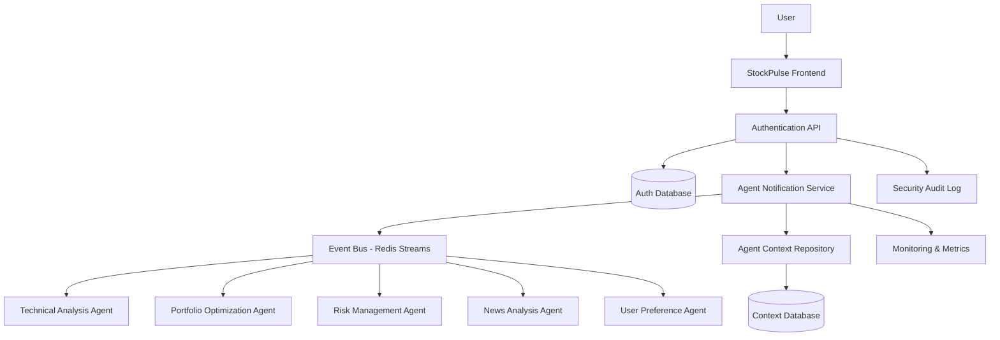
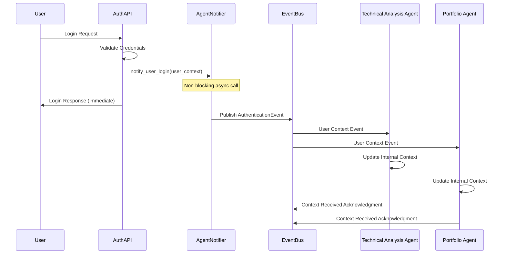
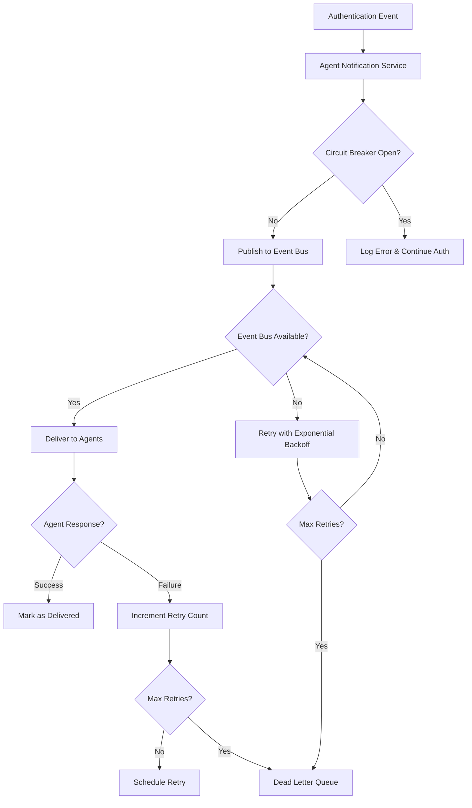

# StockPulse MCP Agent Integration Architecture
## Story 1.4: Authentication Event-Driven Agent Ecosystem

**Version:** 1.0  
**Date:** 2024-01-XX  
**Architect:** Timmy (AI Architect Agent)  
**Status:** Draft for Review

---

## Executive Summary

This architecture document defines the comprehensive integration of the Model Context Protocol (MCP) agent ecosystem with StockPulse's authentication system. The solution enables real-time agent notification and context propagation while maintaining authentication performance, security, and reliability through enterprise-grade patterns including circuit breakers, event-driven architecture, and comprehensive audit trails.

## 1. High-Level Architecture Overview

### 1.1 System Context



### 1.2 Architecture Principles

- **Non-Blocking Authentication:** Agent notifications never delay user authentication
- **Event-Driven Decoupling:** Loose coupling between auth system and agent ecosystem
- **Circuit Breaker Resilience:** Automatic failover and recovery mechanisms
- **Zero Trust Security:** Comprehensive validation at every boundary
- **Comprehensive Audit:** Full traceability for compliance and debugging
- **Horizontal Scalability:** Support for multiple concurrent users and agents

## 2. Component Architecture

### 2.1 Core Components

#### 2.1.1 Agent Notification Service
**Location:** `/services/backend/app/services/mcp/agent_notification_service.py`

```python
class AgentNotificationService:
    """Core orchestrator for agent communication and context management."""
    
    async def notify_user_login(self, user_context: UserContext) -> None
    async def notify_user_logout(self, user_id: str) -> None
    async def propagate_user_context(self, user_context: UserContext) -> None
    async def update_user_preferences(self, user_id: str, preferences: Dict) -> None
    async def validate_agent_permissions(self, user_id: str, agent_name: str) -> bool
```

**Key Features:**
- Async event publishing to Redis Streams
- Circuit breaker protection for agent communication
- Retry logic with exponential backoff
- Comprehensive error handling and logging
- Performance metrics collection

#### 2.1.2 Agent Context Repository
**Location:** `/services/backend/app/services/mcp/agent_context_repository.py`

```python
class AgentContextRepository:
    """Manages persistent storage and retrieval of user contexts for agents."""
    
    async def store_user_context(self, user_context: UserContext) -> None
    async def get_user_context(self, user_id: str) -> Optional[UserContext]
    async def update_user_context(self, user_id: str, updates: Dict) -> None
    async def delete_user_context(self, user_id: str) -> None
    async def get_agent_permissions(self, user_id: str, agent_name: str) -> Dict
```

#### 2.1.3 Agent Authentication Service
**Location:** `/services/backend/app/services/mcp/agent_authentication_service.py`

```python
class AgentAuthenticationService:
    """Handles secure agent authentication and permission validation."""
    
    async def authenticate_agent(self, agent_credentials: AgentCredentials) -> AgentSession
    async def validate_agent_session(self, session_token: str) -> Optional[AgentSession]
    async def create_agent_session(self, user_id: str, agent_name: str) -> AgentSession
    async def invalidate_agent_session(self, session_token: str) -> None
    async def verify_agent_permissions(self, user_id: str, agent_name: str, action: str) -> bool
```

#### 2.1.4 Event Bus Service
**Location:** `/services/backend/app/services/mcp/event_bus_service.py`

```python
class EventBusService:
    """Manages async event publishing and consumption via Redis Streams."""
    
    async def publish_authentication_event(self, event: AuthenticationEvent) -> None
    async def publish_context_update_event(self, event: ContextUpdateEvent) -> None
    async def subscribe_to_agent_events(self, agent_name: str, callback: Callable) -> None
    async def get_event_stream_stats(self) -> Dict[str, Any]
```

### 2.2 Data Models

#### 2.2.1 User Context Model
**Location:** `/services/backend/app/models/mcp/user_context.py`

```python
class UserContext(BaseModel):
    user_id: str
    email: str
    is_active: bool
    preferences: UserPreferences
    portfolio_settings: PortfolioSettings
    active_strategies: List[str]
    risk_profile: RiskProfile
    agent_permissions: Dict[str, AgentPermissionLevel]
    session_id: str
    created_at: datetime
    last_updated: datetime
    
class UserPreferences(BaseModel):
    trading_style: str  # "conservative", "moderate", "aggressive"
    sectors_of_interest: List[str]
    notification_settings: Dict[str, bool]
    timezone: str
    
class PortfolioSettings(BaseModel):
    total_portfolio_value: Decimal
    available_cash: Decimal
    position_limits: Dict[str, Decimal]
    rebalancing_frequency: str
    
class RiskProfile(BaseModel):
    risk_tolerance: str  # "low", "medium", "high"
    max_position_size: Decimal
    stop_loss_percentage: Decimal
    diversification_requirements: Dict[str, Any]
```

#### 2.2.2 Agent Session Model
**Location:** `/services/backend/app/models/mcp/agent_session.py`

```python
class AgentSession(BaseModel):
    id: str
    user_id: str
    agent_name: str
    session_token: str
    permissions: List[str]
    created_at: datetime
    expires_at: datetime
    last_accessed: datetime
    ip_address: str
    is_active: bool
```

#### 2.2.3 Authentication Event Model
**Location:** `/services/backend/app/models/mcp/authentication_event.py`

```python
class AuthenticationEvent(BaseModel):
    event_id: str
    event_type: str  # "user_login", "user_logout", "context_update"
    user_id: str
    user_context: Optional[UserContext]
    timestamp: datetime
    session_info: Dict[str, Any]
    correlation_id: str
    
class AgentNotificationEvent(BaseModel):
    event_id: str
    target_agent: str
    user_id: str
    event_type: str
    payload: Dict[str, Any]
    created_at: datetime
    processed_at: Optional[datetime]
    status: str  # "pending", "delivered", "failed", "retry"
    error_message: Optional[str]
    retry_count: int
```

## 3. Integration Points

### 3.1 Authentication API Integration

#### 3.1.1 Login Endpoint Enhancement
**File:** `/services/backend/app/api/v1/auth.py`

```python
@router.post("/login", response_model=LoginResponse)
async def login(
    request: Request, 
    response: Response, 
    credentials: LoginRequest,
    db: AsyncSession = Depends(get_db),
    agent_notifier: AgentNotificationService = Depends(get_agent_notifier)
):
    # ... existing authentication logic ...
    
    # Create enhanced user context for agents
    user_context = await create_enhanced_user_context(user, db)
    
    # Notify agents (non-blocking)
    asyncio.create_task(
        agent_notifier.notify_user_login(user_context)
    )
    
    return LoginResponse(...)
```

#### 3.1.2 Logout Endpoint Enhancement
```python
@router.post("/logout")
async def logout(
    request: Request,
    response: Response,
    current_user: dict = Depends(get_current_user),
    agent_notifier: AgentNotificationService = Depends(get_agent_notifier)
):
    user_id = current_user["sub"]
    
    # ... existing logout logic ...
    
    # Notify agents to clear contexts (non-blocking)
    asyncio.create_task(
        agent_notifier.notify_user_logout(user_id)
    )
    
    return {"message": "Logout successful"}
```

### 3.2 MCP Agent Registration

#### 3.2.1 Agent Registry
**Location:** `/services/backend/app/services/mcp/agent_registry.py`

```python
class AgentRegistry:
    """Manages registration and discovery of available agents."""
    
    REGISTERED_AGENTS = {
        "technical_analysis": {
            "name": "Technical Analysis Agent",
            "endpoint": "http://localhost:8003",
            "capabilities": ["chart_analysis", "technical_indicators", "pattern_recognition"],
            "required_permissions": ["read_market_data", "access_user_preferences"]
        },
        "portfolio_optimization": {
            "name": "Portfolio Optimization Agent", 
            "endpoint": "http://localhost:8004",
            "capabilities": ["portfolio_rebalancing", "asset_allocation", "risk_assessment"],
            "required_permissions": ["read_portfolio", "read_risk_profile"]
        },
        "risk_management": {
            "name": "Risk Management Agent",
            "endpoint": "http://localhost:8005", 
            "capabilities": ["risk_monitoring", "position_sizing", "stop_loss_management"],
            "required_permissions": ["read_positions", "read_risk_profile", "send_alerts"]
        },
        "news_analysis": {
            "name": "News Analysis Agent",
            "endpoint": "http://localhost:8006",
            "capabilities": ["sentiment_analysis", "news_filtering", "impact_assessment"],
            "required_permissions": ["read_user_preferences", "access_news_feeds"]
        },
        "user_preference": {
            "name": "User Preference Agent",
            "endpoint": "http://localhost:8007",
            "capabilities": ["preference_learning", "behavior_analysis", "personalization"],
            "required_permissions": ["read_user_data", "update_preferences"]
        }
    }
```

## 4. Security Architecture

### 4.1 Agent Authentication Framework

#### 4.1.1 Agent Credential Management
```python
class AgentCredentials(BaseModel):
    agent_name: str
    api_key: str
    client_secret: str
    requested_permissions: List[str]
    
class AgentPermissionLevel(Enum):
    READ_ONLY = "read_only"
    READ_WRITE = "read_write"
    ADMIN = "admin"
    RESTRICTED = "restricted"
```

#### 4.1.2 Permission Validation Matrix
```python
AGENT_PERMISSION_MATRIX = {
    "technical_analysis": {
        "required_permissions": ["read_market_data", "read_user_preferences"],
        "optional_permissions": ["write_analysis_results"],
        "restricted_actions": ["modify_portfolio", "execute_trades"]
    },
    "portfolio_optimization": {
        "required_permissions": ["read_portfolio", "read_risk_profile"],
        "optional_permissions": ["suggest_rebalancing"],
        "restricted_actions": ["execute_trades"]
    },
    # ... other agents
}
```

### 4.2 Security Middleware

#### 4.2.1 Agent Authentication Middleware
**Location:** `/services/backend/app/middleware/agent_auth_middleware.py`

```python
class AgentAuthenticationMiddleware:
    """Validates agent requests and enforces permissions."""
    
    async def __call__(self, request: Request, call_next):
        if request.url.path.startswith("/api/v1/agents/"):
            agent_token = request.headers.get("X-Agent-Authorization")
            if not agent_token:
                raise HTTPException(401, "Agent authentication required")
                
            agent_session = await self.validate_agent_token(agent_token)
            if not agent_session:
                raise HTTPException(401, "Invalid agent token")
                
            request.state.agent_session = agent_session
            
        response = await call_next(request)
        return response
```

## 5. Event Flow Architecture

### 5.1 Authentication Event Flow



### 5.2 Error Handling Flow



## 6. Resilience and Error Handling

### 6.1 Circuit Breaker Implementation

```python
from circuitbreaker import circuit

class AgentNotificationService:
    @circuit(failure_threshold=5, recovery_timeout=30, expected_exception=Exception)
    async def notify_single_agent(self, agent_name: str, event: AuthenticationEvent):
        """Notify individual agent with circuit breaker protection."""
        try:
            agent_config = AgentRegistry.get_agent_config(agent_name)
            async with httpx.AsyncClient(timeout=5.0) as client:
                response = await client.post(
                    f"{agent_config['endpoint']}/context/update",
                    json=event.dict(),
                    headers={"Authorization": f"Bearer {self.get_agent_token(agent_name)}"}
                )
                response.raise_for_status()
                
        except Exception as e:
            logger.error(f"Agent notification failed", agent=agent_name, error=str(e))
            await self.record_notification_failure(agent_name, event, str(e))
            raise
```

### 6.2 Retry Logic with Exponential Backoff

```python
class RetryableNotificationService:
    async def notify_with_retry(self, agent_name: str, event: AuthenticationEvent, max_retries: int = 3):
        """Retry agent notification with exponential backoff."""
        for attempt in range(max_retries + 1):
            try:
                await self.notify_single_agent(agent_name, event)
                return True
                
            except Exception as e:
                if attempt == max_retries:
                    await self.send_to_dead_letter_queue(agent_name, event, str(e))
                    return False
                    
                wait_time = 2 ** attempt + random.uniform(0, 1)
                await asyncio.sleep(wait_time)
                
        return False
```

## 7. Monitoring and Observability

### 7.1 Metrics Collection

```python
from prometheus_client import Counter, Histogram, Gauge

# Authentication metrics
auth_events_total = Counter('auth_events_total', 'Total authentication events', ['event_type'])
auth_duration = Histogram('auth_duration_seconds', 'Authentication request duration')
active_user_sessions = Gauge('active_user_sessions', 'Number of active user sessions')

# Agent notification metrics  
agent_notifications_total = Counter('agent_notifications_total', 'Total agent notifications', ['agent', 'status'])
agent_notification_duration = Histogram('agent_notification_duration_seconds', 'Agent notification duration', ['agent'])
circuit_breaker_state = Gauge('circuit_breaker_state', 'Circuit breaker state', ['agent'])
```

### 7.2 Structured Logging

```python
import structlog

logger = structlog.get_logger()

# Authentication event logging
await logger.ainfo(
    "user_authentication_completed",
    user_id=user.id,
    email=user.email,
    agent_notifications_triggered=len(target_agents),
    authentication_duration_ms=duration_ms,
    correlation_id=correlation_id
)

# Agent notification logging
await logger.ainfo(
    "agent_notification_sent",
    agent_name=agent_name,
    user_id=user_id,
    event_type=event.event_type,
    notification_duration_ms=notification_duration,
    success=success,
    correlation_id=correlation_id
)
```

## 8. Testing Strategy

### 8.1 Test Structure
```
tests/story-1.4/
├── unit/
│   ├── test_agent_notification_service.py
│   ├── test_agent_context_repository.py
│   ├── test_agent_authentication_service.py
│   └── test_event_bus_service.py
├── integration/
│   ├── test_auth_mcp_integration.py
│   ├── test_agent_workflow_end_to_end.py
│   └── test_circuit_breaker_behavior.py
├── performance/
│   ├── test_authentication_latency.py
│   └── test_concurrent_user_load.py
├── security/
│   ├── test_agent_permissions.py
│   └── test_context_isolation.py
├── fixtures/
│   ├── mock_agents.py
│   ├── test_user_contexts.py
│   └── event_bus_fixtures.py
└── utils/
    ├── mcp_test_helpers.py
    └── performance_test_utils.py
```

### 8.2 Key Test Scenarios

#### 8.2.1 Unit Tests
```python
# test_agent_notification_service.py
class TestAgentNotificationService:
    async def test_notify_user_login_success(self):
        """Test successful user login notification to all agents."""
        
    async def test_notify_user_login_with_agent_failure(self):
        """Test graceful handling of individual agent failures."""
        
    async def test_circuit_breaker_activation(self):
        """Test circuit breaker opens after repeated failures."""
        
    async def test_retry_logic_with_exponential_backoff(self):
        """Test retry mechanism works correctly."""
```

#### 8.2.2 Integration Tests
```python
# test_auth_mcp_integration.py
class TestAuthMCPIntegration:
    async def test_complete_authentication_flow(self):
        """Test end-to-end authentication with agent notifications."""
        
    async def test_logout_clears_agent_contexts(self):
        """Test logout properly notifies agents to clear contexts."""
        
    async def test_preference_update_propagation(self):
        """Test user preference changes propagate to relevant agents."""
```

#### 8.2.3 Performance Tests
```python
# test_authentication_latency.py
class TestAuthenticationPerformance:
    async def test_auth_latency_under_load(self):
        """Ensure auth latency remains under 200ms with agent notifications."""
        
    async def test_concurrent_user_authentication(self):
        """Test system performance with multiple concurrent logins."""
```

## 9. Configuration Management

### 9.1 Environment Variables

```python
# Agent configuration
MCP_AGENT_NOTIFICATION_ENABLED = "true"
MCP_CIRCUIT_BREAKER_FAILURE_THRESHOLD = "5"
MCP_CIRCUIT_BREAKER_RECOVERY_TIMEOUT = "30"
MCP_NOTIFICATION_TIMEOUT = "5.0"
MCP_MAX_RETRY_ATTEMPTS = "3"

# Agent endpoints
TECHNICAL_ANALYSIS_AGENT_ENDPOINT = "http://localhost:8003"
PORTFOLIO_OPTIMIZATION_AGENT_ENDPOINT = "http://localhost:8004"
RISK_MANAGEMENT_AGENT_ENDPOINT = "http://localhost:8005"
NEWS_ANALYSIS_AGENT_ENDPOINT = "http://localhost:8006"
USER_PREFERENCE_AGENT_ENDPOINT = "http://localhost:8007"

# Redis Event Bus
REDIS_STREAMS_ENABLED = "true"
REDIS_STREAM_MAX_LENGTH = "10000"
REDIS_CONSUMER_GROUP = "stockpulse_agents"

# Security
AGENT_JWT_SECRET_KEY = "agent_jwt_secret_key"
AGENT_TOKEN_EXPIRE_MINUTES = "60"
```

### 9.2 Feature Flags

```python
class FeatureFlags:
    MCP_AGENT_NOTIFICATIONS = "mcp_agent_notifications"
    CIRCUIT_BREAKER_ENABLED = "circuit_breaker_enabled"
    ADVANCED_AGENT_PERMISSIONS = "advanced_agent_permissions"
    AGENT_PERFORMANCE_MONITORING = "agent_performance_monitoring"
    
# Usage
if feature_flags.is_enabled(FeatureFlags.MCP_AGENT_NOTIFICATIONS):
    await agent_notifier.notify_user_login(user_context)
```

## 10. Deployment Strategy

### 10.1 Phase 1: Core Infrastructure (Sprint 3)
- **Scope:** Basic MCP integration and agent notification service
- **Components:**
  - AgentNotificationService with basic functionality
  - UserContext model and repository
  - Event bus integration (Redis Streams)
  - Basic agent registration and discovery

### 10.2 Phase 2: Security and Resilience (Sprint 4)
- **Scope:** Production-ready security and error handling
- **Components:**
  - Agent authentication framework
  - Circuit breaker implementation
  - Comprehensive error handling and retry logic
  - Security middleware and permission validation

### 10.3 Phase 3: Advanced Features (Sprint 5)
- **Scope:** Monitoring, optimization, and admin tools
- **Components:**
  - Complete monitoring and alerting system
  - Performance optimization
  - Admin APIs for context management
  - Advanced agent permission management

## 11. Implementation Dependencies

### 11.1 Required Python Packages

```python
# requirements-mcp.txt
fastapi-mcp==0.3.0
circuitbreaker==1.4.0
redis==4.5.0
httpx==0.24.0
prometheus-client==0.16.0
structlog==22.3.0
opentelemetry-api==1.17.0
opentelemetry-instrumentation-fastapi==0.38b0
pydantic==1.10.7
```

### 11.2 Database Migrations

```sql
-- 001_create_agent_tables.sql
CREATE TABLE agent_sessions (
    id UUID PRIMARY KEY DEFAULT gen_random_uuid(),
    user_id UUID NOT NULL REFERENCES users(id),
    agent_name VARCHAR(100) NOT NULL,
    session_token VARCHAR(255) NOT NULL UNIQUE,
    permissions JSONB NOT NULL DEFAULT '[]',
    created_at TIMESTAMP WITH TIME ZONE DEFAULT NOW(),
    expires_at TIMESTAMP WITH TIME ZONE NOT NULL,
    last_accessed TIMESTAMP WITH TIME ZONE DEFAULT NOW(),
    ip_address INET,
    is_active BOOLEAN DEFAULT TRUE
);

CREATE TABLE user_contexts (
    id UUID PRIMARY KEY DEFAULT gen_random_uuid(),
    user_id UUID NOT NULL REFERENCES users(id) UNIQUE,
    context_data JSONB NOT NULL,
    created_at TIMESTAMP WITH TIME ZONE DEFAULT NOW(),
    updated_at TIMESTAMP WITH TIME ZONE DEFAULT NOW()
);

CREATE TABLE authentication_events (
    id UUID PRIMARY KEY DEFAULT gen_random_uuid(),
    event_type VARCHAR(50) NOT NULL,
    user_id UUID NOT NULL REFERENCES users(id),
    event_data JSONB NOT NULL,
    correlation_id UUID NOT NULL,
    created_at TIMESTAMP WITH TIME ZONE DEFAULT NOW()
);

CREATE INDEX idx_agent_sessions_user_id ON agent_sessions(user_id);
CREATE INDEX idx_agent_sessions_token ON agent_sessions(session_token);
CREATE INDEX idx_user_contexts_user_id ON user_contexts(user_id);
CREATE INDEX idx_auth_events_user_id ON authentication_events(user_id);
CREATE INDEX idx_auth_events_correlation_id ON authentication_events(correlation_id);
```

## 12. Risk Mitigation

### 12.1 Technical Risks

| Risk | Impact | Probability | Mitigation |
|------|--------|-------------|------------|
| Agent communication failures blocking auth | High | Medium | Circuit breaker, async notifications |
| Performance degradation under load | High | Low | Performance testing, monitoring |
| Security vulnerabilities in agent auth | High | Low | Comprehensive security testing |
| Event bus failures | Medium | Low | Retry logic, dead letter queues |
| Agent context inconsistency | Medium | Medium | Eventual consistency patterns |

### 12.2 Operational Risks

| Risk | Impact | Probability | Mitigation |
|------|--------|-------------|------------|
| Complex deployment coordination | Medium | Medium | Phased rollout, feature flags |
| Monitoring blind spots | Medium | Medium | Comprehensive observability |
| Debugging complexity | Low | High | Structured logging, correlation IDs |

## 13. Success Criteria

### 13.1 Performance Metrics
- **Authentication Latency:** < 200ms (95th percentile) with agent notifications
- **Agent Notification Success Rate:** > 99.5%
- **System Availability:** > 99.9% uptime
- **Circuit Breaker Recovery Time:** < 30 seconds

### 13.2 Security Metrics
- **Zero Authentication Bypasses:** No unauthorized access
- **Agent Permission Violations:** Zero unauthorized agent actions
- **Audit Trail Completeness:** 100% of events logged

### 13.3 Functional Metrics
- **User Context Accuracy:** 100% correct user context propagation
- **Agent Ecosystem Health:** All agents receive user contexts within 5 seconds
- **Preference Update Propagation:** < 1 second for preference changes

## 14. Appendices

### 14.1 Agent Integration Contracts

#### 14.1.1 User Context Event Schema
```json
{
  "event_type": "user_authenticated",
  "event_id": "evt_123456",
  "correlation_id": "corr_789012",
  "timestamp": "2024-01-15T10:30:00Z",
  "user_context": {
    "user_id": "usr_345678",
    "email": "trader@example.com",
    "preferences": {
      "trading_style": "moderate",
      "sectors_of_interest": ["technology", "healthcare"],
      "notification_settings": {
        "email_alerts": true,
        "push_notifications": false
      }
    },
    "portfolio_settings": {
      "total_portfolio_value": "50000.00",
      "available_cash": "5000.00",
      "position_limits": {
        "max_single_position": "5000.00",
        "max_sector_exposure": "15000.00"
      }
    },
    "risk_profile": {
      "risk_tolerance": "medium",
      "max_position_size": "2500.00",
      "stop_loss_percentage": "5.0"
    }
  }
}
```

### 14.2 Monitoring Dashboard Requirements

#### 14.2.1 Authentication Health Dashboard
- Active user sessions count
- Authentication success/failure rates
- Average authentication latency
- Agent notification success rates by agent
- Circuit breaker states for all agents

#### 14.2.2 Agent Ecosystem Dashboard  
- Agent health status
- Event bus message throughput
- Context propagation latency
- Error rates by agent and operation
- Resource utilization metrics

---

**End of Architecture Document**

**Next Steps:**
1. Review and approve this comprehensive architecture
2. Begin Phase 1 implementation (Core Infrastructure)
3. Set up monitoring and testing infrastructure
4. Coordinate with agent development teams for integration points

**Questions for Review:**
1. Are there any additional agents that should be included in the initial scope?
2. Do the security requirements meet your compliance needs?
3. Are the performance targets appropriate for your expected user load?
4. Should we include any additional monitoring or alerting requirements? 