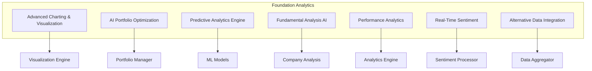
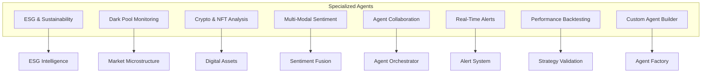
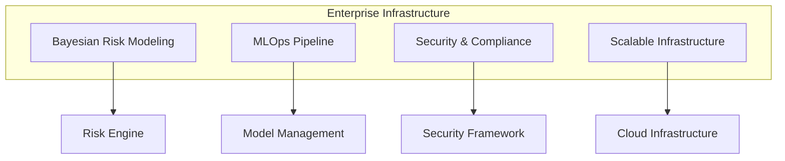
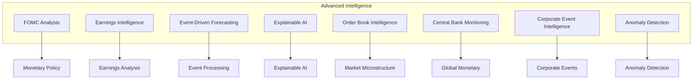
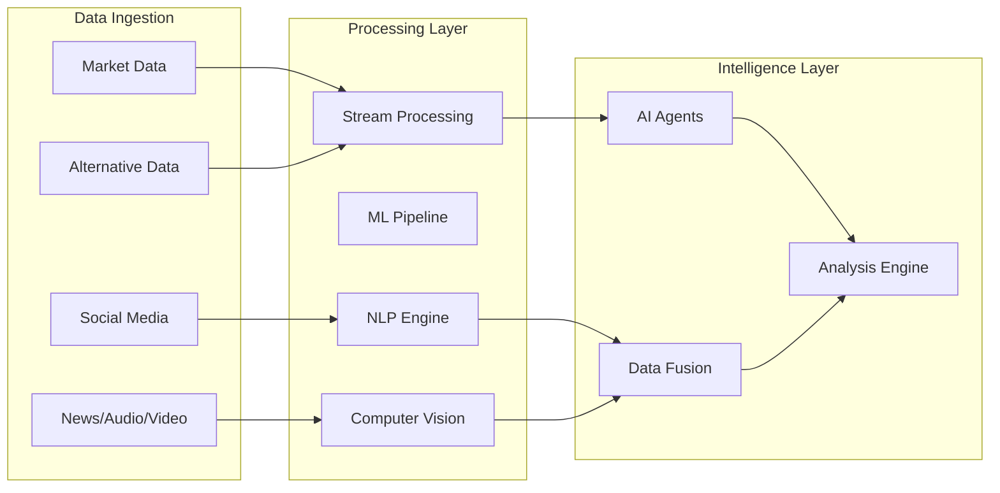
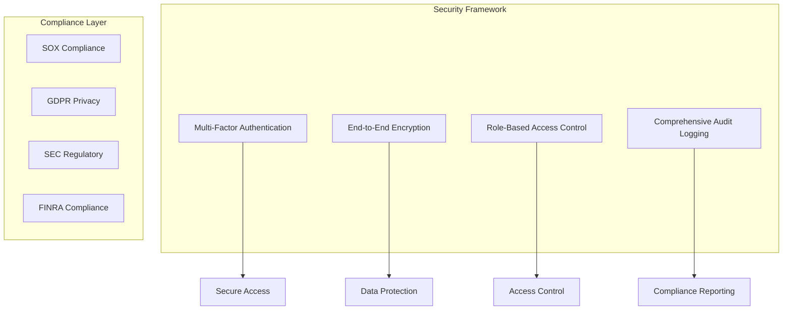
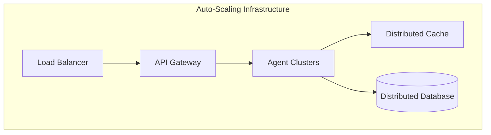
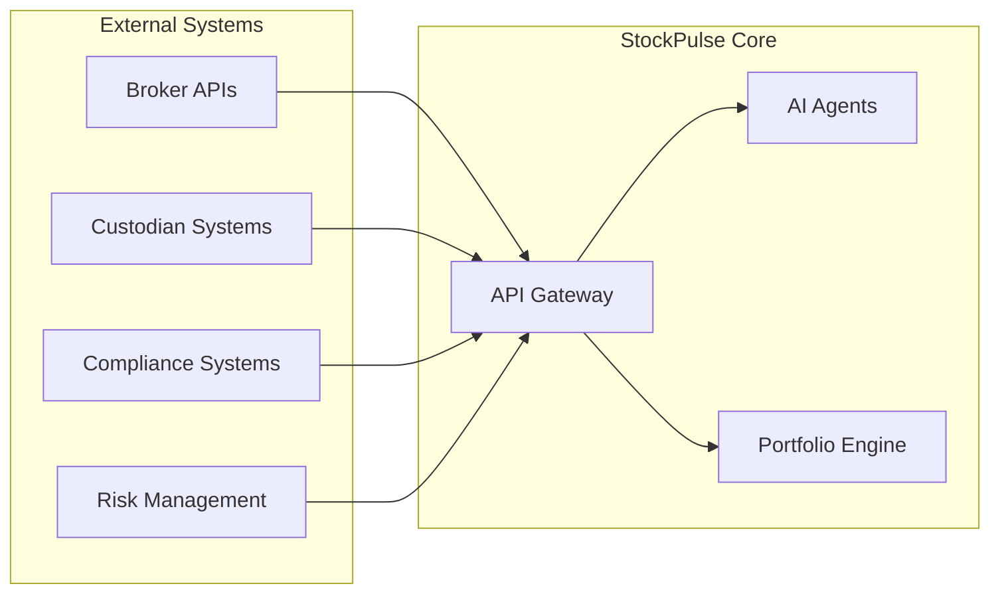
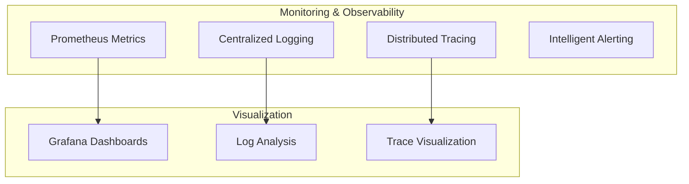
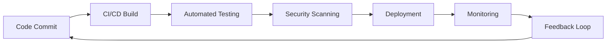

# StockPulse - Enterprise AI Financial Intelligence Ecosystem Architecture

**Version 2.0 - Epic 8 Complete Architecture**

## 1. Executive Summary

StockPulse has evolved into the world's most comprehensive AI Financial Intelligence Ecosystem, featuring 34 specialized AI agents across 533 story points of advanced capabilities. This architecture document outlines the enterprise-grade infrastructure supporting institutional-level financial intelligence rivaling Goldman Sachs and BlackRock capabilities.

## 2. Architectural Vision & Principles

### 2.1 AI-First Financial Intelligence Platform

- **34 Specialized AI Agents**: Comprehensive coverage across all financial domains
- **Multi-Modal Intelligence**: Text, audio, video, and alternative data analysis
- **Real-Time Processing**: Sub-second analysis with enterprise-grade performance
- **Institutional-Grade**: Professional-level capabilities for sophisticated investors

### 2.2 Core Architectural Principles

- **Agent-Orchestrated Architecture**: AI agents dynamically coordinate complex workflows
- **Event-Driven Intelligence**: Real-time data streaming and intelligent event processing
- **Zero-Trust Security**: Bank-grade security with continuous verification
- **Elastic Scalability**: Auto-scaling infrastructure supporting varying loads
- **Multi-Modal Processing**: Unified analysis across diverse data types
- **Explainable AI**: Transparent, interpretable intelligence and recommendations

## 3. Epic 8 AI Agent Ecosystem Architecture

### 3.1 Foundation Analytics Layer (Stories 8.1-8.7)



### 3.2 Specialized Intelligence Agents (Stories 8.8-8.15)



### 3.3 Enterprise Infrastructure (Stories 8.16-8.19)



### 3.4 Next-Generation Intelligence (Stories 8.20-8.31)



## 4. Technical Architecture Stack

### 4.1 Agent Communication Layer

```typescript
interface AgentCommunicationProtocol {
  mcp: ModelContextProtocol; // Agent-to-System communication
  a2a: AgentToAgentProtocol; // Inter-agent communication
  messaging: EventMessaging; // Async event handling
  orchestration: WorkflowEngine; // Multi-agent coordination
}
```

### 4.2 Data Processing Pipeline



### 4.3 Security & Compliance Architecture



## 5. Performance & Scalability

### 5.1 Performance Requirements

- **Real-Time Analysis**: <30 seconds for comprehensive multi-agent analysis
- **Voice Response**: <5 seconds for complex queries
- **Data Processing**: 1M+ events per second
- **Concurrent Users**: 10,000+ simultaneous users
- **System Uptime**: >99.9% availability

### 5.2 Scalability Architecture



### 5.3 Global Distribution

- **Multi-Region Deployment**: US, Europe, Asia-Pacific
- **Edge Computing**: Low-latency processing for time-sensitive operations
- **CDN Integration**: Global content delivery for static assets
- **Data Locality**: Compliance with regional data protection regulations

## 6. Integration Ecosystem

### 6.1 Data Sources Integration

- **Market Data**: 50+ exchanges and data providers
- **Alternative Data**: ESG, satellite, social media, blockchain
- **Financial News**: 500+ sources with real-time processing
- **Audio/Video**: Earnings calls, financial media, podcasts

### 6.2 External System Integration



## 7. Deployment Architecture

### 7.1 Container Orchestration

```yaml
# Kubernetes Deployment Structure
apiVersion: apps/v1
kind: Deployment
metadata:
  name: stockpulse-ai-agents
spec:
  replicas: 10
  selector:
    matchLabels:
      app: ai-agents
  template:
    spec:
      containers:
        - name: agent-orchestrator
          image: stockpulse/agent-orchestrator:latest
          resources:
            requests:
              memory: "2Gi"
              cpu: "1000m"
            limits:
              memory: "4Gi"
              cpu: "2000m"
```

### 7.2 Infrastructure as Code

- **Terraform**: Infrastructure provisioning and management
- **Kubernetes**: Container orchestration and scaling
- **Helm Charts**: Application deployment and configuration
- **GitOps**: Automated deployment pipelines

## 8. Monitoring & Observability

### 8.1 Comprehensive Monitoring Stack



### 8.2 AI-Powered Operations

- **Predictive Scaling**: ML-driven capacity planning
- **Anomaly Detection**: Automated issue identification
- **Self-Healing**: Automated recovery from common failures
- **Performance Optimization**: Continuous performance tuning

## 9. Development & Operations

### 9.1 DevOps Pipeline



### 9.2 Quality Assurance

- **Automated Testing**: Unit, integration, and end-to-end tests
- **Performance Testing**: Load and stress testing for all components
- **Security Testing**: Continuous security validation and penetration testing
- **AI Model Validation**: Rigorous backtesting and performance validation

## 10. Future Roadmap

### 10.1 Planned Enhancements

- **Quantum Computing Integration**: Quantum algorithms for portfolio optimization
- **Advanced NLP**: GPT-4+ integration for enhanced natural language processing
- **Blockchain Integration**: DeFi protocol analysis and yield optimization
- **Global Expansion**: Support for emerging markets and local regulations

### 10.2 Innovation Pipeline

- **Neural Architecture Search**: Automated AI model optimization
- **Federated Learning**: Privacy-preserving collaborative learning
- **Edge AI**: Real-time inference at the network edge
- **Augmented Analytics**: AR/VR interfaces for immersive data exploration

---

**Architecture Document Version 2.0**
**Epic 8 Complete Implementation**
**533 Story Points | 34 AI Agents | Enterprise-Grade Infrastructure**

_This architecture supports the world's most comprehensive AI Financial Intelligence Ecosystem, designed for institutional-level performance and global scalability._ 🚀
