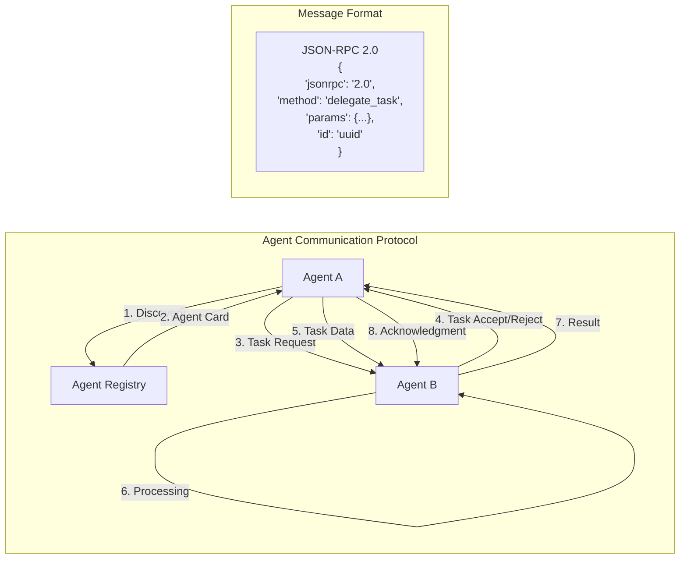
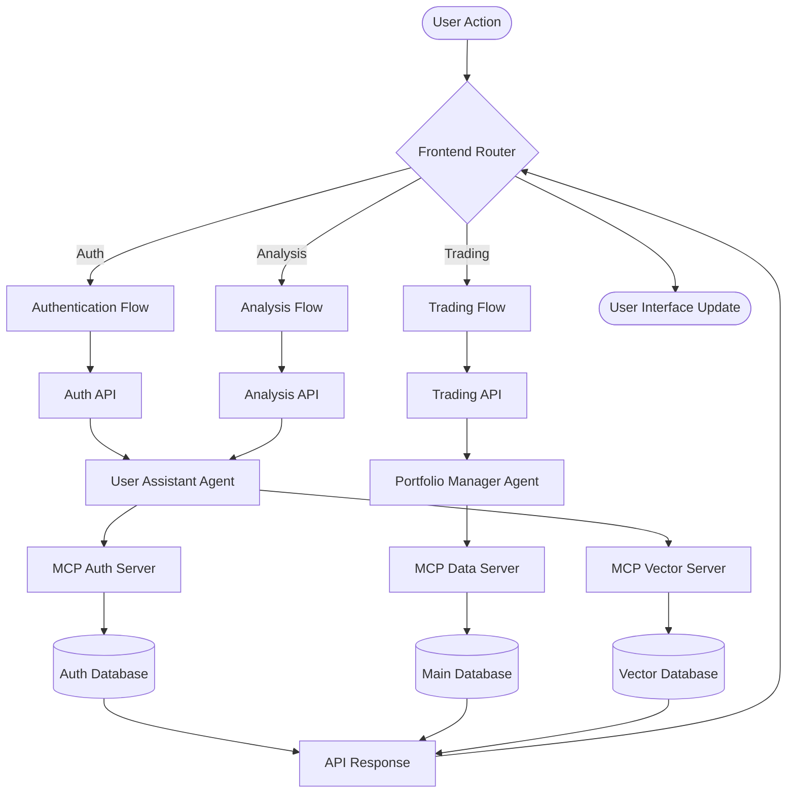
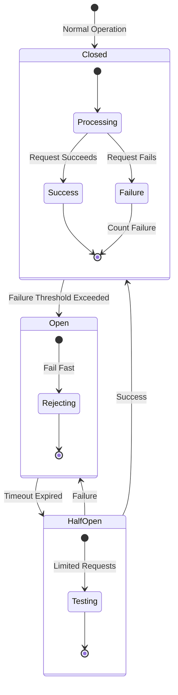

# StockPulse Architecture Diagrams

## 1. Agent Communication & MCP Protocol Flow

```mermaid
graph TB
    %% User Interface Layer
    subgraph "Frontend Layer"
        UI["🖥️ React Frontend<br/>(StockPulse UI)"]
        Dashboard["📊 Dashboard"]
        Trading["💹 Trading Interface"]
        Admin["⚙️ Admin Panel"]
    end

    %% Backend Services Layer
    subgraph "Backend Services Layer"
        API["🔧 FastAPI Backend<br/>(Python)"]
        Auth["🔐 Authentication Service"]
        Session["📋 Session Management"]
    end

    %% AI Agents Layer
    subgraph "AI Agents Layer (A2A Protocol)"
        UA["🤖 User Assistant Agent<br/>(Port: 8001)"]
        PM["💼 Portfolio Manager Agent<br/>(Port: 8002)"]
        Registry["📋 Agent Registry<br/>(Service Discovery)"]
    end

    %% MCP Services Layer
    subgraph "MCP Services Layer"
        AuthMCP["🔐 MCP Auth Server<br/>(Authentication Context)"]
        PostgresMCP["🐘 MCP Postgres Server<br/>(Relational Data Context)"]
        RedisMCP["🔴 MCP Redis Server<br/>(Cache Context)"]
        QdrantMCP["🔍 MCP Qdrant Server<br/>(Vector Search Context)"]
        TimescaleMCP["📈 MCP Timescale Server<br/>(Time Series Context)"]
        GraphitiMCP["🕸️ MCP Graphiti Server<br/>(Knowledge Graph Context)"]
    end

    %% Data Storage Layer
    subgraph "Data Storage Layer"
        Postgres[("🐘 PostgreSQL<br/>(User Data, Transactions)")]
        Redis[("🔴 Redis<br/>(Sessions, Cache)")]
        Qdrant[("🔍 Qdrant<br/>(Vector Embeddings)")]
        Timescale[("📈 TimescaleDB<br/>(Market Data)")]
        Graphiti[("🕸️ Graphiti<br/>(Knowledge Graph)")]
    end

    %% External Services
    subgraph "External Services"
        MarketAPI["📊 Market Data APIs"]
        LLMProviders["🧠 LLM Providers<br/>(OpenAI, Claude, etc.)"]
    end

    %% Frontend to Backend Communications (HTTP/REST)
    UI -.->|"HTTP/REST"| API
    Dashboard -.->|"HTTP/REST"| API
    Trading -.->|"HTTP/REST"| API
    Admin -.->|"HTTP/REST"| API

    %% Backend to Auth and Session
    API <-.->|"Internal API"| Auth
    API <-.->|"Internal API"| Session

    %% Backend to AI Agents Communications
    API <-.->|"A2A Protocol<br/>(JSON-RPC 2.0)"| UA
    API <-.->|"A2A Protocol<br/>(JSON-RPC 2.0)"| PM

    %% Agent-to-Agent Communications (A2A Protocol)
    UA <-.->|"A2A Protocol<br/>(Agent Cards, Task Delegation)"| PM
    UA <-.->|"Service Discovery"| Registry
    PM <-.->|"Service Discovery"| Registry

    %% AI Agents to MCP Services Communications (MCP Protocol)
    UA -.->|"MCP Protocol<br/>(Tool Calls)"| AuthMCP
    UA -.->|"MCP Protocol<br/>(Tool Calls)"| PostgresMCP
    UA -.->|"MCP Protocol<br/>(Tool Calls)"| RedisMCP
    UA -.->|"MCP Protocol<br/>(Tool Calls)"| QdrantMCP

    PM -.->|"MCP Protocol<br/>(Tool Calls)"| PostgresMCP
    PM -.->|"MCP Protocol<br/>(Tool Calls)"| TimescaleMCP
    PM -.->|"MCP Protocol<br/>(Tool Calls)"| QdrantMCP
    PM -.->|"MCP Protocol<br/>(Tool Calls)"| GraphitiMCP

    %% MCP Services to Data Storage (Database Connections)
    AuthMCP -.->|"Database Connection"| Postgres
    PostgresMCP -.->|"Database Connection"| Postgres
    RedisMCP -.->|"Database Connection"| Redis
    QdrantMCP -.->|"Vector API"| Qdrant
    TimescaleMCP -.->|"Database Connection"| Timescale
    GraphitiMCP -.->|"Graph API"| Graphiti

    %% External Communications
    PM -.->|"REST API"| MarketAPI
    UA -.->|"API Calls"| LLMProviders
    PM -.->|"API Calls"| LLMProviders

    %% Styling
    classDef frontend fill:#e1f5fe,stroke:#01579b,stroke-width:2px,color:#000
    classDef backend fill:#f3e5f5,stroke:#4a148c,stroke-width:2px,color:#000
    classDef agents fill:#e8f5e8,stroke:#1b5e20,stroke-width:2px,color:#000
    classDef mcp fill:#fff3e0,stroke:#e65100,stroke-width:2px,color:#000
    classDef storage fill:#fce4ec,stroke:#880e4f,stroke-width:2px,color:#000
    classDef external fill:#f1f8e9,stroke:#33691e,stroke-width:2px,color:#000

    class UI,Dashboard,Trading,Admin frontend
    class API,Auth,Session backend
    class UA,PM,Registry agents
    class AuthMCP,PostgresMCP,RedisMCP,QdrantMCP,TimescaleMCP,GraphitiMCP mcp
    class Postgres,Redis,Qdrant,Timescale,Graphiti storage
    class MarketAPI,LLMProviders external
```

## 2. MCP Protocol Detail Flow

```mermaid
sequenceDiagram
    participant User as 👤 User
    participant Frontend as 🖥️ Frontend
    participant API as 🔧 Backend API
    participant UA as 🤖 User Assistant
    participant PM as 💼 Portfolio Manager
    participant MCP as 🔧 MCP Server
    participant DB as 🐘 Database

    User->>Frontend: Request portfolio analysis
    Frontend->>API: POST /api/v1/portfolio/analyze
    API->>UA: A2A Request: analyze_portfolio

    Note over UA: Agent processing
    UA->>PM: A2A Delegate: get_portfolio_data
    PM->>MCP: MCP Tool Call: query_positions
    MCP->>DB: SQL Query: SELECT * FROM positions
    DB-->>MCP: Position data
    MCP-->>PM: Structured data response
    PM-->>UA: Portfolio positions

    UA->>MCP: MCP Tool Call: get_market_context
    MCP->>DB: Query market data
    DB-->>MCP: Market prices
    MCP-->>UA: Market context

    Note over UA: Generate analysis
    UA-->>API: Analysis report
    API-->>Frontend: JSON response
    Frontend-->>User: Display analysis
```

## 3. Agent-to-Agent (A2A) Communication Flow

## 4. MCP Tool Architecture

```mermaid
graph TB
    subgraph "MCP Tool Ecosystem"
        Agent["🤖 AI Agent"]

        subgraph "MCP Server"
            Handler["Tool Handler"]
            Schema["Tool Schema"]
            Executor["Tool Executor"]
        end

        subgraph "Tool Categories"
            Auth["🔐 Auth Tools"]
            Data["📊 Data Tools"]
            Analysis["📈 Analysis Tools"]
            Trading["💹 Trading Tools"]
        end

        subgraph "Data Sources"
            PG["PostgreSQL"]
            RD["Redis"]
            VDB["Vector DB"]
            TS["TimescaleDB"]
        end
    end

    Agent -->|"tool_call"| Handler
    Handler --> Schema
    Schema --> Executor

    Executor --> Auth
    Executor --> Data
    Executor --> Analysis
    Executor --> Trading

    Auth --> PG
    Data --> PG
    Data --> RD
    Analysis --> VDB
    Analysis --> TS
    Trading --> PG
```

## 5. System Data Flow

## 6. Service Discovery & Registry

```mermaid
graph TB
    subgraph "Service Discovery Architecture"
        Client["🖥️ Client Application"]

        subgraph "Registry Layer"
            AgentRegistry["📋 Agent Registry"]
            MCPRegistry["🔧 MCP Registry"]
            ServiceMesh["🕸️ Service Mesh"]
        end

        subgraph "Service Instances"
            Agent1["🤖 User Assistant"]
            Agent2["💼 Portfolio Manager"]
            MCP1["🔐 Auth MCP"]
            MCP2["🐘 Postgres MCP"]
            MCP3["🔴 Redis MCP"]
        end

        subgraph "Health Monitoring"
            HealthCheck["❤️ Health Checks"]
            Metrics["📊 Metrics Collection"]
            Alerts["🚨 Alert System"]
        end
    end

    Client --> AgentRegistry
    Client --> MCPRegistry

    AgentRegistry --> Agent1
    AgentRegistry --> Agent2

    MCPRegistry --> MCP1
    MCPRegistry --> MCP2
    MCPRegistry --> MCP3

    Agent1 --> HealthCheck
    Agent2 --> HealthCheck
    MCP1 --> HealthCheck
    MCP2 --> HealthCheck
    MCP3 --> HealthCheck

    HealthCheck --> Metrics
    Metrics --> Alerts

    ServiceMesh --> AgentRegistry
    ServiceMesh --> MCPRegistry
```

## 7. Error Handling & Circuit Breaker Pattern

## 8. Real-time Data Pipeline

```mermaid
graph LR
    subgraph "Data Ingestion"
        MarketFeed["📊 Market Data Feed"]
        NewsFeed["📰 News Feed"]
        SocialFeed["🐦 Social Media"]
    end

    subgraph "Processing Pipeline"
        Kafka["🔄 Kafka Stream"]
        Processor["⚡ Stream Processor"]
        AIAnalysis["🧠 AI Analysis"]
    end

    subgraph "Storage & Caching"
        TimeSeries["📈 TimescaleDB"]
        VectorStore["🔍 Vector Store"]
        Cache["🔴 Redis Cache"]
    end

    subgraph "Real-time Distribution"
        WebSocket["🔌 WebSocket"]
        Push["📱 Push Notifications"]
        EventBus["🚌 Event Bus"]
    end

    MarketFeed --> Kafka
    NewsFeed --> Kafka
    SocialFeed --> Kafka

    Kafka --> Processor
    Processor --> AIAnalysis

    AIAnalysis --> TimeSeries
    AIAnalysis --> VectorStore
    AIAnalysis --> Cache

    Cache --> WebSocket
    EventBus --> Push
    TimeSeries --> EventBus
```

