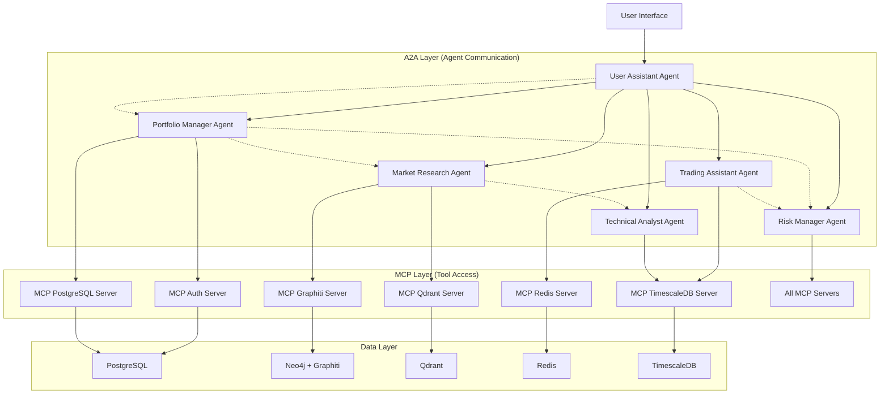
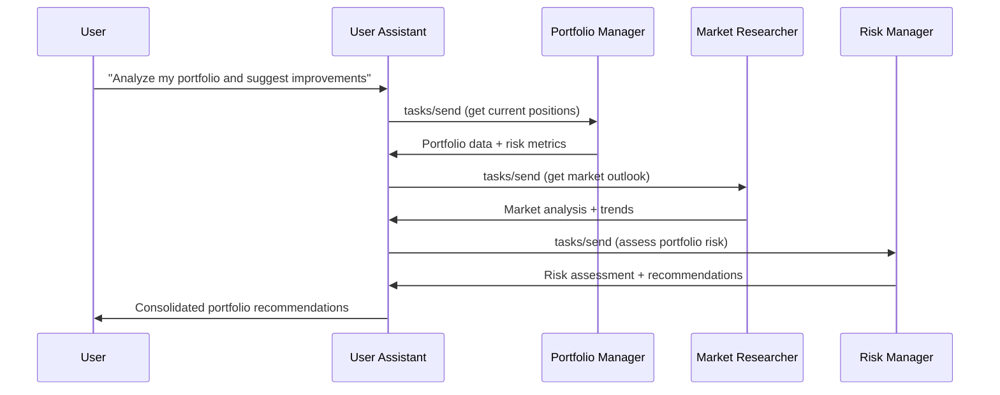
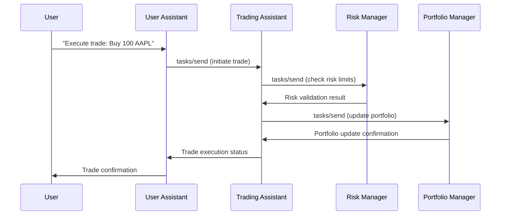

# StockPulse Infrastructure Design

This document outlines the infrastructure design for the StockPulse platform.

**Key Technologies:**

- **Frontend:** React, TypeScript, Tailwind CSS, Framer Motion
- **Backend:** FastAPI (Python), Node.js/Express (planned migration)
- **Database:** PostgreSQL, Redis, TimescaleDB, Neo4j
- **AI/ML:** Graphiti (Knowledge Graphs), OpenAI Embeddings, LangChain
- **Message Queue:** BullMQ
- **Agent Communication:** MCP (Model Context Protocol) + A2A (Agent-to-Agent Protocol)

**Architectural Style:**

- Layered Architecture
- Microservices Architecture (for AI Agents)
- Event-Driven Architecture
- Hybrid MCP+A2A Agent Communication

## 1. Overview

**Version:** 0.4
**Last Updated:** May 29, 2025
This document outlines the infrastructure design for the StockPulse platform, emphasizing its AI-driven capabilities with Graphiti-powered real-time knowledge graphs, hybrid MCP+A2A agent communication, open-source database utilization, and robust, scalable architecture.

## 2. Guiding Principles

- **AI-First:** Leverage Graphiti knowledge graphs and RAG to provide intelligent and proactive features.
- **Real-Time Knowledge:** Use temporal knowledge graphs for dynamic financial intelligence.
- **Hybrid Protocol Architecture:** MCP for tool access + A2A for agent collaboration.
- **Agent Autonomy:** Enable independent agent collaboration following Google A2A specification.
- **Open Source:** Prioritize well-supported open-source technologies, especially for databases.
- **Scalability & Resilience:** Design for growth and fault tolerance.
- **Security:** Implement security best practices at all layers.
- **Modularity:** Encourage a microservices-oriented or well-encapsulated modular design for AI agents and backend services.
- **Observability:** Ensure comprehensive logging, monitoring, and tracing.
- **Standards Compliance:** Follow MCP and A2A protocol specifications for interoperability.

## 3. Compute Layer

- **Frontend Framework:** React, using TypeScript, styled with Tailwind CSS and Framer Motion
- **Backend Framework:** FastAPI (Python) for authentication and core services
- **Knowledge Graph Service:** Graphiti for real-time RAG capabilities
- **AI Agent Services:** A2A-compliant agents for specialized financial intelligence
- **MCP Servers:** Dedicated MCP servers for database and service tool access
- **A2A Agent Services:** Intelligent agents with inter-agent collaboration capabilities
- **Containerization:** Docker for all services, databases, and agents.
- **Orchestration:** (e.g., Kubernetes, Docker Swarm - TBD, consider managed K8s if cloud-hosted)

## 4. Data Layer

### 4.1. StockPulse_PostgreSQL (Relational Data)

    *   **Purpose:** Core transactional data: user profiles, accounts, orders, trades, portfolio holdings.
    *   **Engine:** PostgreSQL, accessed via SQLAlchemy ORM. Includes connection pooling and replication for HA.
    *   **Deployment:** Docker container.
    *   **MCP Interface:** `mcp-postgres-server` - Exposes database operations as MCP tools.
    *   **Key Considerations:** Schema design, indexing, backups, replication.

### 4.2. StockPulse_Redis (Caching & Real-time)

    *   **Purpose:** Caching, session management, real-time notifications (order status, price alerts), message broker for inter-service/agent communication.
    *   **Engine:** Redis
    *   **Deployment:** Docker container.
    *   **MCP Interface:** `mcp-redis-server` - Exposes caching, session, and pub/sub operations as MCP tools.
    *   **Key Considerations:** Data persistence strategy, clustering for HA.

### 4.3. StockPulse_KnowledgeGraph (Graphiti/Neo4j)

    *   **Purpose:** Real-time knowledge graphs for RAG-powered AI agents. Manages financial documents, news, market data, user interactions, and application documentation with temporal tracking, contradiction handling, and semantic search.
    *   **Engine:** Graphiti (Knowledge Graph Framework) with Neo4j as the backend database
    *   **Deployment:** Docker containers for Neo4j. Graphiti integrated into FastAPI backend service.
    *   **MCP Interface:** `mcp-graphiti-server` - Exposes knowledge graph operations as MCP tools.
    *   **Key Features:**
        - **Temporal Handling:** Explicit bi-temporal tracking for financial data changes
        - **Contradiction Management:** Temporal edge invalidation for conflicting information
        - **Real-time Ingestion:** Continuous updates from financial news, filings, market events
        - **Hybrid Search:** Semantic, keyword, and graph-based search capabilities
        - **Custom Entity Types:** Company relationships, market events, user preferences
        - **Sub-second Latency:** Optimized for real-time financial intelligence
    *   **Knowledge Sources:**
        - Financial news APIs (Reuters, Bloomberg, Financial Modeling Prep)
        - SEC filings and company documents
        - Market data and technical indicators
        - User interaction patterns and preferences
        - Research reports and analyst recommendations
    *   **Knowledge Groups:**
        - `financial_news`: Real-time news ingestion and semantic analysis
        - `company_filings`: SEC documents and regulatory filings
        - `market_analysis`: Technical indicators and market correlations
        - `user_interactions`: Personalized trading patterns and preferences
        - `research_reports`: Analyst reports and investment research

### 4.4. StockPulse_TimeSeriesDB (Time-Series Data)

    *   **Purpose:** Historical stock prices, technical indicators, user activity logs, system performance metrics.
    *   **Engine:** TimescaleDB (PostgreSQL extension)
    *   **Deployment:** Docker container.
    *   **MCP Interface:** `mcp-timescale-server` - Exposes time-series operations as MCP tools.
    *   **Key Considerations:** Data ingestion rates, query patterns, data retention policies.

### 4.5. StockPulse_VectorDB (Vector Storage)

    *   **Purpose:** Legacy vector storage for document embeddings and semantic search (complementing Graphiti).
    *   **Engine:** Qdrant
    *   **Deployment:** Docker container.
    *   **MCP Interface:** `mcp-qdrant-server` - Exposes vector operations as MCP tools.
    *   **Key Considerations:** Vector dimensionality, indexing strategies, similarity search optimization.

## 5. Agent Communication Architecture (MCP + A2A Hybrid)

### 5.1. Hybrid Protocol Overview

StockPulse implements a revolutionary hybrid agent communication architecture combining:

- **Model Context Protocol (MCP)**: For agent-to-tool/database access
- **Agent-to-Agent Protocol (A2A)**: For inter-agent collaboration and orchestration

This dual-protocol approach provides both standardized database access and autonomous agent collaboration capabilities.

### 5.2. Architecture Layers



### 5.3. A2A Agent Services

#### 5.3.1. User Assistant Agent (`a2a-user-assistant`)

- **Port:** 9001
- **Role:** Main orchestrator and user interface
- **A2A Skills:**
  - `user_interaction`: Handle user requests and maintain conversation context
  - `task_orchestration`: Coordinate complex workflows across multiple agents
  - `multi_agent_coordination`: Manage agent collaboration and conflict resolution
  - `session_management`: Track user sessions and preferences
- **MCP Dependencies:** `mcp-auth-server`, `mcp-redis-server`
- **Agent Card Location:** `https://localhost:9001/.well-known/agent.json`

#### 5.3.2. Portfolio Management Agent (`a2a-portfolio-manager`)

- **Port:** 9002
- **Role:** Portfolio analysis, performance tracking, and optimization
- **A2A Skills:**
  - `portfolio_analysis`: Comprehensive portfolio performance analysis
  - `performance_tracking`: Real-time portfolio monitoring
  - `rebalancing_recommendations`: Portfolio optimization suggestions
  - `position_management`: Track and manage holdings
  - `allocation_optimization`: Asset allocation strategies
- **MCP Dependencies:** `mcp-postgres-server`, `mcp-timescale-server`, `mcp-redis-server`
- **Agent Card Location:** `https://localhost:9002/.well-known/agent.json`

#### 5.3.3. Market Research Agent (`a2a-market-researcher`)

- **Port:** 9003
- **Role:** Market analysis, news research, and trend identification
- **A2A Skills:**
  - `market_analysis`: Comprehensive market condition analysis
  - `news_research`: Financial news analysis and impact assessment
  - `company_analysis`: Deep-dive company research and evaluation
  - `trend_identification`: Market trend detection and forecasting
  - `sector_analysis`: Industry and sector performance analysis
  - `sentiment_analysis`: Market sentiment and social media analysis
- **MCP Dependencies:** `mcp-graphiti-server`, `mcp-qdrant-server`, `mcp-timescale-server`
- **Agent Card Location:** `https://localhost:9003/.well-known/agent.json`

#### 5.3.4. Trading Assistant Agent (`a2a-trading-assistant`)

- **Port:** 9004
- **Role:** Trade execution, order management, and real-time monitoring
- **A2A Skills:**
  - `trade_execution`: Execute buy/sell orders with best execution
  - `order_management`: Manage order lifecycle and status tracking
  - `risk_checking`: Pre-trade risk validation and compliance
  - `price_monitoring`: Real-time price alerts and monitoring
  - `execution_analytics`: Trade execution quality analysis
- **MCP Dependencies:** `mcp-postgres-server`, `mcp-redis-server`, `mcp-timescale-server`
- **Agent Card Location:** `https://localhost:9004/.well-known/agent.json`

#### 5.3.5. Risk Management Agent (`a2a-risk-manager`)

- **Port:** 9005
- **Role:** Risk assessment, compliance, and exposure monitoring
- **A2A Skills:**
  - `risk_assessment`: Comprehensive portfolio risk analysis
  - `position_sizing`: Optimal position sizing recommendations
  - `volatility_analysis`: Volatility forecasting and risk metrics
  - `compliance_checking`: Regulatory compliance validation
  - `stress_testing`: Portfolio stress testing and scenario analysis
  - `exposure_monitoring`: Real-time risk exposure tracking
- **MCP Dependencies:** All MCP servers for comprehensive risk analysis
- **Agent Card Location:** `https://localhost:9005/.well-known/agent.json`

#### 5.3.6. Technical Analysis Agent (`a2a-technical-analyst`)

- **Port:** 9006
- **Role:** Technical analysis, signal generation, and pattern recognition
- **A2A Skills:**
  - `technical_indicators`: Calculate and analyze technical indicators
  - `chart_analysis`: Chart pattern recognition and analysis
  - `signal_generation`: Generate buy/sell/hold trading signals
  - `pattern_recognition`: Identify chart patterns and formations
  - `momentum_analysis`: Analyze price momentum and trends
  - `support_resistance`: Identify key support and resistance levels
- **MCP Dependencies:** `mcp-timescale-server`, `mcp-qdrant-server`, `mcp-redis-server`
- **Agent Card Location:** `https://localhost:9006/.well-known/agent.json`

### 5.4. A2A Infrastructure Services

#### 5.4.1. A2A Registry Service (`a2a-registry`)

- **Port:** 9000
- **Purpose:** Agent discovery, health monitoring, and capability management
- **Features:**
  - Agent registration and deregistration
  - Health check monitoring for all A2A agents
  - Capability catalog and skill indexing
  - Load balancing and failover support
  - Agent Card caching and validation
- **API Endpoints:**
  - `GET /agents` - List all registered agents
  - `GET /agents/{id}` - Get specific agent details
  - `GET /skills` - List all available skills across agents
  - `GET /health` - Overall system health
  - `POST /agents/register` - Register new agent
  - `DELETE /agents/{id}` - Deregister agent

#### 5.4.2. A2A Gateway Service (`a2a-gateway`)

- **Port:** 9100
- **Purpose:** Routing, authentication, and monitoring for A2A traffic
- **Features:**
  - JWT-based authentication for agent requests
  - Rate limiting and request throttling
  - Request/response logging and monitoring
  - Circuit breaker pattern for fault tolerance
  - API versioning and compatibility management
- **Security Features:**
  - mTLS for agent-to-agent communication
  - API key validation for external access
  - Request signing and verification
  - Audit logging for all agent interactions

### 5.5. A2A Communication Patterns

#### 5.5.1. Task Orchestration Flow



#### 5.5.2. Trade Execution Flow



### 5.6. A2A Protocol Implementation

#### 5.6.1. Agent Card Structure

Each A2A agent publishes a standardized Agent Card following Google A2A specification:

```json
{
  "name": "StockPulse Portfolio Manager",
  "description": "AI agent for portfolio management and optimization",
  "version": "1.0.0",
  "provider": {
    "organization": "StockPulse",
    "website": "https://stockpulse.ai"
  },
  "url": "https://localhost:9002",
  "documentationUrl": "https://docs.stockpulse.ai/agents/portfolio-manager",
  "capabilities": {
    "streaming": true,
    "pushNotifications": true,
    "stateTransitionHistory": true
  },
  "authentication": {
    "schemes": ["bearer", "oauth2"]
  },
  "defaultInputModes": ["text", "data"],
  "defaultOutputModes": ["text", "data"],
  "skills": [
    {
      "id": "portfolio-analysis",
      "name": "Portfolio Analysis",
      "description": "Comprehensive portfolio performance analysis",
      "tags": ["finance", "portfolio", "analysis"],
      "inputModes": ["text", "data"],
      "outputModes": ["text", "data"],
      "examples": [
        "Analyze my portfolio performance over the last quarter",
        "What are my best and worst performing holdings?"
      ]
    }
  ]
}
```

#### 5.6.2. Task Lifecycle Management

A2A tasks follow the standard lifecycle:

- `submitted`: Task received but not yet started
- `working`: Task is actively being processed
- `input-required`: Agent needs more information
- `completed`: Task finished successfully
- `canceled`: Task terminated by request
- `failed`: An error occurred during processing

#### 5.6.3. Core A2A Methods

All A2A agents implement these JSON-RPC 2.0 methods:

- `tasks/send`: Initiate new task or provide additional input
- `tasks/get`: Retrieve task status and artifacts
- `tasks/cancel`: Cancel an ongoing task
- `tasks/sendSubscribe`: Initiate task with SSE streaming
- `tasks/pushNotification/set`: Configure push notifications

### 5.7. MCP Integration Strategy

A2A agents use MCP clients internally to access tools and data:

```python
# Example: Portfolio Manager Agent using MCP client
from mcp import Client

class PortfolioManagerAgent:
    def __init__(self):
        self.mcp_postgres = Client("stockpulse-postgres")
        self.mcp_timescale = Client("stockpulse-timescale")
        self.mcp_redis = Client("stockpulse-redis")

    async def analyze_portfolio(self, user_id: str):
        # Use MCP to get portfolio data
        portfolios = await self.mcp_postgres.call_tool(
            "get_user_portfolios", {"user_id": user_id}
        )

        # Use MCP to get performance data
        performance = await self.mcp_timescale.call_tool(
            "get_portfolio_performance_timeseries",
            {"portfolio_id": portfolios[0]["id"]}
        )

        # Perform analysis and return A2A-formatted result
        return self.format_analysis_result(portfolios, performance)
```

## 6. AI/ML Layer

### 6.1. Graphiti RAG Pipeline

    *   **Framework:** Graphiti (Real-time Knowledge Graphs for AI Agents)
    *   **MCP Integration:** Direct integration through `mcp-graphiti-server`
    *   **Components:**
        *   **Real-time Data Ingestion:** Continuous processing of financial news, SEC filings, market events
        *   **Temporal Knowledge Management:** Bi-temporal tracking with contradiction handling
        *   **Semantic Entity Extraction:** Automatic entity and relationship detection
        *   **Hybrid Search Engine:** Combines semantic, keyword, and graph-based retrieval
        *   **LLM Integration:** OpenAI GPT-4o-mini for structured output and inference
        *   **Embedding Generation:** OpenAI text-embedding-3-small for semantic search
    *   **Advantages over Traditional RAG:**
        - **Dynamic Updates:** Real-time knowledge evolution vs. static document chunks
        - **Temporal Awareness:** Tracks how information changes over time
        - **Relationship Intelligence:** Understands entity relationships and market correlations
        - **Contradiction Resolution:** Handles conflicting information through temporal edges
        - **Sub-second Latency:** Optimized for real-time financial decision making

### 6.2. AI Agent Architecture

    *   **Core Agent Framework:** FastAPI + A2A Protocol + MCP Clients
    *   **A2A Communication:** Agent-to-agent collaboration via JSON-RPC 2.0
    *   **MCP Integration:** Tool and database access via MCP protocol
    *   **Knowledge Integration:** Graphiti-powered RAG for all agent interactions
    *   **Agent Types:**
        *   User Assistant Agent (orchestration and user interaction)
        *   Portfolio Management Agent (portfolio analysis and optimization)
        *   Market Research Agent (market analysis and trend detection)
        *   Trading Assistant Agent (trade execution and order management)
        *   Risk Management Agent (risk assessment and compliance)
        *   Technical Analysis Agent (technical indicators and signals)

### 6.3. Model Management

    *   **Primary LLM:** OpenAI GPT-4o-mini (structured output support)
    *   **Embeddings:** OpenAI text-embedding-3-small
    *   **Knowledge Graph:** Graphiti framework for temporal knowledge management
    *   **MCP Tools:** Standardized database access through MCP servers
    *   **Deployment:** API-based LLM services with local knowledge graph processing

## 7. Networking & Communication

- **Internal Communication:**
  - **A2A Protocol:** JSON-RPC 2.0 over HTTPS for agent-to-agent communication
  - **MCP Protocol:** For agent-to-tool/database communication
  - **REST APIs / gRPC:** For synchronous service-to-service calls
  - **Message Queues:** BullMQ for background jobs and scheduled tasks
- **Agent-to-Agent (A2A) Communication:**
  - **Discovery:** Via A2A Registry service at port 9000
  - **Authentication:** JWT-based with API key validation
  - **Transport:** HTTPS with JSON-RPC 2.0 payload format
  - **Streaming:** Server-Sent Events (SSE) for real-time updates
  - **Security:** mTLS for production agent-to-agent communication
- **Agent-to-Tool (MCP) Communication:**
  - **Protocol:** MCP for standardized tool access
  - **Registry:** MCP Registry at port 8001 for tool discovery
  - **Transport:** Standard MCP transport mechanisms
- **External Communication:**
  - **HTTPS:** For client-facing APIs and agent endpoints
  - **Financial APIs:** Financial Modeling Prep, TAAPI.IO
  - **WebSockets:** For real-time client updates
- **API Gateway:** Nginx or Kong for external API traffic management
- **Service Discovery:**
  - **A2A Registry:** Port 9000 for agent discovery
  - **MCP Registry:** Port 8001 for tool discovery

## 8. Deployment & DevOps

- **Source Control:** Git (GitHub, GitLab)
- **CI/CD:** GitHub Actions, Jenkins
- **Infrastructure as Code (IaC):** Docker Compose for local development, Helm for Kubernetes
- **Database Deployment:** `docker-compose.yml` for all databases
- **MCP Servers Deployment:** `docker-compose.mcp.yml` for all MCP tool servers
- **A2A Agents Deployment:** `docker-compose.a2a.yml` for all A2A agent services
- **Hybrid Orchestration:** `docker-compose.override.yml` for combined MCP+A2A deployment

## 9. Monitoring, Logging & Alerting

- **Logging:** Centralized logging with Python logging and structured JSON format
- **Monitoring:** Grafana and Prometheus for application and system metrics
- **A2A Monitoring:**
  - Agent health checks via A2A Registry
  - Task lifecycle tracking and performance metrics
  - Inter-agent communication latency and success rates
- **MCP Monitoring:** Tool usage metrics and performance tracking
- **Knowledge Graph Monitoring:** Graphiti health checks and performance metrics
- **Tracing:** Distributed tracing across A2A agents and MCP tools
- **Alerting:** Alertmanager integration with PagerDuty

## 10. Security Considerations

- **Authentication & Authorization:** JWT with HttpOnly cookies for users, API keys for agents
- **A2A Security:**
  - mTLS for agent-to-agent communication in production
  - JWT-based authentication with role-based access control
  - Request signing and verification for critical operations
  - Rate limiting and circuit breaker patterns
- **MCP Security:** Authenticated access to MCP servers with tool-level authorization
- **Data Encryption:** At rest and in transit using TLS 1.3
- **Network Security:** Firewalls, security groups, and network isolation
- **Input Validation:** Comprehensive validation for both A2A and MCP protocols
- **Secrets Management:** Environment variables with HashiCorp Vault for production
- **Audit Logging:** Complete audit trail for all agent interactions and decisions

## 11. A2A Implementation Benefits

### 11.1. Agent Autonomy

- **Independent Operation:** Agents can collaborate without central coordination
- **Dynamic Workflows:** Agents adapt workflows based on real-time conditions
- **Specialized Intelligence:** Each agent focuses on domain-specific expertise
- **Fault Tolerance:** Agent failures don't cascade through the entire system

### 11.2. Scalability and Performance

- **Horizontal Scaling:** Individual agents can be scaled independently
- **Load Distribution:** Work distributed across multiple specialized agents
- **Parallel Processing:** Multiple agents can work on different aspects simultaneously
- **Resource Optimization:** Agents only consume resources when actively processing

### 11.3. Development and Maintenance

- **Modular Development:** Teams can develop agents independently
- **Technology Flexibility:** Different agents can use different technologies
- **Easy Testing:** Agents can be tested in isolation with mock dependencies
- **Rapid Innovation:** New agents can be added without affecting existing ones

### 11.4. Enterprise Integration

- **Standards Compliance:** Full compliance with Google A2A specification
- **Vendor Neutrality:** Can integrate with third-party A2A-compliant agents
- **Future-Proof:** Built on open standards for long-term compatibility
- **Interoperability:** Seamless integration with other A2A ecosystems

## 12. MCP + A2A Comparison and Integration

### 12.1. Protocol Comparison

| **Aspect**                | **MCP (Model Context Protocol)** | **A2A (Agent-to-Agent Protocol)**            |
| ------------------------- | -------------------------------- | -------------------------------------------- |
| **Primary Purpose**       | Agent-to-tool communication      | Agent-to-agent collaboration                 |
| **Communication Pattern** | Request/response with tools      | Task-based agent workflows                   |
| **Data Handling**         | Structured tool inputs/outputs   | Rich multi-modal communication               |
| **State Management**      | Stateless tool interactions      | Stateful task lifecycle management           |
| **Discovery**             | Tool discovery via MCP registry  | Agent discovery via Agent Cards              |
| **Authentication**        | Tool-level access control        | Agent-level authentication and authorization |
| **Streaming**             | Limited streaming support        | Full SSE streaming and push notifications    |
| **Use Case**              | Database access, API calls       | Multi-agent orchestration and collaboration  |

### 12.2. Integration Benefits

- **Complete Ecosystem:** Agents have both tool access (MCP) and collaboration (A2A)
- **Standardized Interfaces:** Both protocols follow industry standards
- **Modular Architecture:** Clear separation of concerns between tool access and agent communication
- **Future Compatibility:** Built on open protocols for long-term viability
- **Enterprise Ready:** Production-grade security and monitoring for both protocols

## 13. Future Considerations

- **Multi-region Deployment:** A2A agent replication across regions
- **Advanced Orchestration:** Dynamic agent composition and workflow optimization
- **Agent Marketplace:** Integration with third-party A2A agent services
- **Edge Deployment:** A2A agents closer to data sources for reduced latency
- **Regulatory Compliance:** Enhanced audit trails and compliance reporting for agent decisions
- **AI Model Evolution:** Integration with next-generation AI models and capabilities
- **Cross-Platform Integration:** Interoperability with other A2A ecosystems and vendors

---

_This document is a living document and will be updated as the StockPulse platform evolves with both MCP and A2A capabilities._
