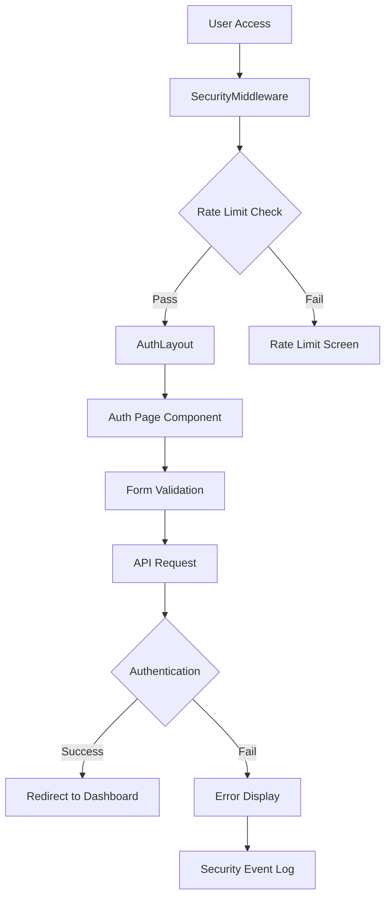
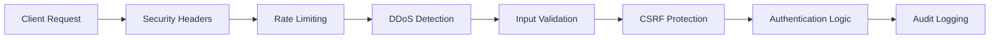

# StockPulse Authentication System Documentation

## 🚀 Overview

The StockPulse Authentication System is a completely independent, enterprise-grade authentication solution designed with mobile-first principles, comprehensive security measures, and SEO optimization. This system is completely separated from the main application and provides a secure, modern, and intuitive user experience.

## 📋 Table of Contents

- [Features](#features)
- [Architecture](#architecture)
- [Security](#security)
- [Mobile Optimization](#mobile-optimization)
- [SEO Optimization](#seo-optimization)
- [Installation](#installation)
- [Usage](#usage)
- [Components](#components)
- [Styling](#styling)
- [Testing](#testing)
- [Performance](#performance)
- [Accessibility](#accessibility)
- [Troubleshooting](#troubleshooting)

## ✨ Features

### Core Authentication Features

- **Modern Login Page** - Clean, intuitive login interface
- **Advanced Registration** - Multi-step registration with validation
- **Password Recovery** - Secure forgot/reset password flow
- **Real-time Validation** - Instant feedback on form inputs
- **Password Strength Indicator** - Visual password strength assessment
- **Remember Me** - Persistent login sessions
- **Biometric Authentication** - Future-ready biometric login support

### Security Features

- **DDoS Protection** - Automated detection and mitigation
- **Rate Limiting** - Configurable request rate limits
- **Brute Force Protection** - Account lockout after failed attempts
- **Security Headers** - Comprehensive HTTP security headers
- **Input Validation** - Client and server-side validation
- **CSRF Protection** - Cross-site request forgery prevention
- **XSS Protection** - Cross-site scripting prevention
- **Content Security Policy** - Strict CSP implementation

### Mobile & UX Features

- **Mobile-First Design** - Optimized for mobile devices
- **Touch-Friendly Interface** - Large touch targets (48px minimum)
- **Responsive Layout** - Adapts to all screen sizes
- **Progressive Enhancement** - Works without JavaScript
- **Offline Support** - Basic offline functionality
- **Dark Mode Support** - Automatic dark/light mode switching
- **Accessibility Compliant** - WCAG 2.1 AA+ compliance

### SEO Features

- **Structured Data** - Rich snippets for search engines
- **Meta Tags Optimization** - Dynamic meta tags per page
- **Canonical URLs** - Proper canonical URL structure
- **Open Graph Tags** - Social media optimization
- **Twitter Cards** - Twitter-specific meta tags
- **Schema.org Markup** - Structured data implementation

## 🏗️ Architecture

### Component Structure

```
src/pages/auth/
├── AuthLayout.tsx          # Main layout wrapper
├── ModernLoginPage.tsx     # Login page component
├── ModernRegisterPage.tsx  # Registration page component
├── ForgotPasswordPage.tsx  # Password recovery page
└── ResetPasswordPage.tsx   # Password reset page

src/components/auth/
├── SecurityMiddleware.tsx  # Security protection layer
├── AuthForm.tsx           # Reusable form components
└── BiometricAuth.tsx      # Biometric authentication

src/styles/
└── auth.css               # Authentication-specific styles
```

### Data Flow



### Security Architecture



## 🔒 Security

### Security Middleware Configuration

```typescript
const securityConfig = {
  maxRequestsPerMinute: 60,
  maxFailedAttempts: 5,
  lockoutDuration: 15, // minutes
  suspiciousActivityThreshold: 10,
  enableDDoSProtection: true,
  enableBruteForceProtection: true,
};
```

### Security Headers Implemented

- **X-Content-Type-Options**: `nosniff`
- **X-Frame-Options**: `DENY`
- **X-XSS-Protection**: `1; mode=block`
- **Referrer-Policy**: `strict-origin-when-cross-origin`
- **Permissions-Policy**: Restricted camera, microphone, geolocation
- **Content-Security-Policy**: Strict CSP with minimal allowed sources

### Rate Limiting

- **Per-minute limits**: 60 requests per minute per IP
- **Failed attempt tracking**: 5 failed attempts trigger lockout
- **Lockout duration**: 15-minute automatic lockout
- **Progressive penalties**: Increasing lockout times for repeat offenders

### DDoS Protection

- **Traffic analysis**: Real-time traffic pattern analysis
- **Automatic blocking**: Suspicious IPs automatically blocked
- **Threshold detection**: Configurable suspicious activity thresholds
- **Graceful degradation**: Service continues for legitimate users

## 📱 Mobile Optimization

### Mobile-First Design Principles

- **Touch targets**: Minimum 48px touch targets
- **Font sizes**: 16px minimum to prevent zoom on iOS
- **Viewport optimization**: Proper viewport meta tags
- **Safe area support**: iPhone X+ safe area insets
- **Orientation handling**: Landscape mode optimizations

### Responsive Breakpoints

```css
/* Small Mobile: 320px - 480px */
/* Medium Mobile: 481px - 768px */
/* Tablet: 769px - 1024px */
/* Desktop: 1025px+ */
```

### Touch Optimizations

- **Touch manipulation**: Optimized touch-action properties
- **Tap highlighting**: Custom tap highlight colors
- **Gesture support**: Swipe and pinch gesture handling
- **Keyboard optimization**: Mobile keyboard type selection

### Performance Optimizations

- **Lazy loading**: Progressive image and component loading
- **Code splitting**: Route-based code splitting
- **Caching**: Aggressive caching strategies
- **Compression**: Gzip/Brotli compression
- **CDN integration**: Static asset CDN delivery

## 🔍 SEO Optimization

### Meta Tags Implementation

```typescript
// Dynamic meta tags per page
<Helmet>
  <title>Sign In - StockPulse | Secure Trading Platform Login</title>
  <meta name="description" content="Sign in to your StockPulse account..." />
  <meta name="keywords" content="StockPulse login, trading platform..." />
  <link rel="canonical" href="https://stockpulse.com/auth/login" />

  {/* Open Graph */}
  <meta property="og:title" content="StockPulse Login" />
  <meta property="og:description" content="Secure trading platform..." />
  <meta property="og:image" content="https://stockpulse.com/og-login.jpg" />

  {/* Twitter Cards */}
  <meta name="twitter:card" content="summary_large_image" />
  <meta name="twitter:title" content="StockPulse Login" />
</Helmet>
```

### Structured Data

```json
{
  "@context": "https://schema.org",
  "@type": "WebApplication",
  "name": "StockPulse",
  "applicationCategory": "FinanceApplication",
  "operatingSystem": "Web Browser",
  "offers": {
    "@type": "Offer",
    "price": "0",
    "priceCurrency": "USD"
  }
}
```

### SEO Best Practices

- **Semantic HTML**: Proper HTML5 semantic elements
- **Heading hierarchy**: Logical H1-H6 structure
- **Alt text**: Descriptive alt text for all images
- **Internal linking**: Strategic internal link structure
- **Page speed**: Optimized Core Web Vitals
- **Mobile-friendly**: Google Mobile-Friendly Test compliant

## 🚀 Installation

### Prerequisites

```bash
# Node.js 18+ required
node --version

# Package manager
npm --version
# or
yarn --version
```

### Installation Steps

```bash
# 1. Install dependencies
npm install

# 2. Install additional auth dependencies
npm install framer-motion lucide-react react-helmet-async

# 3. Import auth styles in main CSS
echo '@import "./styles/auth.css";' >> src/index.css

# 4. Configure environment variables
cp .env.example .env.local
```

### Environment Variables

```env
# Authentication API
VITE_AUTH_API_URL=https://api.stockpulse.com/auth
VITE_AUTH_TIMEOUT=30000

# Security Configuration
VITE_RATE_LIMIT_REQUESTS=60
VITE_RATE_LIMIT_WINDOW=60000
VITE_MAX_FAILED_ATTEMPTS=5
VITE_LOCKOUT_DURATION=900000

# SEO Configuration
VITE_SITE_URL=https://stockpulse.com
VITE_SITE_NAME=StockPulse
VITE_DEFAULT_OG_IMAGE=https://stockpulse.com/og-default.jpg
```

## 💻 Usage

### Basic Implementation

```typescript
import { ModernLoginPage } from './pages/auth/ModernLoginPage';
import { SecurityMiddleware } from './components/auth/SecurityMiddleware';

function App() {
  return (
    <SecurityMiddleware>
      <Routes>
        <Route path="/auth/login" element={<ModernLoginPage />} />
        <Route path="/auth/register" element={<ModernRegisterPage />} />
        {/* Other routes */}
      </Routes>
    </SecurityMiddleware>
  );
}
```

### Security Event Handling

```typescript
const handleSecurityEvent = (event: SecurityEvent) => {
  console.log('Security event:', event);

  // Send to monitoring service
  analytics.track('security_event', {
    type: event.type,
    timestamp: event.timestamp,
    attempts: event.attempts,
  });

  // Alert administrators for critical events
  if (event.type === 'ddos_attempt') {
    alertAdministrators(event);
  }
};

<SecurityMiddleware onSecurityEvent={handleSecurityEvent}>
  {/* Auth components */}
</SecurityMiddleware>
```

### Custom Security Configuration

```typescript
const customSecurityConfig = {
  maxRequestsPerMinute: 30, // Stricter rate limiting
  maxFailedAttempts: 3,     // Fewer attempts allowed
  lockoutDuration: 30,      // Longer lockout
  enableDDoSProtection: true,
  enableBruteForceProtection: true,
};

<SecurityMiddleware config={customSecurityConfig}>
  {/* Auth components */}
</SecurityMiddleware>
```

## 🧩 Components

### AuthLayout

The main layout wrapper that provides:

- SEO meta tag management
- Security header injection
- Responsive layout structure
- Theme management
- Error boundary handling

```typescript
<AuthLayout
  title="Page Title"
  description="Page description"
  keywords="relevant, keywords"
  canonicalUrl="https://stockpulse.com/auth/login"
  pageType="login"
>
  {/* Page content */}
</AuthLayout>
```

### SecurityMiddleware

Comprehensive security protection layer:

- Rate limiting enforcement
- DDoS attack detection
- Brute force protection
- Security event logging
- Automatic lockout handling

### ModernLoginPage

Advanced login page with:

- Real-time validation
- Password visibility toggle
- Remember me functionality
- Biometric authentication preview
- Development mode helpers

### ModernRegisterPage

Comprehensive registration with:

- Multi-field validation
- Password strength indicator
- Terms acceptance
- Phone number validation
- Security notices

## 🎨 Styling

### CSS Architecture

```css
/* Mobile-first approach */
.auth-layout {
  /* Base mobile styles */
}

@media (min-width: 768px) {
  /* Tablet styles */
}

@media (min-width: 1024px) {
  /* Desktop styles */
}
```

### Custom Properties

```css
:root {
  --auth-primary-color: #1e40af;
  --auth-accent-color: #3b82f6;
  --auth-border-radius: clamp(0.5rem, 2vw, 1rem);
  --auth-spacing: clamp(1rem, 4vw, 2rem);
}
```

### Utility Classes

```css
.auth-gradient-bg     /* Gradient background */
.auth-glass-effect    /* Glass morphism effect */
.auth-shadow-soft     /* Soft shadow */
.auth-fade-in         /* Fade in animation */
.auth-slide-up        /* Slide up animation */
```

## 🧪 Testing

### Unit Tests

```bash
# Run auth component tests
npm test -- --testPathPattern=auth

# Run with coverage
npm test -- --coverage --testPathPattern=auth
```

### Integration Tests

```bash
# Run auth flow tests
npm run test:integration -- auth

# Run security tests
npm run test:security
```

### E2E Tests

```bash
# Run authentication E2E tests
npm run test:e2e -- --spec="auth/**"

# Run mobile E2E tests
npm run test:e2e:mobile
```

### Security Testing

```bash
# Run security audit
npm audit

# Run OWASP ZAP scan
npm run security:scan

# Test rate limiting
npm run test:rate-limit
```

## ⚡ Performance

### Core Web Vitals Targets

- **LCP (Largest Contentful Paint)**: < 2.5s
- **FID (First Input Delay)**: < 100ms
- **CLS (Cumulative Layout Shift)**: < 0.1

### Optimization Techniques

- **Code splitting**: Route-based splitting
- **Lazy loading**: Component and image lazy loading
- **Caching**: Aggressive browser caching
- **Compression**: Gzip/Brotli compression
- **CDN**: Static asset delivery via CDN

### Performance Monitoring

```typescript
// Performance tracking
const observer = new PerformanceObserver((list) => {
  for (const entry of list.getEntries()) {
    if (entry.entryType === "navigation") {
      analytics.track("page_load_time", {
        page: "auth_login",
        loadTime: entry.loadEventEnd - entry.loadEventStart,
      });
    }
  }
});

observer.observe({ entryTypes: ["navigation"] });
```

## ♿ Accessibility

### WCAG 2.1 AA+ Compliance

- **Keyboard navigation**: Full keyboard accessibility
- **Screen reader support**: ARIA labels and descriptions
- **Color contrast**: 4.5:1 minimum contrast ratio
- **Focus management**: Logical focus order
- **Alternative text**: Descriptive alt text for images

### Accessibility Features

```typescript
// ARIA labels
<input
  aria-label="Email address"
  aria-describedby="email-error"
  aria-invalid={hasError}
/>

// Focus management
useEffect(() => {
  if (error) {
    errorRef.current?.focus();
  }
}, [error]);

// Screen reader announcements
<div aria-live="polite" aria-atomic="true">
  {statusMessage}
</div>
```

### Testing Accessibility

```bash
# Run accessibility tests
npm run test:a11y

# Lighthouse accessibility audit
npm run audit:a11y

# axe-core testing
npm run test:axe
```

## 🐛 Troubleshooting

### Common Issues

#### Rate Limiting Issues

```typescript
// Check rate limit status
const securityContext = useSecurityContext();
console.log(
  "Rate limit:",
  securityContext.requestCount,
  "/",
  securityContext.maxRequests,
);

// Reset rate limit (development only)
if (process.env.NODE_ENV === "development") {
  localStorage.removeItem("stockpulse_rate_limit");
}
```

#### Mobile Zoom Issues

```css
/* Prevent zoom on input focus */
input {
  font-size: 16px; /* Minimum to prevent zoom on iOS */
}

/* Viewport meta tag */
<meta name="viewport" content="width=device-width, initial-scale=1, maximum-scale=1, user-scalable=no">
```

#### SEO Meta Tag Issues

```typescript
// Ensure Helmet is properly configured
import { HelmetProvider } from 'react-helmet-async';

function App() {
  return (
    <HelmetProvider>
      {/* Your app */}
    </HelmetProvider>
  );
}
```

### Debug Mode

```typescript
// Enable debug mode
localStorage.setItem("stockpulse_debug", "true");

// View security events
console.log(window.stockPulseSecurityContext);

// Check theme status
console.log(document.body.dataset);
```

### Performance Issues

```bash
# Analyze bundle size
npm run analyze

# Check for memory leaks
npm run test:memory

# Profile performance
npm run profile
```

## 📊 Monitoring & Analytics

### Security Monitoring

```typescript
// Security event tracking
const trackSecurityEvent = (event: SecurityEvent) => {
  analytics.track("security_event", {
    type: event.type,
    timestamp: event.timestamp,
    userAgent: navigator.userAgent,
    ip: event.ip,
  });
};
```

### Performance Monitoring

```typescript
// Core Web Vitals tracking
import { getCLS, getFID, getFCP, getLCP, getTTFB } from "web-vitals";

getCLS(console.log);
getFID(console.log);
getFCP(console.log);
getLCP(console.log);
getTTFB(console.log);
```

### User Experience Monitoring

```typescript
// Form completion tracking
const trackFormCompletion = (formType: string, success: boolean) => {
  analytics.track("form_completion", {
    form_type: formType,
    success,
    timestamp: Date.now(),
  });
};
```

## 🔄 Updates & Maintenance

### Regular Maintenance Tasks

- **Security updates**: Monthly security dependency updates
- **Performance audits**: Weekly performance monitoring
- **Accessibility testing**: Quarterly accessibility audits
- **SEO optimization**: Monthly SEO performance review

### Version Updates

```bash
# Update auth dependencies
npm update framer-motion lucide-react react-helmet-async

# Security audit
npm audit fix

# Test after updates
npm test && npm run test:e2e
```

## 📞 Support

### Getting Help

- **Documentation**: Check this README and inline comments
- **Issues**: Create GitHub issues for bugs
- **Security**: Email security@stockpulse.com for security issues
- **Performance**: Use built-in debugging tools

### Contributing

1. Fork the repository
2. Create a feature branch
3. Add tests for new features
4. Ensure all tests pass
5. Submit a pull request

---

## 🏆 Best Practices Summary

### Security

- ✅ Always validate input on both client and server
- ✅ Implement rate limiting and DDoS protection
- ✅ Use HTTPS everywhere
- ✅ Log security events for monitoring
- ✅ Regular security audits and updates

### Mobile

- ✅ Design mobile-first
- ✅ Use minimum 48px touch targets
- ✅ Test on real devices
- ✅ Optimize for slow networks
- ✅ Support offline functionality

### SEO

- ✅ Use semantic HTML
- ✅ Implement structured data
- ✅ Optimize meta tags
- ✅ Ensure fast loading times
- ✅ Mobile-friendly design

### Performance

- ✅ Lazy load components
- ✅ Optimize images
- ✅ Use code splitting
- ✅ Monitor Core Web Vitals
- ✅ Implement caching strategies

### Accessibility

- ✅ Support keyboard navigation
- ✅ Use proper ARIA labels
- ✅ Ensure color contrast
- ✅ Test with screen readers
- ✅ Provide alternative text

---

**Last Updated**: December 2024
**Version**: 1.0.0
**Maintainer**: StockPulse Development Team

🚀
