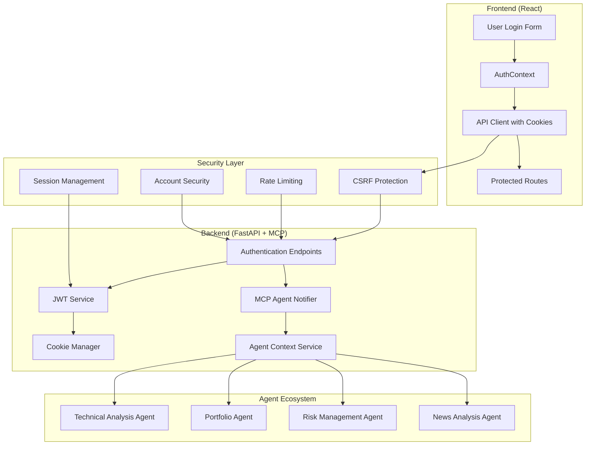
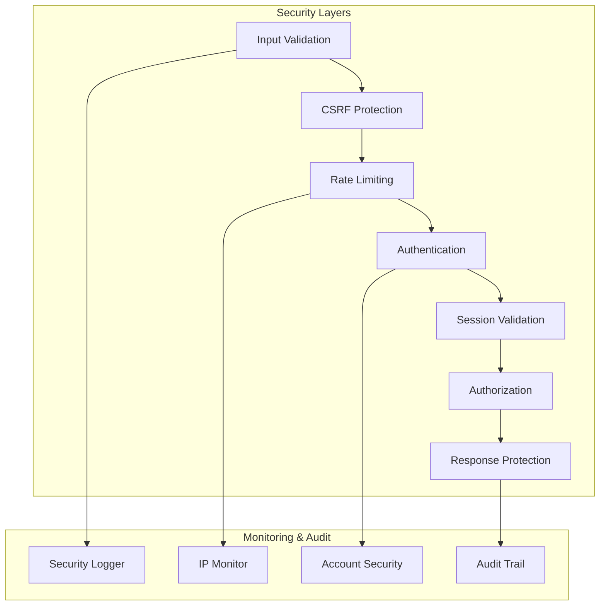

# StockPulse Authentication Architecture Plan

## HttpOnly Cookie JWT Implementation with FastAPI-MCP Integration

---

## Executive Summary

This document outlines the comprehensive authentication architecture for StockPulse, implementing a secure HttpOnly cookie-based JWT authentication system with FastAPI-MCP integration for agent ecosystem communication. The architecture prioritizes security, scalability, and seamless integration with the AI agent platform.

### Key Architectural Decisions

- **JWT Storage**: HttpOnly cookies for XSS protection
- **Backend Framework**: FastAPI with fastapi-mcp for agent integration
- **Frontend State Management**: React AuthContext without localStorage dependency
- **Security Model**: Multi-layered defense with CSRF, rate limiting, and monitoring
- **Agent Integration**: Event-driven MCP notifications for user context propagation

---

## Architecture Overview

### 1. Authentication Flow Architecture



### 2. Security Architecture



---

## Phase 1: Core Authentication Infrastructure (Sprint 1)

### 1.1 Backend Authentication Service

**Components:**

- FastAPI application with fastapi-mcp integration
- JWT service with RS256 algorithm
- HttpOnly cookie management
- User authentication endpoints

**Technical Specifications:**

```python
# JWT Configuration
ALGORITHM = "RS256"
ACCESS_TOKEN_EXPIRE_MINUTES = 30
REFRESH_TOKEN_EXPIRE_DAYS = 7

# Cookie Configuration
COOKIE_SETTINGS = {
    "httponly": True,
    "secure": True,
    "samesite": "strict",
    "max_age": 1800  # 30 minutes
}
```

**API Endpoints:**

- `POST /api/v1/auth/login` - User authentication with cookie response
- `GET /api/v1/auth/me` - Current user information
- `POST /api/v1/auth/logout` - Session termination
- `POST /api/v1/auth/refresh` - Token refresh

### 1.2 Database Schema

**Users Table:**

```sql
CREATE TABLE users (
    id UUID PRIMARY KEY DEFAULT gen_random_uuid(),
    email VARCHAR(255) UNIQUE NOT NULL,
    password_hash VARCHAR(255) NOT NULL,
    is_active BOOLEAN DEFAULT true,
    failed_login_attempts INTEGER DEFAULT 0,
    locked_until TIMESTAMP,
    created_at TIMESTAMP DEFAULT NOW(),
    updated_at TIMESTAMP DEFAULT NOW()
);
```

**User Sessions Table:**

```sql
CREATE TABLE user_sessions (
    id UUID PRIMARY KEY DEFAULT gen_random_uuid(),
    user_id UUID REFERENCES users(id),
    session_token VARCHAR(255) UNIQUE NOT NULL,
    refresh_token_hash VARCHAR(255),
    expires_at TIMESTAMP NOT NULL,
    ip_address INET,
    user_agent TEXT,
    created_at TIMESTAMP DEFAULT NOW()
);
```

---

## Phase 2: Frontend Integration (Sprint 2)

### 2.1 AuthContext Implementation

**Context Structure:**

```typescript
interface AuthContextType {
  user: User | null;
  loading: boolean;
  error: string | null;
  login: (email: string, password: string) => Promise<void>;
  logout: () => Promise<void>;
  checkAuthStatus: () => Promise<void>;
  clearError: () => void;
  isAuthenticated: boolean;
}
```

### 2.2 API Client Configuration

**Axios Setup:**

```typescript
const apiClient = axios.create({
  baseURL: process.env.REACT_APP_API_URL || "http://localhost:8000/api/v1",
  withCredentials: true, // Essential for HttpOnly cookies
  timeout: 10000,
  headers: {
    "Content-Type": "application/json",
  },
});
```

### 2.3 Authentication State Management

**Flow:**

1. App initialization → Check authentication status via `/auth/me`
2. Login → Update context with user data
3. Navigation → Persist authentication state
4. 401 Response → Automatic logout and redirect

---

## Phase 3: MCP Agent Integration (Sprint 3)

### 3.1 Agent Notification System

**User Context Model:**

```python
class UserContext(BaseModel):
    user_id: str
    email: str
    preferences: Dict[str, Any]
    portfolio_settings: Dict[str, Any]
    active_strategies: List[str]
    risk_profile: str
    agent_permissions: Dict[str, bool]
    session_id: str
    created_at: datetime
    last_updated: datetime
```

### 3.2 MCP Integration Points

**Authentication Events:**

- User Login → Notify agents with user context
- User Logout → Clean up agent contexts
- Preference Changes → Update agent configurations
- Session Timeout → Remove user contexts

**Agent Communication:**

```python
class AgentNotificationService:
    async def notify_user_login(self, user_context: UserContext)
    async def notify_user_logout(self, user_id: str)
    async def propagate_user_context(self, user_context: UserContext)
    async def update_user_preferences(self, user_id: str, preferences: Dict)
```

---

## Phase 4: Security Hardening (Sprint 4)

### 4.1 CSRF Protection

**Implementation:**

- Double-submit cookie pattern
- CSRF token validation for state-changing operations
- Frontend CSRF token management

### 4.2 Rate Limiting

**Multi-Level Protection:**

- IP-based rate limiting: 5 attempts/minute
- Account-based rate limiting: 5 attempts/15 minutes
- Graduated response system with progressive delays

### 4.3 Account Security

**Features:**

- Failed attempt tracking
- Account lockout after 5 failed attempts
- 30-minute lockout duration
- IP-based suspicious activity detection

### 4.4 Session Security

**Enhancements:**

- Session fingerprinting
- IP address validation
- User agent consistency checking
- Automatic session timeout

---

## Security Standards Compliance

### 4.5 Industry Standards

**Compliance Framework:**

- OWASP Top 10 mitigation
- SOC 2 requirements
- PCI DSS guidelines (where applicable)
- Financial industry security standards

**Security Headers:**

```python
SECURITY_HEADERS = {
    "X-Content-Type-Options": "nosniff",
    "X-Frame-Options": "DENY",
    "X-XSS-Protection": "1; mode=block",
    "Strict-Transport-Security": "max-age=31536000; includeSubDomains",
    "Content-Security-Policy": "default-src 'self'; script-src 'self'",
    "Referrer-Policy": "strict-origin-when-cross-origin"
}
```

---

## Monitoring and Observability

### 5.1 Security Monitoring

**Metrics to Track:**

- Authentication success/failure rates
- Account lockout events
- Suspicious IP activity
- Session creation/termination
- Agent notification success rates

### 5.2 Audit Logging

**Security Events:**

```python
SECURITY_EVENTS = [
    "user_login_success",
    "user_login_failure",
    "account_locked",
    "ip_blocked",
    "session_timeout",
    "csrf_violation",
    "rate_limit_exceeded"
]
```

---

## Performance Considerations

### 6.1 Optimization Strategies

**Backend Optimizations:**

- Redis caching for session data
- Connection pooling for database
- Asynchronous agent notifications
- Circuit breaker for MCP communication

**Frontend Optimizations:**

- Minimize authentication API calls
- Efficient context state management
- Lazy loading of authentication components

### 6.2 Scalability Measures

**Horizontal Scaling:**

- Stateless authentication design
- Redis clustering for session storage
- Load balancer session affinity
- Microservice-ready architecture

---

## Implementation Roadmap

### Sprint Planning

**Sprint 1 (Phase 1): Core Authentication Infrastructure**

- Stories: 1.2 (Backend Authentication)
- Duration: 2 weeks
- Focus: Secure authentication foundation

**Sprint 2 (Phase 2): Frontend Integration**

- Stories: 1.3 (AuthContext Implementation)
- Duration: 2 weeks
- Focus: User experience and state management

**Sprint 3 (Phase 3): MCP Agent Integration**

- Stories: 1.4 (Agent Integration)
- Duration: 2 weeks
- Focus: Agent ecosystem connectivity

**Sprint 4 (Phase 4): Security Hardening**

- Stories: 1.5 (Security Hardening)
- Duration: 2 weeks
- Focus: Production-ready security

---

## Risk Assessment & Mitigation

### 7.1 Security Risks

**High Priority Risks:**

1. **XSS Attacks** → Mitigated by HttpOnly cookies + CSP
2. **CSRF Attacks** → Mitigated by double-submit cookie pattern
3. **Session Hijacking** → Mitigated by session fingerprinting
4. **Brute Force** → Mitigated by rate limiting + account lockout

### 7.2 Technical Risks

**Implementation Risks:**

1. **MCP Communication Failures** → Circuit breaker pattern
2. **Performance Impact** → Asynchronous processing
3. **Session Storage Scaling** → Redis clustering
4. **Cookie Support Issues** → Fallback mechanisms

---

## Testing Strategy

### 8.1 Security Testing

**Test Categories:**

- Unit tests for authentication components
- Integration tests for full authentication flows
- Penetration testing for security vulnerabilities
- Load testing for performance validation

### 8.2 Agent Integration Testing

**MCP Testing:**

- Mock agent responses for unit tests
- Agent notification integration tests
- Context propagation validation
- Error handling verification

---

## Documentation Requirements

### 9.1 Technical Documentation

**Required Documents:**

- API documentation (OpenAPI/Swagger)
- Security implementation guide
- Agent integration specifications
- Deployment and configuration guide

### 9.2 Compliance Documentation

**Audit Requirements:**

- Security control implementation
- Privacy protection measures
- Incident response procedures
- Change management processes

---

## Conclusion

This comprehensive authentication architecture provides a secure, scalable foundation for StockPulse's user authentication system. The phased implementation approach ensures incremental delivery while maintaining system stability and security compliance.

**Key Benefits:**

- Enhanced security through HttpOnly cookies and multi-layered protection
- Seamless agent integration for personalized user experiences
- Scalable architecture supporting future growth
- Compliance with financial industry security standards
- Comprehensive monitoring and audit capabilities

**Next Steps:**

1. Begin Phase 1 implementation with Story 1.2
2. Set up development and testing environments
3. Establish security monitoring infrastructure
4. Initialize agent ecosystem integration framework

---

_Document Version: 1.0_
_Created by: Timmy (Architect Agent)_
_Date: 2025-01-XX_
_Review Status: Pending Technical Review_
