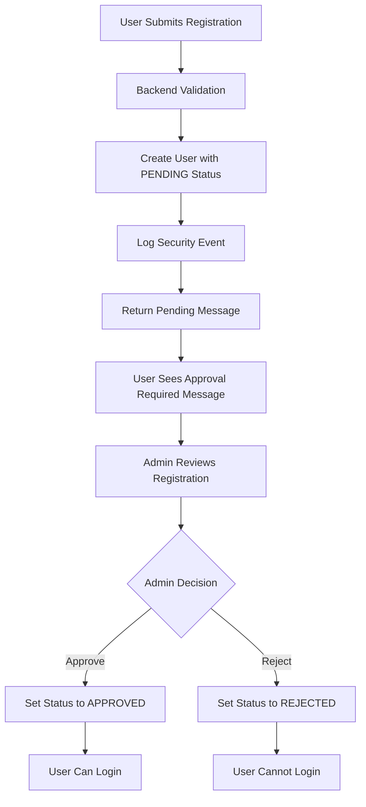

# Admin Approval Workflow - Security Documentation

## Overview

StockPulse implements a **mandatory admin approval workflow** for all new user registrations to prevent unauthorized access and maintain platform security. This document outlines the complete security implementation.

## Security Architecture

### User Registration Flow



### User Status States

| Status | Description | Can Login | Actions Available |
|--------|-------------|-----------|-------------------|
| `PENDING` | Awaiting admin approval | ❌ No | None - must wait |
| `APPROVED` | Admin approved | ✅ Yes | Full platform access |
| `REJECTED` | Admin rejected | ❌ No | Contact support |
| `SUSPENDED` | Temporarily suspended | ❌ No | Contact support |

## Implementation Details

### Database Schema

```sql
-- User approval fields
ALTER TABLE users ADD COLUMN status user_status DEFAULT 'pending' NOT NULL;
ALTER TABLE users ADD COLUMN approved_at TIMESTAMP;
ALTER TABLE users ADD COLUMN approved_by UUID;
ALTER TABLE users ADD COLUMN rejection_reason TEXT;

-- Enum for user status
CREATE TYPE user_status AS ENUM ('pending', 'approved', 'rejected', 'suspended');
```

### Backend Security Checks

#### Registration Endpoint (`/auth/register`)
- Creates user with `PENDING` status
- **NO automatic login** (security improvement)
- **NO session creation** until approved
- Comprehensive logging of registration attempts

#### Login Endpoint (`/auth/login`)
- Validates user credentials
- **Checks approval status before allowing login**
- Returns specific error messages for each status:
  - `pending`: "Your account is pending admin approval"
  - `rejected`: "Your account registration was rejected"
  - `suspended`: "Your account has been suspended"

#### Admin Endpoints (Admin Only)
- `GET /auth/admin/pending-users` - List pending registrations
- `POST /auth/admin/approve-user` - Approve/reject users

### Frontend Security Implementation

#### Registration Process
1. **Multi-step form** with validation
2. **Clear pending approval messaging**
3. **No redirect to dashboard** after registration
4. **Step 4: Pending approval screen** with instructions

#### Login Process
1. **Status-specific error messages**
2. **No session storage** for unapproved users
3. **Graceful handling** of approval status

## Admin Management Interface

### Access Control
- **Admin role required** for all approval endpoints
- **JWT token validation** with admin role check
- **Audit logging** for all admin actions

### User Approval Dashboard (`/admin/user-approval`)

#### Features
- **Real-time pending user list**
- **Search and filter** capabilities
- **Approve/Reject actions** with reason tracking
- **Audit trail** for all decisions
- **Responsive design** for mobile admin access

#### Security Logging
All admin actions are logged with:
- Admin user ID and email
- Target user information
- Action taken (approve/reject)
- Rejection reason (if applicable)
- IP address and timestamp

## Security Benefits

### Attack Prevention
1. **Prevents automated account creation**
2. **Blocks malicious registrations**
3. **Enables manual vetting** of users
4. **Provides audit trail** for compliance

### Compliance Features
1. **GDPR compliance** - manual review before data processing
2. **SOC 2 compliance** - access control and audit trails
3. **Financial regulations** - know your customer (KYC) support
4. **Data protection** - prevents unauthorized access

## Admin User Setup

### Creating Admin Users

```bash
# Run the admin creation script
python scripts/create_admin_user.py
```

**Default Admin Credentials:**
- Email: `admin@stockpulse.com`
- Password: `AdminPass123!`
- Role: `ADMIN`
- Status: `APPROVED`

### Admin Responsibilities

1. **Review registrations promptly** (within 24-48 hours)
2. **Verify user legitimacy** before approval
3. **Provide clear rejection reasons** when declining
4. **Monitor for suspicious patterns** in registrations
5. **Maintain audit compliance** through proper documentation

## Security Monitoring

### Key Metrics to Monitor
- **Pending registration count**
- **Approval/rejection ratios**
- **Time to approval** (SLA compliance)
- **Failed login attempts** from pending users
- **Suspicious registration patterns**

### Alerts and Notifications
- **High volume registrations** from single IP
- **Repeated rejection patterns**
- **Long pending approval times**
- **Admin action anomalies**

## Best Practices

### For Administrators
1. **Regular review schedule** - check pending users daily
2. **Consistent approval criteria** - document decision factors
3. **Prompt communication** - approve/reject within 48 hours
4. **Security awareness** - watch for suspicious patterns
5. **Audit compliance** - maintain proper documentation

### For Development
1. **Never bypass approval** in production
2. **Test approval workflow** in staging
3. **Monitor security logs** regularly
4. **Update admin interface** based on feedback
5. **Maintain security documentation**

## Troubleshooting

### Common Issues

#### User Cannot Login After Registration
- **Check user status** in admin dashboard
- **Verify approval status** in database
- **Review security logs** for login attempts

#### Admin Cannot Access Approval Dashboard
- **Verify admin role** in user table
- **Check JWT token** validity
- **Confirm admin endpoints** are accessible

#### High Pending User Count
- **Increase admin review frequency**
- **Add additional admin users**
- **Implement automated screening** for obvious spam

## Future Enhancements

### Planned Features
1. **Email notifications** for admins on new registrations
2. **Automated screening** for obvious spam/bots
3. **Bulk approval/rejection** capabilities
4. **Advanced filtering** and search options
5. **Integration with KYC services** for financial compliance

### Security Improvements
1. **Two-factor authentication** for admin accounts
2. **IP whitelisting** for admin access
3. **Advanced fraud detection** algorithms
4. **Machine learning** for registration screening
5. **Integration with threat intelligence** feeds

---

**Security Contact:** security@stockpulse.com  
**Documentation Version:** 0.1.0  
**Last Updated:** January 2025 