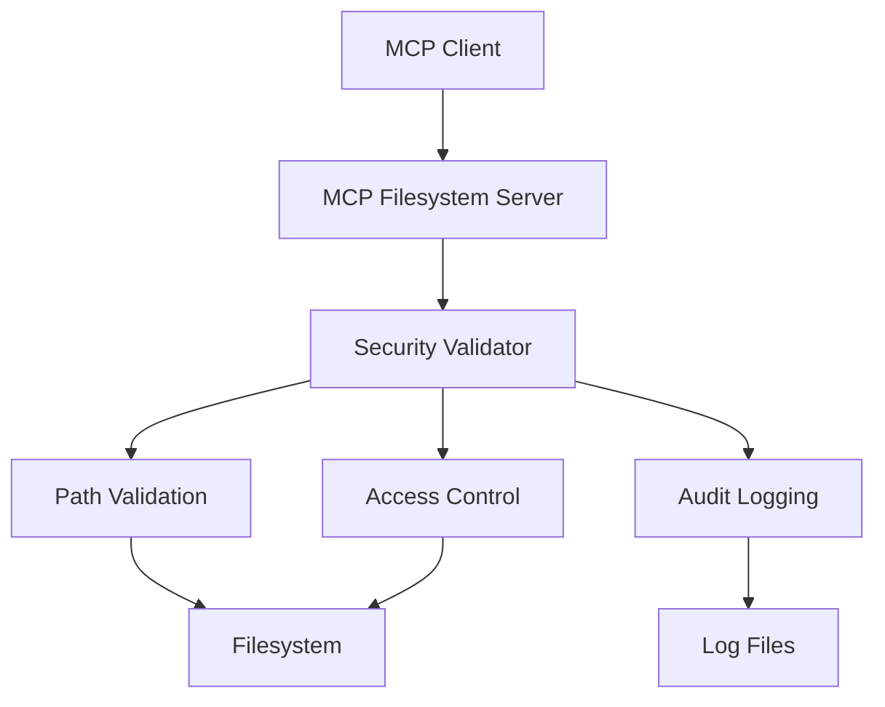

# MCP Filesystem Server Integration

## Overview

The **StockPulse MCP Filesystem Server** provides secure, enterprise-grade filesystem access through the [Model Context Protocol (MCP)](https://medium.com/@nimritakoul01/the-model-context-protocol-mcp-a-complete-tutorial-a3abe8a7f4ef). This server enables other applications to browse, read, and write files using standardized MCP tools while maintaining strict security controls.

## Architecture

### MCP Protocol Implementation

Based on the MCP specification, our filesystem server implements:

- **JSON-RPC 2.0 Protocol**: Standard messaging format for client-server communication
- **Tools Interface**: Exposes filesystem operations as callable tools
- **Resources Interface**: Provides file contents and metadata via URI-based resources
- **Security Layer**: Enterprise-grade access controls and validation

### Security Model



## Installation & Setup

### 1. Build the Server

```bash
cd mcp-servers/filesystem-server
npm install
npm run build
```

### 2. Configuration

Create a configuration file (optional):

```json
{
  "security": {
    "allowedRootPaths": ["/path/to/stockpulse"],
    "readOnlyMode": false,
    "maxFileSize": 10485760,
    "allowedFileExtensions": [".ts", ".js", ".json", ".md"]
  },
  "logging": {
    "level": "info",
    "enableConsole": true
  }
}
```

### 3. Environment Setup

```bash
export MCP_FILESYSTEM_CONFIG=/path/to/config.json
```

## Integration Examples

### Cursor IDE Integration

Add to your Cursor MCP configuration:

```json
{
  "mcpServers": {
    "stockpulse-filesystem": {
      "command": "node",
      "args": ["C:/Users/admin/Desktop/StockPulse/mcp-servers/filesystem-server/dist/index.js"],
      "env": {
        "MCP_FILESYSTEM_CONFIG": "C:/Users/admin/Desktop/StockPulse/mcp-servers/filesystem-server/config.example.json"
      }
    }
  }
}
```

### Claude Desktop Integration

Add to `claude_desktop_config.json`:

```json
{
  "mcpServers": {
    "stockpulse-filesystem": {
      "command": "node",
      "args": ["C:/Users/admin/Desktop/StockPulse/mcp-servers/filesystem-server/dist/index.js"]
    }
  }
}
```

### Custom MCP Client

```typescript
import { Client } from '@modelcontextprotocol/sdk/client/index.js';
import { StdioClientTransport } from '@modelcontextprotocol/sdk/client/stdio.js';

const transport = new StdioClientTransport({
  command: 'node',
  args: ['path/to/filesystem-server/dist/index.js']
});

const client = new Client({
  name: 'stockpulse-client',
  version: '1.0.0'
}, {
  capabilities: {}
});

await client.connect(transport);

// Browse directory
const result = await client.callTool({
  name: 'browse_directory',
  arguments: { path: '/stockpulse/src' }
});

// Read file
const fileContent = await client.callTool({
  name: 'read_file',
  arguments: { path: '/stockpulse/package.json' }
});

// Write file
await client.callTool({
  name: 'write_file',
  arguments: {
    path: '/stockpulse/temp/test.txt',
    content: 'Hello from MCP!',
    createDirectories: true
  }
});
```

## Available Tools

### 1. `browse_directory`

List directory contents with security filtering.

**Parameters:**
- `path` (string, required): Directory path to browse
- `includeHidden` (boolean, optional): Include hidden files
- `recursive` (boolean, optional): Browse subdirectories

**Example:**
```json
{
  "name": "browse_directory",
  "arguments": {
    "path": "/stockpulse/src",
    "includeHidden": false,
    "recursive": false
  }
}
```

**Response:**
```json
{
  "path": "/stockpulse/src",
  "items": [
    {
      "name": "components",
      "type": "directory",
      "accessible": true,
      "modified": "2025-01-06T12:00:00Z"
    },
    {
      "name": "app.tsx",
      "type": "file",
      "size": 1024,
      "accessible": true,
      "modified": "2025-01-06T11:30:00Z"
    }
  ],
  "totalItems": 2
}
```

### 2. `read_file`

Read file contents with validation.

**Parameters:**
- `path` (string, required): File path to read
- `encoding` (string, optional): File encoding (utf8, base64)
- `maxSize` (number, optional): Maximum file size in bytes

**Example:**
```json
{
  "name": "read_file",
  "arguments": {
    "path": "/stockpulse/package.json",
    "encoding": "utf8"
  }
}
```

### 3. `write_file`

Write content to files with backup support.

**Parameters:**
- `path` (string, required): File path to write
- `content` (string, required): Content to write
- `encoding` (string, optional): Content encoding
- `createDirectories` (boolean, optional): Create parent directories
- `backup` (boolean, optional): Create backup of existing file

### 4. `delete_file`

Delete files or directories with optional backup.

**Parameters:**
- `path` (string, required): Path to delete
- `recursive` (boolean, optional): Delete directories recursively
- `backup` (boolean, optional): Create backup before deletion

### 5. `get_file_info`

Get detailed metadata about files or directories.

**Parameters:**
- `path` (string, required): Path to get information about

### 6. `search_files`

Search for files matching patterns.

**Parameters:**
- `rootPath` (string, required): Root directory to search from
- `pattern` (string, required): Search pattern (glob or regex)
- `type` (string, optional): Type of items ('file', 'directory', 'both')
- `maxResults` (number, optional): Maximum results to return
- `maxDepth` (number, optional): Maximum directory depth

## Available Resources

### File Resources

Access file contents directly via URI:

```
file:///absolute/path/to/file.txt
```

### Directory Resources

Get directory listings via URI:

```
directory:///absolute/path/to/directory
```

### Metadata Resources

Get file/directory metadata via URI:

```
metadata:///absolute/path/to/item
```

### System Resources

Server information and capabilities:

```
system://filesystem-server/info
system://filesystem-server/capabilities
```

## Security Features

### Path Validation

- **Directory Traversal Protection**: Prevents `../` attacks
- **Allowed Path Enforcement**: Restricts access to configured directories
- **Extension Filtering**: Controls which file types can be accessed

### Access Controls

- **Read-Only Mode**: Disable write operations entirely
- **File Size Limits**: Prevent reading/writing large files
- **Directory Depth Limits**: Control recursion depth
- **Pattern Blocking**: Block access to sensitive files

### Audit Logging

All operations are logged with:
- Operation type and parameters
- User context and timestamps
- Success/failure status
- Security violations

Example log entry:
```json
{
  "timestamp": "2025-01-06T12:38:00Z",
  "level": "info",
  "message": "Tool execution successful: read_file",
  "tool": "read_file",
  "args": {"path": "/stockpulse/package.json"},
  "success": true
}
```

## Configuration Reference

### Security Configuration

```typescript
{
  security: {
    allowedRootPaths: string[];      // Permitted root directories
    readOnlyMode: boolean;           // Disable write operations
    maxFileSize: number;             // Max file size in bytes
    maxDirectoryDepth: number;       // Max recursion depth
    allowedFileExtensions: string[]; // Permitted file extensions
    blockedPatterns: string[];       // Blocked path patterns
    enableAuditLog: boolean;         // Enable audit logging
  }
}
```

### Default Security Settings

**Allowed Extensions:**
- Source: `.ts`, `.tsx`, `.js`, `.jsx`, `.py`, `.sql`
- Config: `.json`, `.yml`, `.yaml`, `.env.example`
- Docs: `.md`, `.txt`, `.gitignore`
- Assets: `.css`, `.html`, `.svg`, `.png`, `.jpg`

**Blocked Patterns:**
- `**/node_modules/**`
- `**/.git/**`
- `**/.env`
- `**/*.log`
- `**/dist/**`
- `**/*.key`, `**/*.pem`

**Size Limits:**
- Max file size: 50MB
- Max directory depth: 10 levels
- Max files per request: 100

## Monitoring & Troubleshooting

### Health Checks

Check server status:
```bash
# Test server capabilities
curl -X POST -H "Content-Type: application/json" \
  -d '{"method":"resources/read","params":{"uri":"system://filesystem-server/info"}}' \
  http://localhost:3001/mcp
```

### Debug Mode

Enable debug logging:
```json
{
  "logging": {
    "level": "debug",
    "enableConsole": true
  }
}
```

### Common Issues

1. **Access Denied Errors**
   - Verify paths are within `allowedRootPaths`
   - Check file extensions are allowed
   - Ensure paths don't match blocked patterns

2. **File Too Large Errors**
   - Increase `maxFileSize` in configuration
   - Use streaming for large files

3. **Permission Errors**
   - Check filesystem permissions
   - Verify server process has access rights

## Performance Considerations

### Rate Limiting

Configure request limits:
```json
{
  "limits": {
    "maxFilesPerRequest": 100,
    "maxConcurrentOperations": 10,
    "rateLimitPerMinute": 1000
  }
}
```

### Caching

Enable directory listing cache:
```json
{
  "features": {
    "cacheDirectoryListings": true
  }
}
```

## Development & Testing

### Local Development

```bash
# Development mode with watch
npm run dev

# Type checking
npm run type-check

# Linting
npm run lint
```

### Testing

```bash
# Run tests
npm test

# Test specific tool
echo '{"method":"tools/call","params":{"name":"browse_directory","arguments":{"path":"/stockpulse"}}}' | node dist/index.js
```

## Integration with StockPulse Architecture

The MCP Filesystem Server integrates with StockPulse's enterprise architecture:

- **Zero Trust Security**: All access validated and logged
- **Event-Driven Architecture**: File operations can trigger events
- **Layered Structure**: Clean separation of concerns
- **Enterprise Standards**: Follows OWASP, NIST guidelines

## References

- [Model Context Protocol Specification](https://spec.modelcontextprotocol.io/specification/2024-11-05/)
- [MCP TypeScript SDK](https://github.com/modelcontextprotocol/typescript-sdk)
- [MCP Tutorial](https://medium.com/@nimritakoul01/the-model-context-protocol-mcp-a-complete-tutorial-a3abe8a7f4ef)
- [StockPulse Architecture Documentation](../architecture/)

---

🚀 **Built for StockPulse - Enterprise-Grade Financial Trading Platform** 