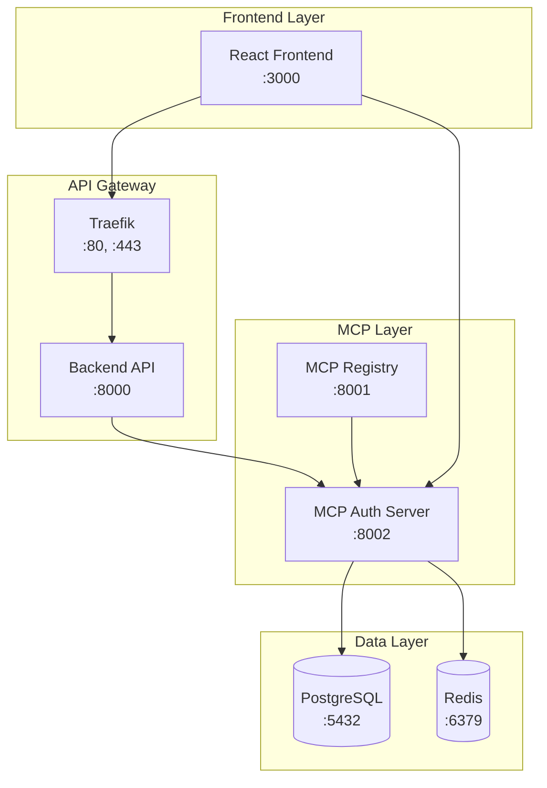

# StockPulse Staging Deployment Guide

## Overview

This guide covers the complete process for deploying StockPulse to a staging environment for user acceptance testing (UAT) with the integrated MCP authentication system.

## Prerequisites

### System Requirements
- Docker Engine 20.10+ with Docker Compose
- Node.js 18+ (for local development)
- Git 2.30+
- 4GB+ available RAM
- 10GB+ available disk space

### Verification Commands
```bash
docker --version
docker-compose --version
node --version
git --version
```

## Quick Start

### 1. Deploy Staging Environment
```bash
# Clone and navigate to project
git clone <repository-url>
cd StockPulse

# Deploy staging environment
./scripts/deploy-staging.sh
```

### 2. Access Application
- **Frontend**: http://localhost:3000
- **Backend API**: http://localhost:8000
- **MCP Auth Server**: http://localhost:8002
- **Traefik Dashboard**: http://localhost:8080

### 3. Test Authentication
**Test Credentials:**
- Email: `testuser@example.com`
- Password: `Password123!`

## Architecture Overview

### Services Deployment Map



## Detailed Deployment Process

### Phase 1: Infrastructure Setup

```bash
# 1. Verify prerequisites
./scripts/deploy-staging.sh health

# 2. Clean previous deployment (if any)
./scripts/stop-staging.sh full

# 3. Deploy infrastructure
./scripts/deploy-staging.sh deploy
```

### Phase 2: Service Verification

```bash
# Check service status
docker-compose -f docker-compose.staging.yml ps

# Check service logs
docker-compose -f docker-compose.staging.yml logs -f mcp-auth-server

# Run health checks
./scripts/deploy-staging.sh health
```

### Phase 3: Frontend Integration Testing

```bash
# Run integration tests
npm test -- --testPathPattern=integration

# Manual testing endpoints
curl http://localhost:8002/health
curl http://localhost:8002/tools/list
```

## User Acceptance Testing (UAT)

### Test Scenarios

#### 1. Authentication Flow
1. **Login Process**
   - Navigate to http://localhost:3000
   - Enter test credentials
   - Verify successful login
   - Check user session persistence

2. **Session Management**
   - Refresh page after login
   - Verify user remains logged in
   - Test logout functionality
   - Verify session cleanup

3. **Security Features**
   - Verify HttpOnly cookies are set
   - Test CSRF protection
   - Verify secure session handling

#### 2. Error Handling
1. **Invalid Credentials**
   - Test with wrong password
   - Test with non-existent email
   - Verify appropriate error messages

2. **Network Issues**
   - Simulate server downtime
   - Verify graceful error handling
   - Test reconnection behavior

#### 3. User Experience
1. **Form Validation**
   - Test email format validation
   - Test password requirements
   - Verify real-time feedback

2. **Loading States**
   - Verify loading indicators
   - Test button disabled states
   - Check responsive design

### UAT Checklist

- [ ] **Authentication**
  - [ ] Login with valid credentials
  - [ ] Login failure with invalid credentials
  - [ ] Session persistence across page refreshes
  - [ ] Logout functionality
  - [ ] Session timeout handling

- [ ] **Security**
  - [ ] HttpOnly cookies are set
  - [ ] No sensitive data in localStorage
  - [ ] CSRF token protection
  - [ ] Secure password handling

- [ ] **User Experience**
  - [ ] Form validation works correctly
  - [ ] Loading states are clear
  - [ ] Error messages are helpful
  - [ ] Responsive design on mobile
  - [ ] Accessibility compliance

- [ ] **Performance**
  - [ ] Login response time < 2 seconds
  - [ ] Page load time < 3 seconds
  - [ ] No memory leaks in browser
  - [ ] Smooth navigation

## Monitoring & Observability

### Health Check Endpoints
```bash
# Application health
curl http://localhost:8002/health

# Service status
curl http://localhost:8001/health

# Database connectivity
docker exec stockpulse-postgres-staging pg_isready
```

### Log Monitoring
```bash
# Real-time logs
docker-compose -f docker-compose.staging.yml logs -f

# Specific service logs
docker-compose -f docker-compose.staging.yml logs mcp-auth-server

# Error logs only
docker-compose -f docker-compose.staging.yml logs --since 10m | grep ERROR
```

### Metrics Dashboard
- **Traefik Dashboard**: http://localhost:8080
- **Application Metrics**: Integrated in service logs
- **Database Metrics**: PostgreSQL logs

## Troubleshooting

### Common Issues

#### 1. Service Not Starting
```bash
# Check service status
docker-compose -f docker-compose.staging.yml ps

# Check logs for errors
docker-compose -f docker-compose.staging.yml logs [service-name]

# Restart specific service
docker-compose -f docker-compose.staging.yml restart [service-name]
```

#### 2. Authentication Failures
```bash
# Verify MCP auth server is healthy
curl http://localhost:8002/health

# Check auth server logs
docker-compose -f docker-compose.staging.yml logs mcp-auth-server

# Test direct authentication
curl -X POST http://localhost:8002/tools/call \
  -H "Content-Type: application/json" \
  -d '{"tool":"authenticate_user","parameters":{"email":"testuser@example.com","password":"Password123!"}}'
```

#### 3. Database Connection Issues
```bash
# Check PostgreSQL status
docker exec stockpulse-postgres-staging pg_isready -U stockpulse_user

# Connect to database
docker exec -it stockpulse-postgres-staging psql -U stockpulse_user -d stockpulse

# Check Redis connectivity
docker exec stockpulse-redis-staging redis-cli -a stockpulse_redis_password ping
```

### Recovery Procedures

#### Full Environment Reset
```bash
# Stop all services
./scripts/stop-staging.sh full

# Clean Docker resources
docker system prune -f

# Redeploy
./scripts/deploy-staging.sh
```

#### Database Recovery
```bash
# Backup current data
docker exec stockpulse-postgres-staging pg_dump -U stockpulse_user stockpulse > backup.sql

# Reset database
./scripts/stop-staging.sh full
./scripts/deploy-staging.sh
```

## Performance Considerations

### Resource Usage
- **Memory**: ~2GB total for all services
- **CPU**: 2 cores recommended
- **Storage**: ~5GB for logs and data
- **Network**: Minimal external bandwidth

### Scaling Notes
- Staging environment is single-node
- Production should use container orchestration
- Database should be externalized for production
- Consider load balancing for production

## Security Notes

### Staging-Specific Security
- Uses test credentials and data
- JWT secrets are development-grade
- HTTPS not enforced (development only)
- Debug logging enabled

### Production Differences
- All secrets must be rotated
- HTTPS enforcement required
- Production-grade JWT secrets
- Audit logging enabled
- Rate limiting configured

## Next Steps

### Story 1.3 Development
After successful staging deployment:

1. **Frontend Context Enhancement**
   - Implement advanced AuthContext features
   - Add user preference management
   - Enhance error handling

2. **MCP Agent Integration**
   - Connect trading agents to auth system
   - Implement user context propagation
   - Add agent authorization

3. **Security Hardening**
   - Implement rate limiting
   - Add account lockout policies
   - Enhanced monitoring

### Production Readiness
- [ ] External database configuration
- [ ] Secret management system
- [ ] HTTPS/TLS certificates
- [ ] Production monitoring
- [ ] Backup procedures
- [ ] Disaster recovery plan

## Support

### Documentation
- [Architecture Plan](./authentication-architecture-plan.md)
- [MCP Integration Guide](./mcp-integration-tutorial.md)
- [Story 1.2 Implementation](../docs/stories/story-1.2.md)

### Commands Reference
```bash
# Deploy staging
./scripts/deploy-staging.sh

# Check health
./scripts/deploy-staging.sh health

# View logs
./scripts/deploy-staging.sh logs

# Stop staging
./scripts/stop-staging.sh

# Full cleanup
./scripts/stop-staging.sh full
``` 