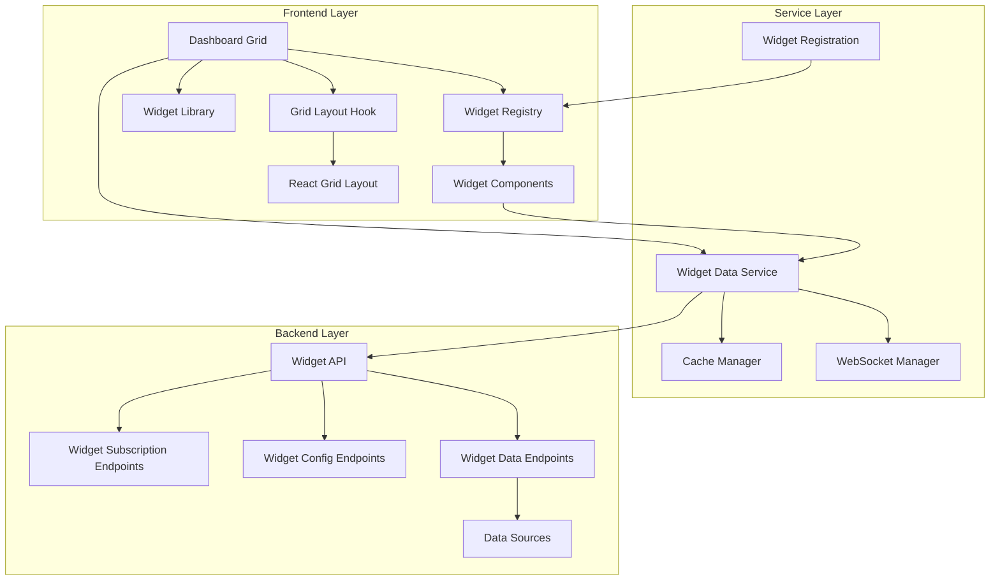

# Widget System Documentation - Story 2.2

## Overview

The StockPulse Widget System is a comprehensive, enterprise-grade solution for creating customizable, interactive dashboards. This system provides users with the ability to add, remove, resize, and rearrange widgets to create personalized financial data views.

## Table of Contents

1. [Architecture Overview](#architecture-overview)
2. [Core Components](#core-components)
3. [API Documentation](#api-documentation)
4. [Frontend Components](#frontend-components)
5. [Widget Development Guide](#widget-development-guide)
6. [Configuration](#configuration)
7. [Testing](#testing)
8. [Deployment](#deployment)
9. [Troubleshooting](#troubleshooting)

## Architecture Overview

### System Architecture

The widget system follows a federated architecture pattern with the following key principles:

- **Federated Widget Architecture**: Individual widget components with central orchestration
- **Custom Hooks with Local State + Backend Sync**: Granular state management
- **Widget-Specific Data Subscriptions**: Real-time data flow pattern
- **Layered Service Architecture**: Clean separation of concerns
- **Enhanced Grid Layout with AppContainer Integration**: UI system integration

### High-Level Architecture Diagram



### Data Flow

1. **Widget Registration**: Widgets are registered at application startup
2. **Dashboard Initialization**: Dashboard loads user's saved layout
3. **Widget Rendering**: Widgets are rendered with their configurations
4. **Data Subscription**: Widgets subscribe to real-time data updates
5. **User Interactions**: Edit mode allows layout modifications
6. **Persistence**: Changes are saved to backend storage

## Core Components

### 1. Widget Registry (`src/services/widget-registry.ts`)

The central registry for all available widgets in the system.

**Key Features:**

- Dynamic widget registration
- Lazy loading support
- Permission-based access control
- Search and categorization
- Factory pattern for widget creation

**Usage:**

```typescript
import { widgetRegistry } from "@/services/widget-registry";

// Register a widget
widgetRegistry.register(metadata, factory);

// Get a widget
const widget = widgetRegistry.get("portfolio-overview");

// Search widgets
const results = widgetRegistry.search("portfolio");
```

### 2. Grid Layout Hook (`src/hooks/useGridLayout.ts`)

Manages the React Grid Layout integration and responsive behavior.

**Key Features:**

- Responsive breakpoints
- Optimal positioning algorithms
- Auto-arrange functionality
- Layout persistence
- Collision detection

**Usage:**

```typescript
import { useGridLayout } from "@/hooks/useGridLayout";

const {
  layout,
  updateLayout,
  addWidget,
  removeWidget,
  saveLayout,
  isEditMode,
} = useGridLayout(initialLayout);
```

### 3. Widget Data Service (`src/services/widget-data-service.ts`)

Handles data fetching, caching, and real-time updates for widgets.

**Key Features:**

- WebSocket subscriptions
- Smart caching with TTL
- Retry logic with exponential backoff
- Multi-widget data sharing
- Error handling and recovery

**Usage:**

```typescript
import { widgetDataService } from "@/services/widget-data-service";

// Subscribe to widget data
const unsubscribe = widgetDataService.subscribe("portfolio-overview", (data) =>
  setWidgetData(data),
);

// Get cached data
const data = widgetDataService.getCachedData("portfolio-overview");
```

### 4. Widget Library (`src/components/dashboard/widget-library.tsx`)

Interactive widget browser for discovering and adding widgets.

**Key Features:**

- Category-based browsing
- Search functionality
- Widget previews
- Grid and list view modes
- Drag-and-drop support

### 5. Dashboard Grid (`src/components/dashboard/dashboard-grid.tsx`)

Main orchestration component that manages the entire widget system.

**Key Features:**

- Edit mode controls
- Widget lifecycle management
- Connection monitoring
- Error boundaries
- Performance optimization

## API Documentation

### Widget Data Endpoints

#### GET `/widgets/data/{widget_type}`

Retrieves real-time data for a specific widget type.

**Parameters:**

- `widget_type` (path): Type of widget (e.g., 'portfolio-overview')
- `config` (query, optional): Widget configuration parameters

**Response:**

```json
{
  "widget_type": "portfolio-overview",
  "data": {
    "total_value": 125750.5,
    "day_change": 2847.25,
    "day_change_percent": 2.31,
    "positions": 12,
    "cash": 5250.75
  },
  "timestamp": "2024-01-15T10:30:00Z",
  "is_cached": false,
  "cache_expires_at": "2024-01-15T10:35:00Z"
}
```

#### POST `/widgets/data/bulk`

Retrieves data for multiple widgets in a single request.

**Request Body:**

```json
{
  "widget_types": ["portfolio-overview", "market-summary"],
  "configs": {
    "portfolio-overview": { "showCash": true },
    "market-summary": { "indices": ["SPY", "QQQ"] }
  }
}
```

**Response:**

```json
{
  "widget_data": {
    "portfolio-overview": {
      /* widget data */
    },
    "market-summary": {
      /* widget data */
    }
  },
  "errors": {},
  "timestamp": "2024-01-15T10:30:00Z"
}
```

### Widget Configuration Endpoints

#### POST `/widgets/config/{widget_id}`

Updates configuration for a specific widget instance.

**Request Body:**

```json
{
  "widget_type": "portfolio-overview",
  "config": {
    "showCash": true,
    "refreshInterval": 30000
  }
}
```

#### GET `/widgets/config/{widget_id}`

Retrieves configuration for a specific widget instance.

### Widget Subscription Endpoints

#### POST `/widgets/subscribe`

Subscribes to real-time updates for specific widgets.

**Request Body:**

```json
{
  "widget_types": ["portfolio-overview", "market-summary"],
  "refresh_intervals": {
    "portfolio-overview": 30000,
    "market-summary": 60000
  }
}
```

#### DELETE `/widgets/subscribe/{subscription_id}`

Cancels subscription to widget updates.

### Widget Metrics Endpoints

#### GET `/widgets/metrics`

Retrieves usage metrics for user's widgets.

**Parameters:**

- `timeframe` (query): Time period for metrics (1d, 7d, 30d)

## Frontend Components

### Widget Wrapper (`src/components/dashboard/widget-wrapper.tsx`)

Standardized wrapper for all widgets providing common functionality.

**Features:**

- Error boundaries
- Loading states
- Action menus
- Resize handles
- Edit mode overlays

**Props:**

```typescript
interface WidgetWrapperProps {
  widget: WidgetConfig;
  isEditMode: boolean;
  onRemove: () => void;
  onConfigure: () => void;
  children: React.ReactNode;
}
```

### Widget Components

All widgets follow a consistent interface:

```typescript
interface WidgetProps {
  config: WidgetConfig;
  data?: any;
  isLoading?: boolean;
  error?: string;
  isEditMode?: boolean;
  className?: string;
}
```

#### Available Widgets

1. **Portfolio Overview** (`portfolio-overview`)

   - Total portfolio value
   - Day change and percentage
   - Position count and cash balance

2. **Market Summary** (`market-summary`)

   - Major market indices
   - Real-time price updates
   - Change indicators

3. **Watchlist** (`watchlist`)

   - Customizable stock list
   - Price and change data
   - Quick action buttons

4. **Portfolio Chart** (`portfolio-chart`)

   - Interactive portfolio performance chart
   - Time range selection
   - Benchmark comparison

5. **AI Insights** (`ai-insights`)

   - AI-generated recommendations
   - Risk analysis
   - Market sentiment

6. **Recent Transactions** (`recent-transactions`)

   - Latest buy/sell orders
   - Transaction details
   - Performance impact

7. **Performance Metrics** (`performance-metrics`)

   - Sharpe ratio, alpha, beta
   - Risk metrics
   - Benchmark comparison

8. **Alerts** (`alerts`)

   - Price alerts
   - News alerts
   - System notifications

9. **News Feed** (`news-feed`)

   - Financial news articles
   - Market updates
   - Company-specific news

10. **Sector Performance** (`sector-performance`)

    - Sector allocation
    - Performance by sector
    - Rebalancing suggestions

11. **Top Movers** (`top-movers`)

    - Biggest gainers and losers
    - Volume leaders
    - Market momentum

12. **Economic Calendar** (`economic-calendar`)
    - Upcoming economic events
    - Impact ratings
    - Historical data

## Widget Development Guide

### Creating a New Widget

1. **Define Widget Type**

Add the new widget type to `src/types/dashboard.ts`:

```typescript
export type WidgetType =
  | "portfolio-overview"
  | "market-summary"
  | "your-new-widget"; // Add here
```

2. **Create Widget Component**

Create `src/components/widgets/YourNewWidget.tsx`:

```typescript
import React from 'react';
import { Card, CardHeader, CardContent } from '@/components/ui/card';
import { WidgetProps } from '@/types/dashboard';

const YourNewWidget: React.FC<WidgetProps> = ({
  config,
  data,
  isLoading,
  error,
  isEditMode,
  className
}) => {
  if (error) {
    return (
      <Card className={className}>
        <CardContent className="p-4">
          <div className="text-red-500">Error: {error}</div>
        </CardContent>
      </Card>
    );
  }

  return (
    <Card className={className}>
      <CardHeader>
        <h3 className="text-lg font-semibold">{config.title}</h3>
      </CardHeader>
      <CardContent>
        {isLoading ? (
          <div>Loading...</div>
        ) : (
          <div>
            {/* Your widget content */}
          </div>
        )}
      </CardContent>
    </Card>
  );
};

export default YourNewWidget;
```

3. **Create Preview Component**

Create `src/components/widgets/previews/YourNewWidgetPreview.tsx`:

```typescript
import React from 'react';

const YourNewWidgetPreview: React.FC<{ isPreview?: boolean }> = () => {
  return (
    <div className="h-full w-full p-4 bg-white dark:bg-gray-800 rounded-lg border">
      <h3 className="text-sm font-medium mb-2">Your New Widget</h3>
      <div className="text-xs text-gray-500">
        Preview of your widget functionality
      </div>
    </div>
  );
};

export default YourNewWidgetPreview;
```

4. **Register Widget**

Add registration in `src/services/widget-registration.ts`:

```typescript
// Import your components
const YourNewWidget = lazy(() => import("../components/widgets/YourNewWidget"));
const YourNewWidgetPreview = lazy(
  () => import("../components/widgets/previews/YourNewWidgetPreview"),
);

// Add to widget definitions
const WIDGET_DEFINITIONS: WidgetDefinition[] = [
  // ... existing widgets
  {
    type: "your-new-widget",
    metadata: {
      type: "your-new-widget",
      config: {
        id: "your-new-widget",
        type: "your-new-widget",
        title: "Your New Widget",
        description: "Description of your widget",
        icon: YourIcon,
        category: "portfolio", // or appropriate category
        isEnabled: true,
      },
      libraryItem: {
        type: "your-new-widget",
        title: "Your New Widget",
        description: "Detailed description for the library",
        category: "portfolio",
        icon: YourIcon,
        isAvailable: true,
        isPremium: false,
        tags: ["portfolio", "custom"],
      },
      component: YourNewWidget,
      previewComponent: YourNewWidgetPreview,
      permissions: ["portfolio.read"],
      dataRequirements: ["portfolio_data"],
    },
    factory: {
      create: (config: WidgetConfig) => YourNewWidget,
      validate: (config: any) => true,
      getDefaultConfig: () => ({
        refreshInterval: 30000,
        // other default config
      }),
    },
  },
];
```

5. **Add Backend Data Support**

Add data generation in `services/backend/app/api/v1/widgets.py`:

```python
elif widget_type == "your-new-widget":
    return {
        "your_data": "sample_value",
        "last_updated": datetime.utcnow().isoformat()
    }
```

### Widget Best Practices

1. **Performance**

   - Use React.memo for expensive components
   - Implement proper loading states
   - Optimize data fetching

2. **Accessibility**

   - Use semantic HTML
   - Provide ARIA labels
   - Support keyboard navigation

3. **Error Handling**

   - Graceful degradation
   - User-friendly error messages
   - Retry mechanisms

4. **Responsive Design**
   - Mobile-first approach
   - Flexible layouts
   - Touch-friendly interactions

## Configuration

### Environment Variables

```bash
# Frontend
VITE_API_BASE_URL=http://localhost:8000
VITE_WS_URL=ws://localhost:8000/ws
VITE_WIDGET_REFRESH_INTERVAL=30000

# Backend
WIDGET_CACHE_TTL=300
WIDGET_MAX_SUBSCRIPTIONS=100
WIDGET_DATA_RETENTION_DAYS=30
```

### Widget Configuration Schema

```typescript
interface WidgetConfig {
  id: string;
  type: WidgetType;
  title: string;
  description?: string;
  icon: string;
  category: WidgetCategory;
  isEnabled: boolean;
  refreshInterval?: number;
  customConfig?: Record<string, any>;
}
```

## Testing

### Running Tests

```bash
# Unit tests
npm run test:unit

# Integration tests
npm run test:integration

# E2E tests
npm run test:e2e

# All tests
npm run test
```

### Test Coverage

The widget system maintains >80% test coverage across:

- Unit tests for core services and components
- Integration tests for API endpoints
- E2E tests for user workflows

### Test Data

Test fixtures are available in `tests/story-2.2/fixtures/`:

- `widget-data.json`: Sample widget data
- `user-layouts.json`: Sample dashboard layouts
- `widget-configs.json`: Sample widget configurations

## Deployment

### Frontend Deployment

1. **Build the application**

   ```bash
   npm run build
   ```

2. **Deploy to CDN/Static hosting**
   ```bash
   npm run deploy
   ```

### Backend Deployment

1. **Build Docker image**

   ```bash
   docker build -t stockpulse-backend .
   ```

2. **Deploy with environment variables**
   ```bash
   docker run -e DATABASE_URL=... -e REDIS_URL=... stockpulse-backend
   ```

### Database Migrations

```bash
# Run widget-related migrations
alembic upgrade head
```

## Troubleshooting

### Common Issues

#### Widget Not Loading Data

1. Check network connectivity
2. Verify API endpoint availability
3. Check authentication status
4. Review browser console for errors

**Solution:**

```typescript
// Check widget data service status
console.log(widgetDataService.getConnectionStatus());

// Retry data fetch
widgetDataService.retryFailedRequests();
```

#### Layout Not Saving

1. Verify user authentication
2. Check backend API availability
3. Review browser storage permissions

**Solution:**

```typescript
// Force layout save
await dashboardService.saveLayout(currentLayout, { force: true });
```

#### Widget Performance Issues

1. Check widget refresh intervals
2. Review data caching configuration
3. Monitor memory usage

**Solution:**

```typescript
// Optimize refresh intervals
widgetDataService.updateRefreshInterval("widget-id", 60000);

// Clear cache if needed
widgetDataService.clearCache();
```

### Debug Mode

Enable debug mode for detailed logging:

```bash
# Frontend
VITE_DEBUG_WIDGETS=true

# Backend
LOG_LEVEL=DEBUG
```

### Performance Monitoring

Monitor widget performance with built-in metrics:

```typescript
// Get widget performance metrics
const metrics = await widgetDataService.getPerformanceMetrics();
console.log("Average load time:", metrics.averageLoadTime);
console.log("Error rate:", metrics.errorRate);
```

## Support

For additional support:

1. Check the [FAQ](./faq.md)
2. Review [API Reference](./api-reference.md)
3. Submit issues to the project repository
4. Contact the development team

---

**Last Updated:** January 2024
**Version:** 2.0.0
**Authors:** StockPulse Development Team
