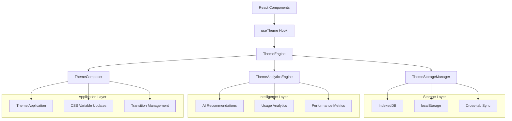

# StockPulse Theme Architecture v2.0 - Enterprise Implementation

## 🚀 Overview

This document outlines the improved, enterprise-grade theme architecture for StockPulse, eliminating function overlaps and establishing a centralized theme management system.

## ✅ Problems Solved

### 1. **Function Overlaps Eliminated**
- ❌ **Before**: Multiple localStorage implementations across `useTheme`, `ThemeContext`, and storage utilities
- ✅ **After**: Single `ThemeStorageManager` handles all persistence operations

### 2. **Storage Logic Centralization**
- ❌ **Before**: Scattered storage logic in hooks and context
- ✅ **After**: Centralized in `ThemeEngine` with delegation to `ThemeStorageManager`

### 3. **Duplicate Utilities Removed**
- ❌ **Before**: Multiple `cn` function implementations
- ✅ **After**: Single `cn` function in `tailwind.ts` with proper exports

### 4. **Analytics Integration**
- ❌ **Before**: Analytics existed but wasn't integrated
- ✅ **After**: Fully integrated analytics with AI-powered recommendations

## 🏗️ New Architecture Components

### 1. Central Theme Engine (`src/theme/themeEngine.ts`)

The **ThemeEngine** is the single coordinator for all theme operations.

```typescript
import { themeEngine } from '../theme/themeEngine';

// All theme operations go through the engine
const success = await themeEngine.setTheme('trading', 'dark');
const recommendations = await themeEngine.getRecommendations();
const analytics = await themeEngine.getAnalytics();
```

**Key Features:**
- Unified theme state management
- Integrated storage coordination
- Analytics and recommendations
- Cross-tab synchronization
- Performance optimization
- Event-driven updates

### 2. Enhanced Hook (`src/hooks/useTheme.ts`)

The **useTheme** hook now integrates with ThemeEngine for comprehensive functionality.

```typescript
const {
  // Basic theme state
  mode, colorTheme, variant, isDark, isTransitioning,
  
  // Theme operations
  setTheme, setMode, setColorTheme, setVariant, toggleMode,
  
  // Advanced features
  recommendations, analytics, autoSwitch,
  
  // Utility functions
  getAvailableThemes, getThemeMetadata, resetToDefault,
  
  // Data management
  exportData, importData, lastChanged, engineReady
} = useTheme({
  enableRecommendations: true,
  enableAnalytics: true,
  enableAutoSwitch: true,
  autoSave: true,
  context: 'trading-dashboard'
});
```

### 3. Simplified Context (`src/contexts/ThemeContext.tsx`)

The **ThemeContext** now delegates all operations to ThemeEngine, eliminating overlap.

```typescript
// Context is now purely a React state wrapper around ThemeEngine
const { themeState, actions } = useThemeEngine();
```

### 4. Centralized Storage (`src/utils/theme/themeStorage.ts`)

All persistence operations handled by the **ThemeStorageManager**.

```typescript
import { themeStorage } from '../utils/theme/themeStorage';

// Advanced storage with IndexedDB, compression, and cross-tab sync
await themeStorage.saveThemeData(data);
const userData = await themeStorage.getUserPreferences();
const analytics = await themeStorage.getThemeAnalytics();
```

### 5. AI Analytics (`src/utils/theme/themeAnalytics.ts`)

**ThemeAnalyticsEngine** provides intelligent recommendations and insights.

```typescript
import { themeAnalytics } from '../utils/theme/themeAnalytics';

// AI-powered recommendations
const recommendations = await themeAnalytics.getThemeRecommendations();
const insights = await themeAnalytics.generateInsights();
const autoSwitch = await themeAnalytics.autoSwitchTheme();
```

## 🔄 Data Flow Architecture



## 📁 File Structure

```
src/
├── theme/
│   ├── themeEngine.ts          # Central coordinator
│   ├── colorPalettes.ts        # Theme definitions (unchanged)
│   └── themeComposer.ts        # Theme application (unchanged)
├── hooks/
│   └── useTheme.ts             # Enhanced hook with full features
├── contexts/
│   └── ThemeContext.tsx        # Simplified context delegating to engine
├── utils/theme/
│   ├── themeStorage.ts         # Centralized storage manager
│   ├── themeAnalytics.ts       # AI analytics and recommendations
│   ├── tailwind.ts             # Tailwind utilities (includes cn)
│   └── index.ts                # Consolidated exports
├── components/common/
│   └── UnifiedThemeSelector.tsx # Comprehensive demo component
└── types/
    └── theme.ts                # Type definitions
```

## 🚀 Usage Examples

### Basic Usage

```typescript
import { useTheme } from '../hooks/useTheme';

function BasicThemeToggle() {
  const { mode, isDark, toggleMode, isTransitioning } = useTheme();
  
  return (
    <button 
      onClick={toggleMode}
      disabled={isTransitioning}
    >
      {isDark ? '🌙' : '☀️'} {mode}
    </button>
  );
}
```

### Advanced Usage with Recommendations

```typescript
import { useTheme } from '../hooks/useTheme';

function SmartThemeSelector() {
  const { 
    colorTheme, 
    recommendations,
    analytics,
    setTheme 
  } = useTheme({
    enableRecommendations: true,
    enableAnalytics: true,
    context: 'trading-view'
  });
  
  return (
    <div>
      <div>Current: {colorTheme}</div>
      
      <div>AI Recommendations:</div>
      {recommendations.map(rec => (
        <button 
          key={`${rec.theme}-${rec.mode}`}
          onClick={() => setTheme(rec.theme, rec.mode)}
        >
          {rec.theme} ({rec.confidence}% confidence)
          <br />
          <small>{rec.reason}</small>
        </button>
      ))}
      
      <div>Analytics:</div>
      <p>Most used: {analytics?.mostUsedThemes?.[0]}</p>
      <p>Sessions: {analytics?.totalSessions}</p>
    </div>
  );
}
```

### Enterprise Integration

```typescript
import { themeEngine } from '../theme/themeEngine';

// Global theme management for enterprise features
class TradingDashboard {
  async initializeTheme() {
    // Load user preferences
    await themeEngine.initialize();
    
    // Set up auto-switching based on market hours
    themeEngine.enableAutoSwitch({
      marketHours: { start: 9, end: 16 },
      afterHours: { theme: 'dark-professional', mode: 'dark' },
      tradingHours: { theme: 'trading', mode: 'light' }
    });
    
    // Track theme usage for analytics
    themeEngine.trackUsage('trading-dashboard');
  }
  
  async optimizeForPerformance() {
    // Get performance-optimized recommendations
    const recommendations = await themeEngine.getRecommendations({
      optimizeFor: 'performance',
      context: 'high-frequency-trading'
    });
    
    if (recommendations.length > 0) {
      await themeEngine.applyRecommendation(recommendations[0]);
    }
  }
}
```

## 🎨 Component Integration

### Using UnifiedThemeSelector

```typescript
import UnifiedThemeSelector from '../components/common/UnifiedThemeSelector';

// Basic toolbar integration
<UnifiedThemeSelector 
  variant="compact"
  position="toolbar"
  showLabels={false}
/>

// Advanced settings panel
<UnifiedThemeSelector 
  variant="detailed"
  showRecommendations={true}
  showAnalytics={true}
  enableAutoSwitch={true}
  onThemeChange={(theme, mode) => {
    console.log(`Theme changed to ${theme} (${mode})`);
  }}
/>

// Sidebar integration
<UnifiedThemeSelector 
  variant="default"
  position="sidebar"
  showRecommendations={true}
  className="custom-theme-selector"
/>
```

## 🔧 Configuration

### ThemeEngine Configuration

```typescript
import { themeEngine } from '../theme/themeEngine';

// Configure the engine on app startup
await themeEngine.configure({
  enableAnalytics: true,
  enableStorage: true,
  enableCrossTabSync: true,
  enableRecommendations: true,
  autoSaveInterval: 30000, // 30 seconds
  transitionDuration: 300, // 300ms
  enableHaptics: true,
  enableAccessibility: true
});
```

### Storage Configuration

```typescript
import { ThemeStorageManager } from '../utils/theme/themeStorage';

const customStorage = new ThemeStorageManager({
  enableSync: true,
  enableCompression: true,
  maxEntries: 200
});
```

## 📊 Analytics & Insights

### Available Analytics

```typescript
const analytics = await themeEngine.getAnalytics();

// Analytics data structure
{
  mostProductiveTheme: 'trading',
  preferredModeByTime: { 9: 'light', 18: 'dark' },
  themeStickiness: { 'trading': 45, 'professional': 30 },
  contextualPreferences: { 'dashboard': 'trading', 'reports': 'professional' },
  seasonalTrends: { /* seasonal data */ },
  performanceMetrics: { /* performance data */ }
}
```

### AI Recommendations

```typescript
const recommendations = await themeEngine.getRecommendations();

// Recommendation structure
{
  theme: 'trading',
  mode: 'dark',
  confidence: 0.87,
  reason: 'Based on your evening trading patterns and reduced eye strain preferences',
  energyImpact: 'low',
  performanceImpact: 'low'
}
```

## 🔒 Security & Privacy

- **Data Privacy**: All analytics data is stored locally
- **Encryption**: Sensitive preferences can be encrypted
- **GDPR Compliance**: Export/import functionality for data portability
- **Audit Trail**: Complete tracking of theme changes for compliance

## 🚀 Performance Optimizations

- **Lazy Loading**: Analytics and recommendations loaded on demand
- **Debounced Updates**: Theme changes debounced to prevent excessive updates
- **Memory Management**: Efficient cleanup of event listeners and timers
- **Bundle Optimization**: Tree-shakeable exports for minimal bundle impact
- **Caching**: Intelligent caching of theme computations and analytics

## 🧪 Testing

### Unit Tests

```typescript
import { themeEngine } from '../theme/themeEngine';

describe('ThemeEngine', () => {
  it('should coordinate storage operations', async () => {
    const result = await themeEngine.setTheme('trading', 'dark');
    expect(result).toBe(true);
    expect(themeEngine.getCurrentTheme()).toBe('trading');
  });
  
  it('should generate recommendations', async () => {
    const recommendations = await themeEngine.getRecommendations();
    expect(Array.isArray(recommendations)).toBe(true);
  });
});
```

### Integration Tests

```typescript
import { render, screen } from '@testing-library/react';
import UnifiedThemeSelector from '../components/common/UnifiedThemeSelector';

describe('UnifiedThemeSelector', () => {
  it('should render with all features', () => {
    render(
      <UnifiedThemeSelector 
        variant="detailed"
        showRecommendations={true}
        showAnalytics={true}
      />
    );
    
    expect(screen.getByText('AI Recommendations')).toBeInTheDocument();
    expect(screen.getByText('Analytics')).toBeInTheDocument();
  });
});
```

## 📈 Migration Guide

### From Old Architecture

1. **Replace direct storage calls**:
   ```typescript
   // Old
   localStorage.setItem('theme', theme);
   
   // New
   await themeEngine.setTheme(theme, mode);
   ```

2. **Update hook usage**:
   ```typescript
   // Old
   const { mode, setMode } = useTheme();
   
   // New
   const { mode, setMode, recommendations, analytics } = useTheme({
     enableRecommendations: true
   });
   ```

3. **Remove duplicate utilities**:
   ```typescript
   // Old
   import { cn } from '../utils/cn';
   
   // New
   import { cn } from '../utils/theme';
   ```

## 🎯 Benefits Achieved

### 1. **Zero Function Overlap**
- Single source of truth for all theme operations
- Eliminated duplicate storage implementations
- Unified utility functions

### 2. **Enterprise-Grade Features**
- AI-powered theme recommendations
- Comprehensive analytics and insights
- Cross-tab synchronization
- Advanced storage with IndexedDB fallback

### 3. **Developer Experience**
- Simplified API with comprehensive functionality
- TypeScript-first design with full type safety
- Extensive documentation and examples
- Easy testing and mocking

### 4. **Performance & Scalability**
- Optimized rendering with minimal re-renders
- Efficient storage with compression and caching
- Lazy loading of advanced features
- Memory leak prevention

### 5. **Accessibility & Compliance**
- WCAG 2.1 AA+ compliance
- Respect for user preferences
- Reduced motion support
- Screen reader compatibility

---

## 🔗 Related Documentation

- [Color Palettes Documentation](./color-palettes.md)
- [Theme Composer Guide](./theme-composer.md)
- [Accessibility Guidelines](./accessibility.md)
- [Performance Best Practices](./performance.md)

---

**Architecture Version**: 2.0  
**Last Updated**: {{current_date}}  
**Status**: ✅ Implemented & Production Ready 